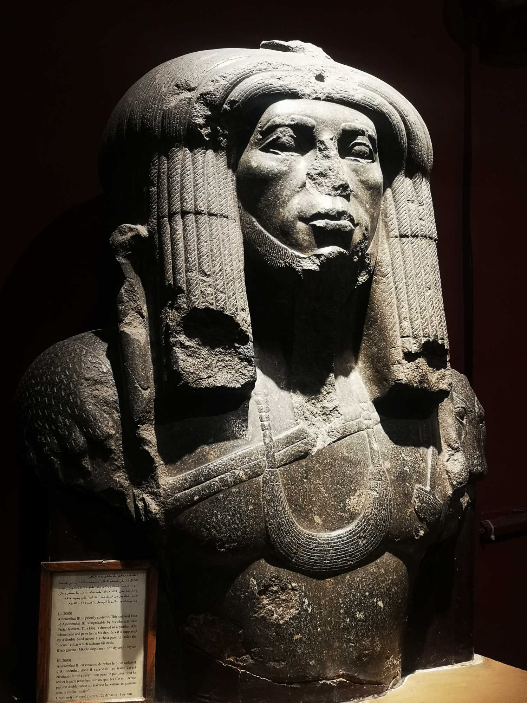
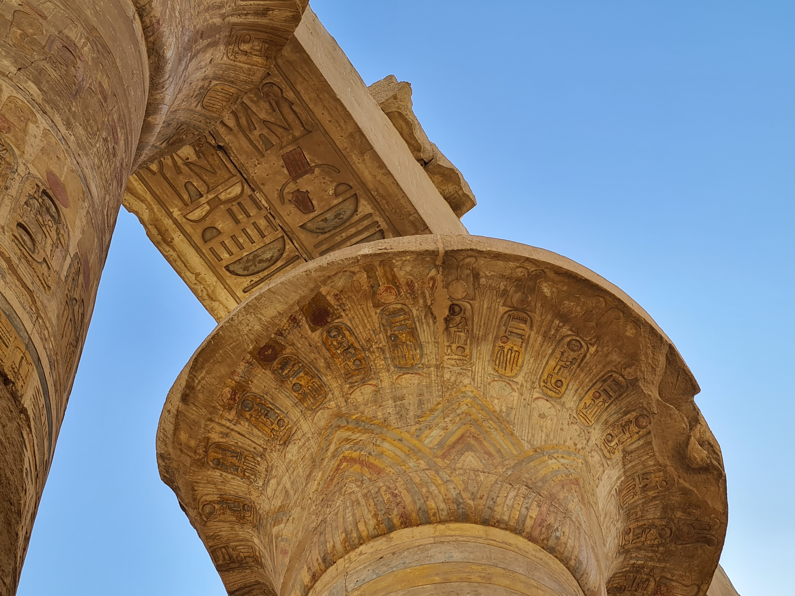
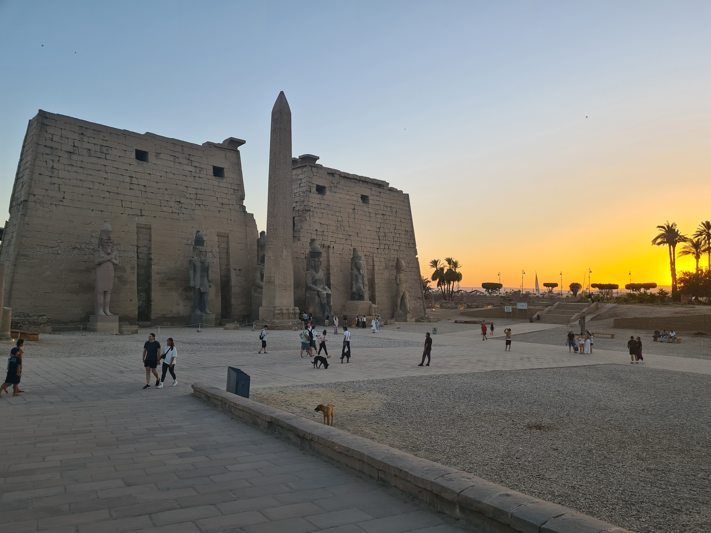

_Le 12 juin départ à 4 heures du matin de Nairobi, arrivée à 9h au Caire avec Alan pour la découverte de l'Égypte en 9 jours: 3J Caire, 2J Luxor, 3J Aswan, 1J retour au Caire._

> **Infos pratiques**:
> * Uber fonctionne bien au Caire mais pas dans les autres villes. Attention les plaques d'immatriculation sont en chiffres arabes, pas facile de s'y faire au début [chiffres égyptiens contemporains](https://www.pinterest.fr/pin/33847434686747902/). Possibilité de prendre un Uber depuis l'aéroport du Caire (le parking point de rdv est juste devant l'aéroport, uniquement 1 escalier à descendre. Ne croyez pas les taxis qui vous disent que c'est super loin.) Prix aéroport - downtown : 250 Livres Égyptiennes (LE)
> * Achetez une carte SIM à votre arrivée à l'aéroport méga pratique et prix convenable. Possibilité de payer par carte (VISA) ou de retirer de l'argent à un ATM (Le wifi ne fonctionne pas dans l'aéroport)
> * Visa en ligne (léger gain de temps à l'aéroport -> aller direct à l'immigration en arrivant) [evisaEgypt](https://visa2egypt.gov.eg/eVisa/)
> * Les pancartes, etc sont quasis toutes écrites en arabe! Un traducteur via l'appareil photo et super pratique. Rares sont les égyptiens qui parlent bien anglais, connaître quelques mots de vocabulaire vous aidera beaucoup
> * En Égypte les gens fument partout même dans les restaurants (ça rappelle la vieille France de mes souvenirs d'enfant)
> * Listes gmaps des points phares et des hostels / hôtels sympas: [ici](https://goo.gl/maps/dfPQDowR4dcSt22p8)
> * Lors de notre séjour le taux de change était environ de 1€ = 35 LE

## J1 - Arrivée au Caire

Nous regardons les dernières lueurs de Nairobi au travers des vitres de notre uber. Au revoir le Kenya.

Notre avion décolle à 4h du matin et nous avons pu dormir quelques heures chez Aude avant de prendre la route. Je dors encore un peu dans l'avion tandis que Alan regarde Wonderwoman. Le petit déjeuner servis par EgyptAir est affreux: une vieille saucisse avec une omelette sans goût. Parce que j'aime pas jeter la nourriture je mange quand même et je me fais du mal, c'est stupide.

Un peu avant d'atterrir nous découvrons le Canal de Suez depuis le ciel et la mer Rouge (pas du tout rouge le truc). Le contraste du bleu avec la terre jaune de sable est saisissant. C'est la première fois que je vois un paysage aussi désertique. Vu du ciel c'est certainement encore plus troublant.

Nous récupérons nos bagages et c'est rapidement un calvaire: 2 énormes valises, 1 petite, 1 gros sac à dos de rando et nos deux petits sacs de voyage... 8 mois de vie en Afrique là dedans. Habituée à avoir uniquement mon gros sac à dos pour tous mes périples je me retrouve maintenant à traîner un point mort et je n'aime pas ça. Heureusement nous sommes deux pour se répartir ces 80 kg d'affaires.

En sortant nous sommes écrasés par la chaleur sèche du désert. Un petit vent nous la rend supportable. Nous trouvons rapidement notre Uber et montons dans l'habitacle climatisé direction le centre ville. Ce que je vois par les fenêtres n'est pas très alléchant. Le plaisir et l'envie de découverte ont tous deux été bien entamés par la fatigue.

En arrivant devant l'immeuble où nous logeons, nous constatons avec bonheur l'existence d'un petit ascenseur pour monter jusqu'au dernier étage où se trouve notre auberge de jeunesse. Sauf qu'il s'arrête au 6ème et que l'hostel est au 7ème... L'horrible bonheur que de porter de lourdes valises sous 40°...

L'auberge est super: plein de petits coins canapés, le vent sur le rooftop et un accueil avec le sourire par les jeunes qui tiennent l'endroit. Les chambres sont spartiates mais propres. Nous comatons un peu après cette nuit incomplète avant d'imaginer toute potentielle visite.

> Dahab Hostel : [leur site](https://www.dahabhostel.com/)  [avis google](https://www.google.com/maps/place/Dahab+Hostel/@30.0480652,31.2374697,15z/data=!4m9!3m8!1s0x145840c72ef1474b:0x593647d36eda6b9d!5m2!4m1!1i2!8m2!3d30.0480652!4d31.2374697!16s%2Fg%2F1tfvwfst?entry=ttu)

Première sortie pour aller manger et prendre nos premières marques dans le Caire. Les gens dans la rue nous regardent parce que nous sommes européens même si nous portons des vêtements respectueux de la culture musulmane. Je pense que nous dégageons une atmosphère de nouvels arrivés naïfs en début de découverte. J'avais pensé que ce serait facile pour nous étant donné notre expérience du Kenya. J'avais tord, les regards sont tout autre et je ne me sens pas très à l'aise dans la rue. J'imagine que comme Nairobi il faut d'abord s’imprégner de l'ambiance avant de pouvoir s'y fondre avec aisance.

Très vite nous comprenons la, excusez-moi du terme, sournoiserie des vendeurs - scammeurs: ils font mine de vous aider en vous indiquant le chemin et comme par hasard leur boutique est sur la route. Ils vous invitent à entrer, juste pour voir et comme ils ont l'air sympathiques vous y allez et le bal commence. D'abord avec un premier cadeau (qui deviendra payant), puis en vous demandant votre nom pour ensuite l'écrire sur un papyrus et vous obliger à l'acheter (par exemple).

Maintenant armés de notre connaissance de la roublardise des marchands à touristes, nous nous rendons au musée ([Musée égyptien du Caire](https://egyptianmuseumcairo.eg/emc/ar/)) pour flâner parmi les statues, sarcophages et antiquités. Musée pauvre en explications mais se balader en solitaire est agréable. Nous rentrons à l'auberge épuisés par la chaleur, le peu de sommeil et les bruits de la ville.

En arrivant de Nairobi je croyais trouver plus de modernité au Caire et c'est au final tout l'inverse. La ville semble partout en construction et pleine de poussière. Il y a plus de déchets dans les rues que dans celle du centre ville kényan. Des anciennes façades magnifiques se cachent entre les immeubles qui ne seront jamais finis (une histoire de taxes) et des chantiers nouveaux. Pour l'instant je n'aime pas trop le Caire. Je pense cependant qu'il s'agit d'une ville qu'on apprend à aimer avec le temps.

## J2 - Les pyramides de Gizeh

> * Centre ville - Pyramides en Uber : 200 LE
> * Chameau ou cheval sur place : 500 LE pour une heure (panneau avec le prix), 800 LE pour 2h prix négociable + pourboire (nous avons donné que 150, car très peu d'explications); le site est faisable à pied quoique très grand, prévoir plutôt 3h de marche.
> * Pyramides de Gizeh: [ticket office](https://www.google.com/maps/place/Giza+Pyramids+Ticket+office/@29.9751684,31.1387483,18z/data=!4m6!3m5!1s0x14584589ddbad7ad:0x9852aed4671fa261!8m2!3d29.9754076!4d31.1408443!16s%2Fg%2F11h9y53f06?entry=ttu )

Aujourd'hui nous allons voir ce qui amène tant de gens, dont moi, en Égypte. C'est, je l'avoue, la chose que j'ai le plus envie de voir ici, la 7ème merveille du monde antique (je crois): les pyramides!

Nous prenons un Uber pour aller jusqu'à l'entrée du site. Depuis la route nous voyons se dresser au loin devant nous la Pyramide de Khéphren, c'est impressionnant de grandeur. C'est cette vue de la pyramide, alors que nous étions en route vers Gizeh, qui m'a le plus marqué: l'impression de proximité avec l'édifice de par sa grandeur et simultanément la sensation d'entre être très loin.

Nous payons nos tickets à un petit guichet bondé à côté de l'entrée. Devant la taille du site et la chaleur nous décidons de prendre des montures: chameau pour moi, cheval pour Alan. Un pseudo-guide (qui nous apprendra rien et prendra des photos au cadrage plus qu'approximatif) nous accompagne pour guider nos montures. La vue sur les pyramides est magnifique. Leur hauteur est impressionnante. Devant, on se demande une fois encore comment elles ont bien pu être construites...

**Je ne ressens cependant pas la poésie d'un moment hors du temps dans ce lieu millénaire: les séances photos et surtout les déchets plastiques un peu partout ramènent à la réalité, à la dualité de notre merveilleux et désolant monde. Comme le disait Victor Hugo: "La réalité n'est pas Instagram".** Aux portes du désert je me surprend aussi à penser à Dune (aux livres de Franck Herbert): la vie sans eau.

Cela reste un superbe moment. J'ai adoré la balade à dos de chameau de pyramide en pyramide. Nous terminons par la visite d'une mini pyramide et le tour du sphinx (compris avec l'entrée du site, ne pas perdre le ticket). Il est aussi possible de visiter l'intérieur des grandes pyramides mais apparemment à part se trouver sur un sol de plusieurs millénaires, il n'y a rien à voir.

Notre guide veut évidemment son bakchich et il fait sacrément la tête lorsque je lui donne que 100 LE. Je finis par lâcher 50 de plus, il est déçu mais il voit bien qu'il ne s'en tirera pas avec plus. Je peux paraître sèche mais avec aucune explication et juste quelques photos c'est ce que je suis d'accord de donner.

En sortant du site des vendeurs nous alpaguent immédiatement. Alan leur dit que nous n'avons pas de dollars ni d'euros et que nous venons du Kenya ce qui les décontenancent un peu et nous fait rire. Un charlatan plus tenace essaye de lui mettre de force un turban sur la tête: un "cadeau" qui risque de devenir bien vite payant. Il faut ignorer ou lancer des "la choukran" assez puissants. J'ai tendance à marcher vite et j'y vois de plus en plus un mécanisme de défense face aux interactions non désirées.

Nous marchons maintenant en direction du nouveau musée pour une visite qui n'adviendra jamais. Des travaux tout le long de la route nous font faire des détours et nous tombons sur un égyptien d'une quarantaine d'année, très serviable qui nous propose de nous déposer. Je le sens bien. Il était allé à la banque en voiture et il habite dans le coin. Nous montons avec lui et sa femme. Il est comptable et a travaillé en Arabie Saoudite. Il a un peu voyagé et c'est pour ça qu'il parle anglais. Il nous parle de la fraternité entre les peuples et les religions, fustige les faux croyants responsables d'attentats en Europe, et fini sur le développement de l'Égypte: trop centré sur les routes et pas assez sur les biens sociaux comme les hôpitaux.

C'est rafraîchissant de tomber sur une personne serviable gratuitement après tous les marchands escrocs et les demandeurs de bakchich. Cela m'aide à me rappeler qu'il faut de tout pour faire un monde et la suite de notre voyage nous prouvera que les égyptiens sont un peuple très aidant. Peu parlent anglais, mais lorsque la communication est possible, ils souhaitent juste vous aider à découvrir leur pays dans les meilleures conditions.

Après des tonnes de détours le gentil couple nous dépose à l'entrée du musée. Le gardien nous apprend qu'il n'est pas encore fini et que la majorité des expositions sont fermées. Il est tout de même visitable pour la modique somme de 30 € (lol). Étant donné le prix, nous laissons tomber malgré notre longue aventure pour y arriver.

Nous rentrons en taxi (200 LE, facilement négociable si vous connaissez les prix via Uber) avec encore une fois moult détours, cette fois à cause d'une communication hasardeuse. Alan tente de donner des directions en arabe et cela fonctionne une fois sur deux. J'y vois dans ce tour de la ville l'occasion de repérer de beaux bâtiments que nous pourrons visiter demain.

De retour à l'auberge nous nous lions d'amitié avec d'autres français et nous prévoyons de sortir en meute le lendemain: profiter de l'effet de groupe pour nous sentir plus en confiance.

## J3 - La meute au Caire

Alan et moi nous nous rendons à la gare pour acheter des billets de train couchette pour Luxor, départ le soir même (possible en ligne mais site méga long et claqué). La gare est comme la rue: bondée et bruyante. Un égyptien, parlant anglais, nous aperçoit perdu entre tous les panneaux en arabes. Il nous guide jusqu'au bon guichet. Nous achetons facilement nos billets: c'est un train plutôt touristique donc la dame du guichet parle bien anglais. Comme indiqué sur internet pour une cabine double c'est 80$ par personne. Extrêmement cher pour l'Égypte et plus cher qu'un avion même si cela nous fera économiser une nuit d'hôtel.

Retour à l'auberge pour partir avec la meute: Laurie, Lucas et Jane; et découvrir un peu plus le Caire. Un Uber plus tard nous voilà devant la Citadelle de Saladin magnifique endroit surplombant la ville. Une des mosquée que nous visitons est splendide avec un plafond orné et peint de toute part. De l'autre côté une place arborée donnant sur la ville du Caire. Du haut de notre perchoir nous voyons au loin les pyramides et juste en bas la mosquée du Sultan Hassan, bâtiment impressionnant. Laurie fait une petite chorégraphie de danse classique pour un projet vidéo à elle, c'est beau à regarder. La visite tous ensemble est très agréable et nous la clôturons par des bonnes pizzas. Je sens qu'être en groupe aide pour avoir plus d'énergie, pour la prise de décision et pour la mise en action.

Portés par une envie de fraîcheur, nous montons à 5 dans un petit taxi, fenêtres grandes ouvertes, en direction du parc Al-Azhar (35 LE l'entrée). En entrant dans le parc nous entendons de la musique et nous voyons au loin des fontaines: petite balade plaisante à l'ombre des arbres et pause repos dans l'herbe pour contempler tout ce vert.

Retour à l'auberge pour la troupe: Lucas et Jane restent une nuit avant de partir pour la mer rouge, Laurie part pour Gizeh mais nous la retrouverons à Luxor plus tard; et nous partons prendre le train de nuit. Heureusement nos grosses valises restent dans la salle de stockage de l'auberge et c'est uniquement chargé de petits sacs à dos que nous nous mettons en route.

Plusieurs égyptiens nous aident en nous indiquant la direction de notre quai. Il est facile de se perdre et surtout de perdre patience devant tous ces panneaux dans une langue incompréhensible. Je regarde la vie sur les quais: des enfants dans les jupes de leur mère, des hommes mangeant un casse-croûte ou buvant un soda. Le train a quai part, un autre arrive mais ce n'est toujours pas le notre. Les trains sont de grosses machines imposantes et qui s’avéreront assez lentes.

Enfin nous montons à bord. La cabine est sommaire mais propre. Le prix est certainement excessif mais nous avons nos deux repas compris et les matelas sont confortables. Je dors bien d'abord sur la couchette du haut puis je rejoins Alan dans celle du bas. J'ai trop froid avec l'air conditionné du train.

## J4 - Arrivée à Luxor

En sortant de la gare il ne faut que quelques mètres pour savoir que j'aime Luxor bien plus que j'ai aimé le Caire: moins de bruits et de voitures, des rues et des bâtiments bien plus propres. Nous marchons quelques minutes pour arriver jusqu'à l'auberge Bob Marley Sherief House. Le bâtiment est situé au fond d'une petite ruelle calme avec un salon ouvert décoré de drapeaux à côté de la réception.

> Bob Marley house : [avis google](https://goo.gl/maps/Xxj6zHWTUfvLf8dk9), réserver via booking ou juste se pointer si basse saison.

Nous sommes accueillis par Zigi, en charge des lieux, et Ali son cousin. Tous les deux sont super gentils et très accueillants. Ali nous sort une carte et nous montre les endroits intéressants de la ville. Il nous donne aussi un petit glossaire avec des mots en arabe. Juste par envie de communiquer et de partager. Il nous dit que des voisins se sont déjà moqué de lui parce qu'il faisait ça gratuitement mais pour lui les échanges lui donnent quelque chose que l'argent ne pourrait pas acheter.

Avec Zhi, un singapourien qu'Alan avait déjà rencontré à l'auberge du Caire, nous nous baladons le long du Nil en refusant les tours en calèche ou les balades en felouques. Zigi nous avait averti qu'ici aussi il y a pas mal de scam: on vous propose un tour en calèche de 10 minutes pour 10 LE, le gars vous promène au final 1h et évidemment vous demande un prix bien plus élevé que 60 LE. Ou encore un jeune dans la rue qui se présente comme le cuisiner de l'auberge (alors qu'il y a pas de cuisinier) pour sympathiser et ensuite vous arnaquer (et nous avons effectivement croisé quelqu'un qui s'est fait passé pour le cuisinier de notre auberge!).

Comme me le rappellera Alan avec une douce humanité, ces scams ou encore les bakchichs ne sont ici qu'une façon comme une autre de faire de l'argent. Ces gens utilisent les armes qu'ils ont pour vivre ou survivre. Souvent je ne répond pas, ou sèchement, mi par expérience mi parce que je n'ai pas envie de me lancer dans un jeu de palabres. Ma patience dans ce domaine est émoussée. Alan est plus gentil à ce jeu là, peut être par candeur ou grâce au recul qu'il prend sur la situation de ces gens. Il est beau.

Petit détour pour se restaurer sur le rooftop d'un joli restaurant. Très léger pour moi, la chaleur me coupe vraiment l'appétit. Au restaurant nous rencontrons une canadienne, Jasmine, qui se joindra à nous demain pour un tour dans la vallée des rois (notre auberge propose des tours à des prix très honnêtes).

Nous continuons notre balade jusqu'au musée de Luxor qui est finalement fermé. Les horaires sur Google ne sont pas fiables: de 13 à 17h le musée est fermé pour "pause sieste" à cause de la chaleur et il rouvre ensuite jusqu'à 20h. Nous poursuivons donc notre périple à pied le long du fleuve jusque Karnak.

Karnak est un complexe de plusieurs temples. Nous prenons grand plaisir à le découvrir malgré la chaleur de l'après midi. Des colonnes peintes immenses, des fresques sculptées remplies de hiéroglyphes. C'est grandiose et magnifique. Vous l'avez compris je suis bien plus dans la contemplation que dans la lecture scrupuleuse de l'histoire de ces monuments antiques (même si ça doit être super intéressant).

> Karnak : [ticket office](https://goo.gl/maps/EmGWnoXPrerKqLuP6), prévoir de l'eau, le prix des boisons dans l'enceinte du temple est exorbitant pour l'Égypte.

Retour à l'auberge en taxi pour une pause avant de re-sortir à 19h et profiter du temple de Luxor avec le coucher du soleil. Les couleurs sont très belles avec les oranges du crépuscule. Les lumières s'allument peu à peu partout dans le temple et cette visite de nuit est très douce. Il fait toujours très chaud, les pierres rejetant la chaleur accumulée dans la journée et le vent semble encore chargé de soleil.

Quand nous rentrons il est déjà 22h et je suis épuisée.

## J5 - La vallée des rois

Départ 8h dans un mini bus climatisé (le luxe), nous sommes 12 entre 20 et 30 ans à faire ce tour ensemble (de notre auberge et d'une autre un peu plus loin). Zhi, Jasmine, 2 espagnols de notre établissement Noria et Ghilem, 1 allemand un peu grognon et d'autres avec qui je n'ai pas pris le temps de discuter.

Notre guide, Aladin, est diabétique, aveugle d'un œil et semble fébrile et fatigué. Il l'est, tout en sachant jouer son rôle à la perfection: alliant malice, anecdotes rocambolesques contemporaines ou antiques sur l'Égypte. Je n'ai pas eu beaucoup de guide dans ma vie pour comparer mais je me souviendrai d'Aladin pour sa force face à l'adversité et sa singularité.

Nous commençons le tour par le temple de Medinet Habou qui n'a servi uniquement 7 jours pour l'embaumement de Ramsès III: des colonnes où il reste de la peinture que sur les parties hautes, qui ont échappées aux inondations, et des fresques immenses. Les hiéroglyphes et les gravures sont profondes ce qui permet à des heureux pigeons de se nicher un peu partout malgré les tentatives des égyptiens pour les déloger. Aladin nous explique qu'il y a même des faucons (prédateur naturel des pigeons) qui ont été lâchés au abord du temple pour les chasser. Mais ce n'a rien donné.

J'aime particulièrement une gravure à l'arrière du temple où l'on voit le roi Ramsès chasser et pêcher. Ces activités ordinaires sont inattendues ici parmi toutes les sculptures de divinité et de pérégrination vers la mort.

Nous nous rendons ensuite à a vallée des rois où nous allons voir les tombes de Ramsès IV, III, II et V, VI.

> Vallée des rois : [office](https://goo.gl/maps/cY9HCkYiMFUqu44V8), prévoir de l'eau 3 tombes comprises avec l'entrée + 1 autre billet si vous voulez faire la tombe de Ramsès v et VI. Il est possible de faire la tobe de Toutankamon mais elle est très cher et il n'y a plus d'objet à voir tout est au musée.

les tombes sont magnifiques, pleines de hiéroglyphes colorés. Difficile de croire qu'elles sont là depuis plusieurs milliers d'années.

Le tour continu avec le temple d'Hatchepsout ("chicken soup" comme le dit Aladin en plaisantant) qui a servit à l'embaumement de la reine pharaonne (qui dirigeait comme un homme et qui est donc dans la vallée des rois) tout comme le temple de Medinet Habou pour Ramsès III.

Nous terminons par un stop devant les deux colosses de Memnon, des statues impressionnantes que nous n'apprécions pas à leur juste valeur, rincés par la chaleur grandissante.

Fatigués par cette journée qui n'est pas encore finie nous retrouvons Laurie (du Caire) à l'auberge et une sieste plus tard, nous voilà parti avec elle et Zhi pour le musée de Luxor. La climatisation du musée est un délice et nous flânons de salle en salle en lisant les explications. Je me moque gentiment de Alan qui prend moult photos des objets et des pancartes.

> Musée de Luxor : [office](https://goo.gl/maps/YCAcxtDJXQZACQnL7), attention les horiaires ne sont pas toujours ceux indiqué par Google. Très bon musée avec des explications détaillées, des vidéos explicatives de fouilles et des momies!

Viens ensuite la mésaventure prévisible pour l'achat des billets de train. Des billets sont au prix de 200 LE mais ils ne nous sont pas proposés, ils sont uniquement pour les égyptiens (mesure mise en place par le gouvernement récemment). Les touristes doivent prendre des tickets beaucoup plus cher ou trouver un égyptien qui veuillent bien acheter des tickets pour eux moyennant bakchich. Je rage face à cette situation que je trouve injuste, même au Kenya le prix des transports publics est le même pour tous selon le confort choisi. Je comprend les différences pour les lieux touristiques mais pas pour le train.

On m'avait dit avant d'arriver que l'Égypte était un pays pas facile pour le touriste qui veut voyager par ces propres moyens. C'est plutôt vrai quand l'on compare avec les croisières ou les agences de voyages où tout est calculé pour que vous ne voyez que les aspects lissés du pays. J'avais envie de faire un tour operator en Égypte, justement pour ne pas me faire chier avec de la logistique, le poids des regards, l'impression de se faire avoir et d'être un porte monnaie sur patte.

Zigi de l'auberge nous aide donc à organiser notre trajet du lendemain en mini bus local (autre possibilité: Gobus ou en avion). On verra se que donne l'expérience de la traversée du désert dans un transport sans clim.

## J6 - Luxor - Aswan

Environ 4h de bus pour rejoindre Aswan depuis la route. Pour ce périple Jasmine, Noria et Ghilem se joigne à nous. Accompagné de Zigi, nous arrivons à la station de bus et nous montons dans un van bien plus confortable que les matatus du Kenya. Comme ces derniers, il faut attendre que le véhicule soit rempli pour que le départ soit lancé. Après une bonne demi-heure nous voilà en route avec les fenêtres ouvertes en bonne climatisation naturelle. Arrivé dans le désert, le vent est tellement chaud qu'il vaut mieux tout fermer pour ne pas se faire fouetter par l'air brûlant. Nous somnolons dans le bus mais il est difficile de se reposer réellement avec la lourde chaleur.

Les paysages du désert se remplacent et se ressemblent. Du sable jaune, quelques bâtiments perdus et la singulière vibration de l'air chaud sur le bitume. Nous sommes heureux lorsqu'à 15h nous pénétrons enfin dans la ville d'Aswan. Nous disons au revoir à nos camarades et 1 taxi plus tard nous arrivons dans le tant attendu hôtel avec piscine.

L'endroit surplombe la ville et nous offre une vue magnifique sur le Nil. La piscine au rez-de-chaussée est fraîche et c'est avec grand plaisir que nous nous y baignons. Nous échangeons aussi avec Hadès, réceptionniste et aide de l'hôtel qui répond à toutes nos questions. C'est une crème.

> Aswan Nil Palace : [avis](https://goo.gl/maps/Sts8EPTBvu2Bnxns6) à 20-30 minutes du centre ville à pied ou 100 LE en taxi / 40 LE en tuktuk

# J7 - Découverte de Aswan

Aswan a l'air d'être une jolie ville dans la même verve que Luxor, bâtie sur les berges du Nil. Arrivés dans le petit centre ville, nous marchons sur les bords du Nil en profitant du vent du matin, pas encore trop chaud.

Nous prenons le ferry public (à côté du KFC) pour aller sur l'île Éléphantine où nous prévoyons de déjeuner et de se balader quelque peu dans le village nubien. Hadès nous a recommandé Animalia, une habitation que son propriétaire à transformé en petit musée sur l'histoire et la vie des nubiens. Nous retrouvons Jasmine sur l'île et mangeons avec elle avant de déambuler.

Le petit musée se visite pour 40 LE avec une nubienne qui nous présente leur culture avec de nombreuses explications sur leur mode de vie. Ce peuple du Sud de l'Égypte s'appuie principalement sur le palmier (tapis, panier, construction, corde, ...), le Nil et le travail des femmes. Se sont leurs 3 piliers. Malheureusement la construction du barrage (qui a donné le lac Nasser) à engloutit 43 village nubiens et les habitants ont été relogés dans le désert loin du Nil et des palmiers, brisant un usage de l'écosystème établi de longue date. On sent dans ses paroles une amertume ancienne mais toujours présente, écho du malheur de son peuple. Sa tristesse et sa rancœur sont bien justifiable.

Avec Jasmine nous trempons nos pieds dans le Nil. L'eau est propre et claire. Ici il est possible de s'y baigner sans danger. Nous sommes surprise par la température glaciale de l'eau alors qu'elle fait face constamment aux forts rayons du Soleil.

Nous rentrons à l'hotel pour échapper à la chaleur du milieu d'après midi avant de prendre une voiture puis un bateau pour la fameuse île de Philae et du temple d'Isis. Évidemment tout est organisé d'une main de maître par Hadès (taxi 400 LE, bateau 300 LE, aller-retour + attente).

La voiture passe le long du fameux barrage d'Aswan et je ne peux que repenser aux explications de la dame du musée ce matin.

Il fait encore chaud mais la chaleur commence à tomber peu à peu lorsque nous débarquons sur l'île. Il n'y a personne sauf les gardes et les guides qui font la sieste à l'ombre des colonnes. Quelques uns se réveillent et tentent de nous attraper dans leurs filets mais nous esquivons maintenant habitués des manœuvres et peu désireux de jouer à ce jeu.

Le temple en l'honneur de la déesse est magnifique. Les hiéroglyphes gravés en relief sont très impressionnant et ont du demandé quantité de travail. Dans l'entrée du bâtiment nous tombons sur un message en français gravé par un géneral de l'armée de Napoléon à son passage vers 1800. C'est amusant et décalé de lire du français sur les hiéroglyphes égyptiens. Cette visite est très belle, rehaussée par le calme et la solitude dans ces lieux. Je pense qu'il s'agit d'une de mes préférée depuis notre arrivée.

## J8 Abu Simbel

Encore une fois Hadès organise tout et à 4h du matin nous prenons un taxi jusqu'au centre ville pour rejoindre un petit bus climatisé qui roulera pendant 3h30 jusqu'à Abu Simbel (passage par un tour ~35$, clairement le plus simple et le moins cher). Le réveil n'a pas été facile et nous dormons un peu (j'aurais aimé beaucoup) sur la route. À 8h le bus arrive sur le site et c'est tout ensommeillé que nous faisons face au lac Nasser. On dirait la mer tellement c'est grand. À cause du barrage les temples d'Abu Simbel (Ramsès II) et celui de Nefertari allaient être totalement submergés (ce qui est arrivé aux villages nubiens), l'UNESCO a alors lancé un appel au sauvetage en 1960. Entre 1964 et 1968 les deux temples ont été totalement déplacés 65m plus haut.

> Abu Simbel et Nefertari : [office](https://goo.gl/maps/AAZQcWKvxrDZHH8x9) temples de culte pour Ramsès II et Nefertari son épouse, tous deux élevés au rang de divinité. Prévoir de l'eau.

À 10h nous retrouvons le bus et nous re-voilà parti pour quasiment 4h de transport. À l'arrivée sieste et temps calme obligatoire avant de profiter de notre dernière soirée en Égypte.

Nous sommes tous les deux fatigués et notre idée de felouque sur le Nil tombe à l'eau. À la place une petite balade nocturne et un petit restaurant nubien magnifique avec une vue superbe sur la ville éclairée et le Nil endormi. Le sommeil nous cueille dès notre retour, demain sera une journée de trajet jusqu'à Paris.

# J9 Retour au Caire, retour en France

Rien de très palpitant pour notre dernier jour au pays des pharaons. Un avion tôt le matin pour retourner au Caire. Et oui nous avons (évidemment) cédé à la tentation du transport le plus rapide et quasiment le moins cher...

Il fait presque frais dans la capitale avec le vent qui ne porte plus la chaleur du désert. À peine arrivés, nous allons à Dahab Hostel pour récupérer notre tonne de bagages. Je retrouve le Caire avec plus de douceur, maintenant que je me sens façonnée par notre séjour. Je ne me sens plus heurtée par les regards. Mon assurance nouvelle fait glisser sur moi la tension que j'éprouvais exactement dans cette même rue il y a 9 jours. Pas le temps de traînasser longtemps, nous prenons de nouveau le cap de l'aéroport un poids nouveau sur les épaules (et un autre à tirer).

Derrière nous l'Égypte, derrière nous 8 mois en Afrique. Je me sens totalement excitée à l'idée de rentrer. C'est comme si j'allais reprendre le cours de ma vie là où je l'avais laissée. Comme si elle avait été en pause durant tout ce temps. Je sais que c'est faux, mais cette sensation continue de me coller à la peau. Quand je récupère ma valise à Charles de Gaulle, j'ai une impression de déjà vue: la boucle est bouclée, le cycle se referme et s'ouvre sur un nouveau. J'ai peur de me sentir perdue face à l'avenir et au changement mais je rejette cette peur. Je pense avec malice au cycle de Dune. Il raisonne en moi par la similarité entre le paysage de l'Égypte et celui d'Arrakis mais surtout pour la litanie de la peur des soeurs Bene Gesserit:
> Je ne connaîtrai pas la peur, car la peur tue l'esprit.
La peur est la petite mort qui conduit à l'oblitération totale.
J'affronterai ma peur.
Je lui permettrai de passer sur moi, au travers de moi.
Et lorsqu'elle sera passée, je tournerai mon œil intérieur sur son chemin.
Et là où elle sera passée, il n'y aura plus rien.
Rien que moi.

Que ces mots sont vrais. La peur ne m'apportera qu'une immobilité inutile. Je veux retrouver des repères connus, des visages familiers et je sens en moi, plus fort que jamais, un besoin de stabilité. J'espère que mes pas me mènerons maintenant vers une construction mobile et souple, surprenante et rassurante.

> Voyager est futile si l'envie est lointaine et les désirs ailleurs. Cependant si le voyage est là, et la réalité du moment non altérable, alors il s'agit d'évincer la frustration et la peur: accepter et être en paix, être vrai avec vos envies profondes.  

