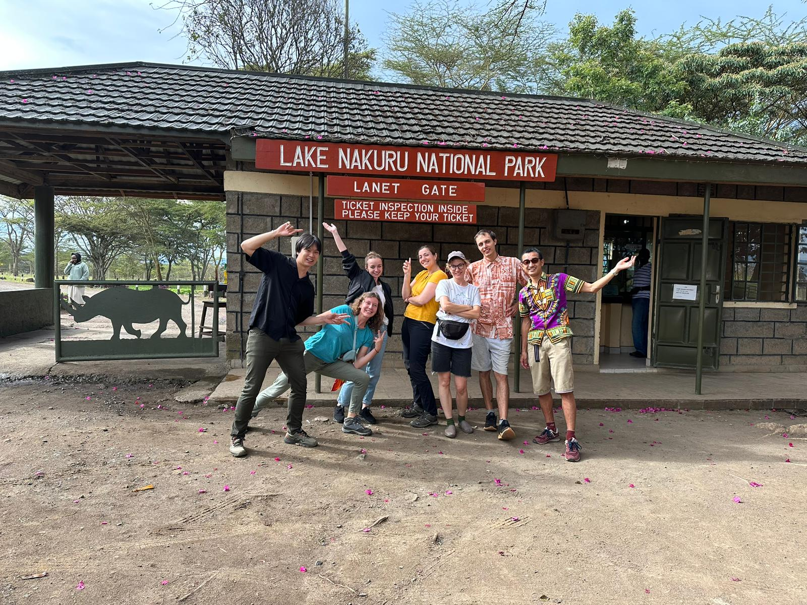
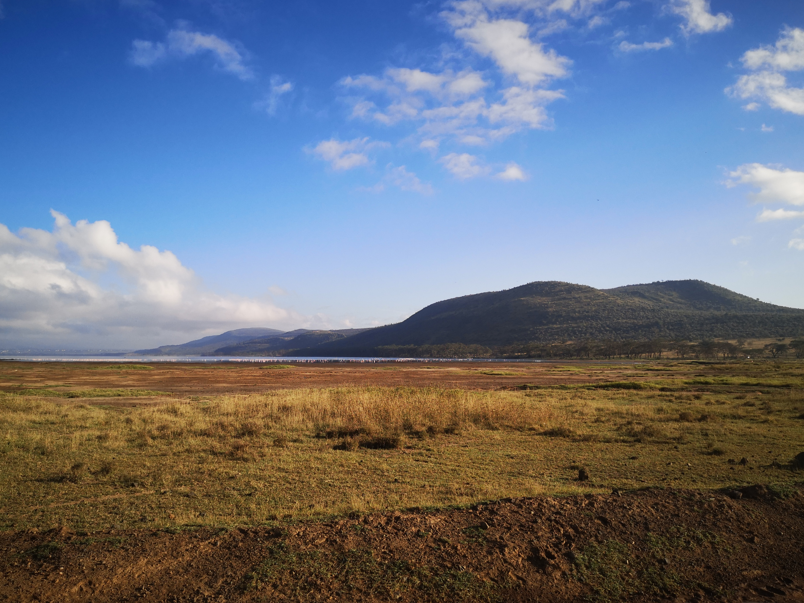
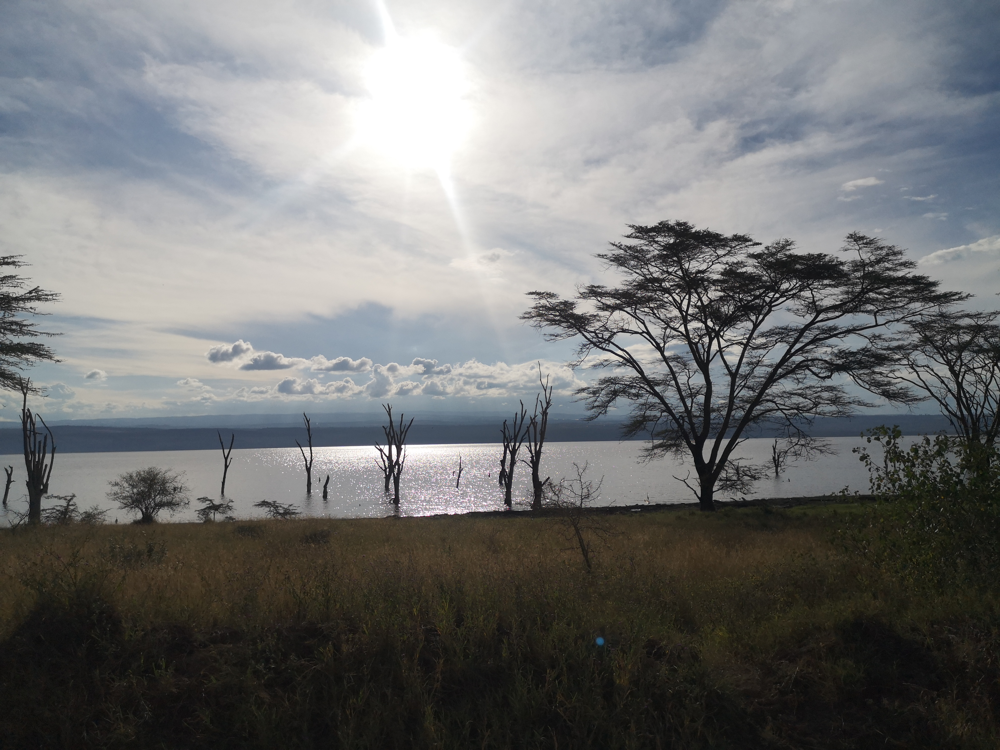

_Je suis allée par deux fois à Naivasha et j'y retournerai certainement de nombreuses autres. La première fois par mes propres moyens: à la "locale" et la deuxième fois au retour d'un safari en groupe dans le parc de Nakuru. Je vais raconter ici ces deux voyages à quelques semaines d'intervalle et en profiter pour dépeindre aussi ce que j'ai pu voir de Nakuru._

## Première excursion à Naivasha, 26-27 novembre 2022

### Trajet pour Naivasha

Pour voyager au Kenya les moyens et les routes sont limitées. Soit on prend le train mais il y en a très peu (un seul train express, celui pour Mombasa et il y en a que 2 par jour), soit on loue une voiture ce qui coûte vite très cher, soit on prend un bus via une compagnie (souvent pour les longues distances sans train) ou soit pour les trajets relativement cours on se tourne vers les **✨matatus✨**. Pour voyager en mode routard, il faut apprendre à les aimer. Personnellement j'adore, cela me rappelle les transports chaotiques en Inde, c'est certainement mon goût discutable pour le "bordel".

Les matatus sont le moyen de transport le moins cher. Ils sont vu comme peu fiables par les touristes et les expats parce qu'ils ne partent que quand ils sont pleins, font beaucoup d'arrêt et - on va pas se le cacher c'est un peu le cas de tous les véhicules ici - roulent comme des dingues. **Ces petits bus sont empruntés quasiment que part des locaux et si, comme moi, on souhaite vivre une expérience typique et locale il n'y a rien de mieux.**

>📑 _Comment prendre un matatu?_
>* _Il suffit de savoir où se trouve le départ et si vous êtes déjà sur un axe, juste faire un signe pour qu'il s'arrête._
>* _Connaître le prix (sinon vous risquez juste de payer plus cher parce que vous êtes un mzungu)_
>* _Y aller tôt ou tard (début ou fin de journée) pour ne pas attendre trop longtemps que le bus se remplisse_

> 🚐 _Matatu Nairobi - Naivasha_
>* _Départ des matatus à Nairobi [point gmaps](https://goo.gl/maps/jZXLyS2vMo5AMFvQ8)_
>* _Prix: entre 250-400 ksh (prix max sur la période Noël - nouvel an)_
>* _Heures de départ: beaucoup de trajets donc toute la journée même si c'est toujours plus rapide le matin_

À 7 heure du matin nous voilà donc arrivés, Alan, une canadienne et une anglaise a qui j'avais proposé l'expédition, et moi, à une station essence où nous trouvons assez facilement un petit guichet pour acheter nos billets. Une courte attente le temps que le matatu se remplisse et nous voilà partis.

Après 1h30 de trajet le matatu nous dépose dans le centre ville de Naivasha. Il nous faut en prendre un autre matatu pour aller dans notre campement au bord du lac (environ 1h avec l'attente au départ et les nombreux arrêts).

>🚐 _Matatus à Naivasha:_
>* _Pour Naivasha-Nairobi: [point gmaps](https://goo.gl/maps/L6Y5serniccirR5n7), prix comme pour Nairobi- Naivasha: 250-400 ksh_
>* _Pour Naivasha-"Rive du lac": [point gmaps](https://goo.gl/maps/s9LwBsahKBSxyxpL9) c'est à cette endroit on trouve des matatus pour le village de Longonot, pour le comté de Narok et pour les rives du lac. Demander "Fisherman's camp ou Carnellys camp ou le nom de votre campement ou montrer sur une carte, prix pour Naivasha - Carnellys / Fishermans 100ksh_

Pour ce premier voyage nous dormons sur les rives du lac à [Carnellys](http://www.campcarnelleys.com/). C'est un lieu très tranquille où le campement et les nuits en chambre sont abordables (4000 ksh pour deux en saison basse et 6000 en haute). Le restaurant est très bon mais un peu cher. Je recommande les pizzas qui sont cuites dans un vrai four à pain avec plein de fromageeeeee - denrée rare et surtout chère ici.

Nous passons ce samedi après midi à ne rien faire au bord du lac, à écouter les oiseaux et à admirer l'immense miroir d'eau.

 

### Hell's gate

Le dimanche nous nous levons tôt pour faire du vélo dans un des seuls parcs qui permet ce moyen de locomotion: le [Hell's Gate](http://www.kws.go.ke/content/hells-gate-national-park).

Aléas de la vie de groupe, du temps de petit déj et de la préparation de chacun, nous ne nous mettons en route pour 9h après avoir loué des vélos à Carnellys (800 ksh pour le vélo à la journée).

Nous suivons la route qui longe le lac puis bifurquons en direction de Elsa Gate (entrée du parc) sur une route sableuse. L'entrée du Hell's Gate est de 30$ plus un supplément pour faire entrer les vélos. Au Kenya toutes les entrées dans des parcs sont payantes avec des prix spéciaux pour les touristes. La plupart des entrées coutent 60$.

Nous faisons un grand tour de vélo (environ 20km) et nous apercevons des girafes, de nombreux zèbres, des phacochères, des gazelles et des antilopes. **La balade est agréable hormis le soleil qui nous asperge constamment (il n'y a quasiment pas de points d'ombre dans le parc). Le nom de Hell's Gate provient peut être de la chaleur et de l'ambiance de fournaise qui apparaît dès 10h.** D'où la nécessité d'aller se promener dans le parc très tôt le matin. Faire du vélo n'est pas toujours une mince affaire. Nous suivons le "circuit des buffalos" et nous devons mettre pied à terre au premier tiers: une grosse et longue montée impraticable avec l'état du chemin, de même pour une bonne partie de la descente trop abrupte et glissante avec les cailloux.  

>📑 _Hell's gate:_
>_C'est un des nombreux parcs nationaux du Kenya où l'on peut voir des animaux se promener en toute liberté (conditionnelle à l'enceinte délimitée par le parc). Dans le Hell's Gate on peut se balader à pied (pas très recommandé parce que cela reste très grand), en vélo (recommandé mais le terrain reste bien galère: piste de sable et cailloux), ou en voiture (bof bof, l'intérêt de se parc est justement de s'en affranchir)._
>_À savoir: partir le matin TÔT, entrée 30$ et supplément pour les véhicules._
>_Avis: c'est un parc sympathique pour débuter les safaris et pour se dégourdir les jambes mais ce n'est pas un must do._

### Retour Nairobi

Pour rentrer à Nairobi rien de plus facile: il nous suffit de nous placer au bord de la route vers Naivasha puis de faire signe au premier matatu venu. De là bas un nouveau matatu pour Nairobi.

## Safari à Nakuru et deuxième escapade à Naivasha, 11-14 décembre 2022

Le début de cette expédition est bien différente de la première: tout d'abord je suis en charge de rien (ce qui est bien agréable), nous prenons un transport privé depuis Nairobi et nous sommes un groupe de 7 où je ne connais personne hormis Aude, la collègue d'Alan et, maintenant on peut le dire, notre amie. Donc 7: deux japonais, deux russes, une slovaque et deux françaises dans un van - oui on dirait le début d'une mauvaise blague - en direction de Nakuru pour une après midi et une matinée de safari. Sur le retour de Nairobi Aude et moi serons lâchées à Naivasha.

### Le parc national du lac Nakuru

Après 3h de route, quelques achats type nourriture (pas de restaurant là où nous prévoyons de dormir mais une cuisine à disposition) et un déjeuner rapide nous entrons dans le parc national de [Nakuru](www.kws.go.ke/lake-nakuru-national-park).

>📑 _"Le parc national du lac Nakuru fait partie de ces sanctuaires aménagés pour permettre au rhinocéros d’assurer sa survie. Une unique image a fait sa célébrité : celle de centaines de milliers de flamants roses massés sur ses eaux alcalines. Las, d’imperceptibles mouvements telluriques (semble-t-il) ont récemment chamboulé la donne : malgré la sécheresse qui prévaut depuis quelques temps au Kenya, jamais, de mémoire d’homme, les lacs du pays n’ont vu leur niveau aussi élevé. Les eaux saumâtres, dans lesquelles se multipliaient les spirulines, ces algues si appréciées des flamants, sont devenues douces et les plus célèbres hôtes de Nakuru, Elmenteita et Bogoria sont partis chercher leur pitance ailleurs…" dixit: [Le routard](https://www.routard.com/contenu-dossier/cid137037-parcs-et-reserves-du-kenya.html?page=8)_
>_À savoir: les animaux sont le plus présents le matin et en soirée comme dans beaucoup de parc, entrée 70$ et supplément véhicule._
>_Avis: Très beau safari, beaucoup d'animaux différents (rhinocéros, lions, buffalos, ...) et des paysages changeants (petites forêts et plaines, rives du lac). Je recommande!_

L'endroit où nous dormons est situé dans le parc pour être au plus près des animaux et profiter le plus possible du temps imparti. La nuit coûte 2000ksh par personne pour des chambres partagées dans une petite maison ce qui est très (très, très, très) raisonnable pour un hébergement dans un parc: [Wild Life Club Kenya](https://wildlifeclubsofkenya.or.ke/nakuru-hostel.html).

**À bord de notre van au toit ouvrant nous apercevons des gazelles, des impalas, des zèbres, des girafes, des rhinocéros et même des lions avachis au pied d'un arbre.**

Il n'y a pas beaucoup de véhicules dans le parc malgré la haute saison ce qui rend la visite plutôt agréable. Nous sommes confinés dans le van mais le toit ouvrant permet tout de même de prendre l'air et d'avoir une belle vue. L'après midi et la matinée de safari ont été appréciable et riche en découverte. Je pense que c'est pour moi la bonne durée, moins: je n'en aurais certainement pas vu assez et plus: j'aurais été lassée de me faire bringue ballé en voiture.

### De nouveau au lac de Naivasha

Aude et moi sommes donc déposées à Naivasha et un matatu plus tard nous voici à [Fishermans camp](https://fishermanscamp.com/), juste à côté de Carnelly's où Alan nous rejoint. À Fishermans il est possible de louer des tentes avec couette et matelas (environ 1600 ksh pour deux avec la totale) et de camper sur les rives du lac. **La tente est agréable et le panorama magnifique.** En cette saison les nuits sont "froides": entre 11 et 15°C, et il n'y a donc pas (ou peu) de moustiques même au bord du lac.

**C'est devant le campement de Fishermans que les hippopotames ont l'habitude de venir brouter de l'herbe (oui, oui, j'ai demandé, les hippopotames mangent essentiellement de l'herbe) en début de soirée.** Donc pour voir des hippos hors de l'eau et en s'affranchissant des ballades en bateau, il faut aller à Fishermans!

### Randonnée du mont Longonot

L'ascension du mont [Longonot](http://www.kws.go.ke/content/mount-longonot-national-park), un volcan dormant, est pour le moment l'activité que j'ai préféré au Kenya. **D'ailleurs le Petit Futé dit qu'il s'agit de la plus belle randonnée du Kenya et je ne peux que leur donner raison.**

Après une montée plus au moins escarpée (environ 1h et 500m dénivelé positif), nous arrivons devant un cratère immense contenant une véritable forêt vierge. La vue est à couper le souffle. La randonnée se poursuit avec le tour du cratère (environ 2h) avec de chaque côté un panorama fabuleux: le cratère et les formidables reliefs de la vallée du Rift. Le point le plus haut est sur le pourtour du cratère à 2776 mètre d'altitude.

> 📑 _Mont Longonot_
>_À savoir: Le mieux est de commencer la randonnée très tôt pour ne pas être en pleine montée sous un soleil de plomb. Prévoir de quoi se restaurer et de l'eau en quantité. En prenant son temps la randonnée complète est d'environ 5-6h pour 21km (montée + tour du cratère). En arrivant en haut du volcan faire le tour du cratère dans le sens anti-horaire pour commencer par l'ascension du point le plus culminant (200m de dénivelé supplémentaire). L'entrée du parc pour la randonnée est de 26$, il est possible de prendre un ranger pour guide à l'entre mais cela n'est pas nécessaire, le chemin se trouve facilement._
>_Avis: Si vous aimer marcher et si vous aimer les paysages surprenants vous allez adorer le Mont Longonot._

>🚐 _Pour se rendre au début de la randonnée il faut soit:_
>* _Prendre un matatu jusqu'au croisement entre Naivasha et la route vers Longonot, puis un matatu jusqu'à Longonot (village) puis un taxi moto jusqu'à l'entrée. C'est le moins cher (100 + 100 + 150 pour l'aller) et plutôt facile mais c'est un peu long. En partant à 7h de Fishermans il est possible d'arriver vers 8h15 aux portes du parc et ainsi gravir le volcan avant la chaleur._
>* _Prendre un taxi depuis son campement / hôtel. Depuis Fishermans camp nous avons payé le conducteur 4000 ksh pour l'aller retour (le chauffeur vous attend). C'est le camp qui nous a mis en contact avec un chauffeur: proposition de départ 5000 ksh puis nous avons négocié._

### Sanctuary farm et Crescent Island

**En plus du Hell's Gate il y a un autre parc national à Naivasha: [Crescent Island](https://www.crescentisland.co/directions).** Il s'agit d'une petite île que l'on parcourt à pied, une promenade d'environ 2h. **On peut y voir buffles, zèbres, girafes, gazelles, gnous et impalas en liberté. Certains animaux sont originaires de l'île et ont été coupés du contient quand les eaux ont monté, d'autres ont été amenés - certainement pour le tourisme.**

Pour se rendre sur l'île il faut obligatoirement prendre un bateau. Notre camp le propose mais pour 7000 ksh alors nous préférons prendre un matatu pour [Sanctuary Farm](sanctuaryfarmkenya.com/index.php/home) où l'aller retour est à 3000 ksh. (trajet entre Fishermans et Sanctuary Farm assez court, nous avons payé 50ksh)

Pour rentrer dans Sanctuary Farm à pied et accéder au bateau il faut payer 100 ksh par personne. Nous nous retrouvons dans une grande étendue verdoyante protégée par l'ombre des arbres où nous rencontrons des zèbres et des impalas en grand nombre en avançant vers la rive du lac.

 Arrivés au bord du lac nous trouvons rapidement le service de bateau et nous embarquons en direction de Crescent Island. L'aller retour en bateau comprend également un tour de 20 minutes pour voir les oiseaux et les hippopotames sur le lac. Le tour est très agréable. **Notre capitaine nous explique qu'en 2020 les eaux du lac ont monté ce qui a entraîné la mort de nombreux arbres sur les rives, les flamands roses sont partis et la jacinthe d'eau à commencé à envahir les bords du lac.**  

 Une fois sur l'île nous voyons rapidement de nombreux zèbres et des girafes. Ici les animaux semblent à l'étroit et la végétation est dégarnie. L'endroit est calme et apaisant mais très sec par rapport aux rives du lac.

 De retour dans Sanctuary Farm nous nous rendons dans le restaurant à l'intérieur de l'enceinte pour prendre un thé (restaurant cher mais impeccable, pour manger il faut prévenir à l'avance). L'établissement est entouré de singes qui guettent la nourriture. Au loin nous voyons des impalas profitant de la fraîcheur des acacias.  

 

 >* 📑 _Crescent Island: L'entrée pour faire le tour de l'île coûte 30$ en plus du bateau (3000 ksh depuis Sanctuary Farm)._
 >* 📑 _Sanctuary Farm propose aussi des tour de bateau d'une heure sur le lac et des ballades à cheval dans l'enceinte (très grande) de la ferme. Pour avoir vu les chevaux galoper dans un pâturage de la ferme, ils sont en bonne santé et bien traités. Entrée à pied par la porte principale: 100 ksh pour accéder au bateau sinon 500 ksh pour visiter._
 >_Avis: Dans les deux cas il est très agréable de pouvoir voir les animaux à pied et de marcher à quelques mètres d'eux. Personnellement, j'ai préféré ma balade dans Sanctuary Farm à l'ombre des grands arbres et avec de la verdure de tout côté à celle de Crescent Island. Je trouve l'île peu intéressante et je recommande de profiter plutôt d'une longue balade dans Sanctuary Farm. Dans les deux endroits on peut voir des girafes et beaucoup de zèbres et de gazelles._

 ## Petite conclusion

 Contrairement à ce que l'on peut entendre, **je trouve que les matatus sont un moyen de transport appréciable si on est prêt à faire un petit sacrifice de temps et d'espace vital. Cela permet de se retrouver au plus proche des kényans et de leur quotidien.**

 Pour ce qui est des endroits visités **je ne peux que recommander chaudement la randonnée du mont Longonot. Malgré la chaleur et le dénivelé positif de 700m, c'est une randonnée abordable si l'on prend son temps. Et le paysage vaut tous les efforts.**

 Quant au différents parcs je trouve que Hell's Gate vaut le coup pour une première approche des safaris si on aime le vélo. Crescent Island est sympathique mais si vous voulez faire des économies, un tour dans Sanctuary farm est tout autant agréable. Pour finir le parc national de Nakuru était mon premier safari classique (en voiture) et j'ai apprécié l'expérience. La nature y était très belle, j'ai pu voir beaucoup d'animaux et il n'y avait pas grand monde malgré la haute saison. Il ne faut pas y aller dans l'optique de voir des milliers de flamands roses mais pour le reste c'est un très beau parc.
