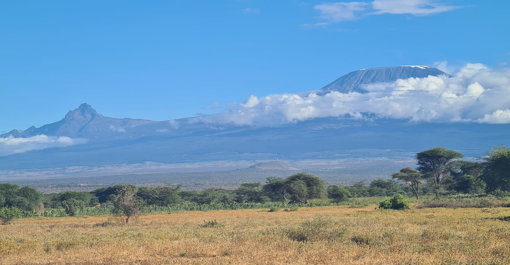
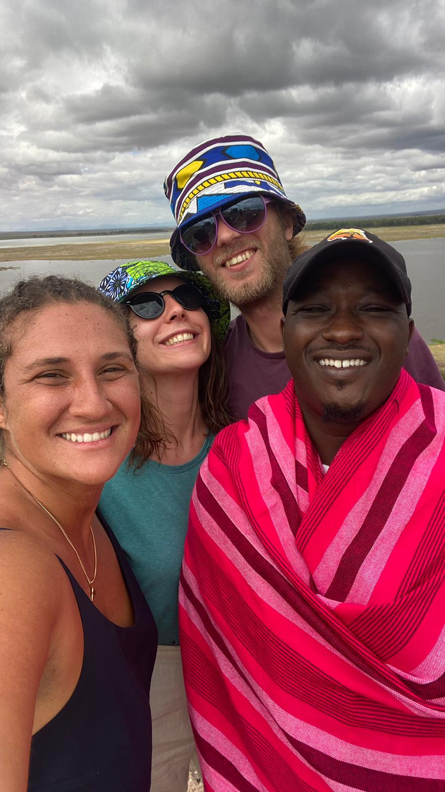

_Du 3 au 5 juin, avant de nous envoler loin du Kenya, échappée avec Alan dans un des plus beaux endroits du Kenya: rencontres, paysages et histoires._

> **Infos pratiques**:
> * Camp très sympa avec un accueil en or et la vue sur le Kilimandjaro : [We4Kenya](https://goo.gl/maps/27qH6VMFnc8L1hWZ6), 3700 ksh pension complète. Propose des safaris à prix correct. Merci encore à Wilson, Manu et Laleto.
> * Nairobi à Amboseli: [Naekana](https://goo.gl/maps/cCNnjUQeJU1tCi2B8) compagnie de matatu (ligne en direction de Loitoktok) demander à s'arrêter à [Isinet](https://goo.gl/maps/xkLztoz1ty385L1a8) - 800 ksh; puis prendre une moto pour se rendre jusqu'au camp We4Kenya - 500ksh ou avec une voiture privative 2000 ksh

C'est le début de la fin pour nous au Kenya, fini Nairobi en tout cas. Nous avons un peu de temps pour des vacances aventureuses avant de nous envoler. Première destination: Amboseli, le parc national au pied du Kilimandjaro. Surtout intéressés par la montagne, le paysage, et des rencontres furtives avec les Masais, nous n'étions pas sûrs de faire un safari dans le parc. Les prix sont assez élevés pour l'entrée et la location de voiture (8000 ksh entrance fee et 22000 ksh pour la voiture 4x4 toit ouvrant).

Évidemment nous avons craqué, se sera notre dernier safari au Kenya. Comme des amis nous l'ont dit: vous avez la chance d'y être, autant faire la totale.

Comme souvent l'aventure commence dans le centre de Nairobi (CBD) pour prendre un matatu ici à Naekana Stage. Très vite nous voilà partis dans le mini bus 16 places, un peu serrés mais convenablement installés pour ce type de transport. Une demi-heure de route plus tard, sur la voie express, le pneu droit avant explose dans un grand bruit. Nous nous retrouvons à l'arrêt, sortons du véhicule et commençons à discuter et prendre des photos sur le bord de la route. Tout est propice à la discussion pour faire passer le temps. Nous repartons assez rapidement, moins d'une heure, et 4h après nous descendons à Isinet.

Alan ne souhaite pas prendre un bodaboda (moto) de peur de faire tomber son ordinateur (la "route" jusqu'au camp est très cabossée), alors nous montons dans une sorte de carriole harnachée à un moto: très inconfortable mais amusant.

À We4Kenya nous sommes accueillis à bras ouverts par Wilson avec un bon repas. Le camp est presque au milieu de nul part: des tentes, des huttes, des arbres et quelques plantations. Wilson est un fermier: il a des plantations, des moutons et des chèvres. Il nous demande si nous aimons la viande, "oui", et nous informe qu'il a prévu d'égorger un mouton ce soir pour faire de la viande grillée.

Nous profitons de la douceur du Soleil en fin d'après midi pour nous promener autour du camp. Wilson nous rappelle de bien rester dans l'enceinte électrique qui entoure le camp et les alentours car il peut y avoir des attaques d'animaux, notamment des hyènes même si elles sont principalement actives de nuit. Nous déambulons à travers la savane: quelques cases Masais, des enfants qui nous font des grands signes en criant et surplombant l'ensemble : le Kilimandjaro qui nous fait face du haut de ses 5965 m. C'est magnifique.

Nous rencontrons Carole, une brésilienne pétillante qui nous accompagnera pour le safari de demain.

De retour au camp Laleto et Manu égorge le mouton pour le soir. C'est impressionnant sans l'être vraiment. Avec dextérité ils lui enlèvent la peau comme s'ils le déshabillaient et le découpent. À peine une heure plus tard nous sommes autour du feu à regarder puis déguster les côtes du mouton grillées. La soupe aux abats bouillonne sur le feu, il ne me tarde pas de la goûter. La viande est succulente à la fois juteuse et croquante. La soupe à un goût un peu écœurant de cartilage mais je finis ma tasse après qu'une kényane m’ait dit que les racines utilisées étaient un puissant répulsif anti-moustique. Les histoires fusent autour du feu avec quelques chants.

Nous nous levons un peu après l'aube et petit-déjeunons avant de monter à bord d'un gros (et vieux) 4x4 pour la visite du parc. Dixon est notre guide. Amboseli est le parc national que j'ai préféré au Kenya même si son attraction principale, le Kilimandjaro, nous a été caché durant toute la journée.

Collines, marécages, lacs et bosquets et quasiment toujours entre nous et l'horizon: des éléphants. C'est un beau moment passé avec Carole et Dixon.

Nous sortons du parc pour sa fermeture à 18h. Des éléphants fourragent à 2m de l'entrée et nous avons l'opportunité de pouvoir prendre des photos souvenirs juste devant eux.

Wilson nous attend au camp avec un bon repas copieux (vive les chapatis). Alan fait un interview de Dixon: il lui demande de faire une petite présentation d'Amboseli en anglais (comme il nous l'avait fait dans la voiture) qu'il utilisera pour faire de la compréhension orale de retour en France.

Pendant ce temps je discute longuement avec Carole: elle est au Kenya depuis un mois et voyage à sac à dos. Elle est allée au Nord près du lac Turkana ce qu'on déconseille beaucoup aux blancs parce que c'est "dangereux" à cause des conflits armés. En réalité c'est plus dangereux pour les locaux que pour les touristes: les attaques tribales concernent principalement le vol de bétails. Là bas comme dans d'autres endroits du Kenya rural il n'y a pas d'eau courante ni d'électricité et les gens sont très attachés à leurs terres et leurs traditions.

Les parents ne veulent pas mettre leurs enfants à l'école, les filles de 13 ans sont mariées à des vieux qui ont déjà plusieurs épouses et les jeunes se percent et s'agrandissent les oreilles à l'aide de tissons ardents. Tout y est "normal" pour eux. Envie de juger, forcément, certaines traditions nous semblent tellement barbares. Comme le fait de tuer le premier né si une femme accouche de jumeaux car ce n'est pas un enfant mais un démon qui va perpétuer le mal sur Terre.

Mais les traditions sont aussi le folklore que nous aimons, les tissus, les bijoux que nous admirons. Comme nous l'a dit un Masai (ou comme le dit le vieux sorcier dans [_Kirinyaga_](https://fr.wikipedia.org/wiki/Kirinyaga_(roman)), recueil de nouvelles de science-fiction de l'auteur américain Mike Resnick) les traditions perdurerons tel qu'elles sont, île dans la mondialisation, où s'émousseront totalement au fil des ans et des générations pour qu'il ne reste que des faux villages , des photos et de très vieilles légendes. Qu'il ne reste que de l'Histoire.

Peut être ont-ils tord: le Masai moderne avec une culture hybride où le barbarisme aura été gommé par les lumières de la société dominante, pourrait exister bel et bien. En tout cas, pour le moment, dans les campagnes kényanes les traditions restent bien enracinées, cimentées par la fierté et l'usage des langues locales.

Avec Carole et Alan nous nous retrouvons une nouvelle fois autour du feu cette fois avec la femme de Wilson, Rachel, et son fils de deux ans Max, qui court partout. Elle nous raconte que d'après une légende Masai, les éléphants sont des jeunes femmes ayant désobéi ou manqué de respect à leur père. Parmi les animaux sauvages se sont les seuls à qui on donne des prénoms pour cette raison et aussi parce que ce sont des animaux ayant une vraie vie de tribu.

Elle nous explique aussi que certains, s'ils se sentent agressés, peuvent devenir dangereux et même tuer des hommes. S'ils commettent un crime envers un membre de la tribu ou un autre animal pacifique, ils sont alors chassés de leur famille et ils deviennent fou de culpabilité et de chagrin. Il faut alors les tuer car ils sont extrêmement dangereux ou les envoyer ailleurs en espérant que le changement d'environnement et le renouveau les apaisera.

Pour beaucoup de Masais ,qui ne vivent pas dans une enceinte électrique, les animaux sauvages, dont les hyènes, sont une vraie préoccupation. Un voisin a retrouvé son troupeau de chèvres décimé par les hyènes un matin. Il a investi dans une clôture électrique après ça. Écouter Rachel est presque plus dépaysant que le safari d'aujourd'hui. Évidemment elle ne s'appelle pas toujours Rachel, elle a aussi un prénom kiswahili et un prénom Masai. Elle comme Dixon, Wilson ou Manu change son prénom selon l'environnement et les personnes présentes.

Après une bonne nuit de sommeil, nous disons au revoir à toutes ces belles rencontres. Nous montons sur des bodabodas direction Isinet puis Emali où nous prendrons le train pour Mombasa et pour la fin de nos aventures kényanes.
