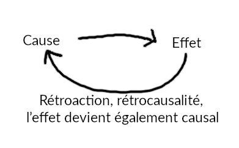

## Cause vers cause

_Il a fait très chaud la semaine dernière. L’orage est là, il pleut aujourd’hui._

Une cause, un effet ? L’effet est la résultante de la cause qui l’a produit, généré. Sous cet effet naissent d’autres effets. Ici : _l'eau ruisselle sur les sols, les arbres poussent, la vie grandit._

Derrière le lien « cause → effet » l’effet devient causal à son tour : il génère et vient jouer avec la cause qui l’a fait émergé; _l'air se charge de goutelettes d'eau, les nuages se forment, le cycle de l'eau se perpétue_

Edgar Morin définit l’existence d’une **causalité génératrice et productrice de soi**. La cause s’auto-alimente avec ses effets, elle boucle. Plus loin encore que l’effet papillon, la boule de neige descend de la montagne, et dans un même temps, elle remonte - sous forme de gouttelettes d’eau en suspension dans l’air - pour rencontrer l’origine de sa descente.

Le lien « cause – effet » est l’**exo-causalité**, correspondant à la causalité classique, et le lien « effet – cause » est l’**endo-causalité**, correspondant à la causalité génératrice.  

- Exo-causalité: externe, générale, produit de forces extérieures, non forcément organisée
- Endo-causalité : interne, locale, résultante d’une organisation active, incertaine, implique une production de soi.
- Production de soi : production d’un système qui va lui même se générer, se ré-générer, s’entretenir et constamment se réorganiser pour rester dans un état apparent stable.  

## Cause sans effet

_Dehors il fait froid, le vent souffle. Pourtant la température de mon corps reste constante._

Les organisations dynamiques, proactives résistent, épongent et corrigent les perturbations.  Elles neutralisent, stoppent, détournent, transforment, déforment les effets des causes externes :
« La cause n’entraîne pas son effet, et l’important devient, du point de vue de la causalité extérieure, ce qui n’a pas eu lieu. » (p. 258)

La cause demeure mais son effet est annulé. C’est la **causalité négative.**

Il y a la production d’une causalité intérieure (endo-causalité, ici : _le corps est stimulé_) en relation avec une causalité extérieure (exo-causalité, ici : _l’atmosphère est froid_).

## Cause productrice

> « La causalité circulaire, c’est à dire rétroactive et récursive, constitue la transformation permanente d’états généralement improbables en états localement et temporairement probables ». (p. 259)

_Face aux aléas du temps, la température du corps humain devrait constamment diminuer et augmenter en suivant la température de l’atmosphère..._ Mais le corps humain est une formidable machine régulatrice et productrice de soi. Les causes externes amènent notre corps à produire, à répondre aux effets. La causalité externe (_le froid_) devient **causalité générative**. Elle génère une causalité interne (_chaleur produite pour que le corps reste à 37°_).

Les états improbables deviennent existants par la recherche d’équilibre et de balance du système, comme les échanges thermodynamiques vers l'état stationnaire. Notre corps cherche constamment l’équilibre, le juste milieu à atteindre et qui n'est jamais totalement atteint ou alors atteint localement et temporairement. Reflet de notre corps, l’esprit quête aussi cet équilibre et joue en perpétuelle balance.

## Lumière sur la causalité interne (endo-causalité)

La causalité extérieure met en exergue les états d’équilibre – déséquilibre mais voile les états stationnaires où agissent les causalités internes. L’absence de la notion d’endo-causalité – du moins dans la plupart des disciplines – cache des mécanismes, des réactions, des contre-actions où l’exo-causalité est neutralisée. Il est important de se rappeler l'existence des mécanismes internes qui sont cause première des états d'équilibres. Leur régulation du système permet une pérénité et une existence - plus ou moins paisible - de ce même système. 

La simplification simulus → réaction (cause → effet) qui découle du behaviorisme, occulte les mécanismes génératifs, producteur de soi. Mettre l’action-cause au centre du raisonnement met de côté l’importance du soi. Mettre en lumière les causalités internes permet de quitter une vue simplifiée et biaisée d’un système producteur et d’approcher une vision plus complexe. Plus complexe, plus complète, une vision où nous prenons du recul pour tenter de nous contempler dans notre mystère. 

Cette vision complexe nous rappelle qu'il n'y a pas uniquement de grandes lois productrices mais que les particules existantes au sein du système génèrent elles aussi de la matière. **Allons plus loin: cela nous rappelle que chaque petite action d'une particule du système a une importance tant dans son entretien que dans sa chute.** 

## La finalité

Le système producteur avance vers une finalité. _Dans une usine automatique, chaque cellule à un but précis et clair dans une optique globale de production_. Pour aller vers sa finalité, le système producteur de soi déclenche des endo-causalités. **La causalité finalitaire est une causalité intérieure.** 

_Le corps humain a pour finalité de rester à 37°C. Pour cela il réagit aux perturbations extérieures (exo-causalité) pour se rafraîchir ou produire de la chaleur (endo-causalité)_. **La production de soi se fait dans un but et car il y a production de soi**: car il faut conserver le soi, le préserver, le faire exister.

> « L’être vivant fait subir à son environnement les effets de ses propres finalités » (p.261)  

> « Ainsi en est-il de l’Homme qui asservit les « Lois de la Nature » elles-mêmes, en imposant sur les déterminismes physiques extérieurs la sur-détermination de ses propres finalités » (p.261)

## La finalité de l’Homme, de la Nature, du Monde   

_Les pièces de l’usine automatique, les machines artificielles, sont finalisées par l’Homme avant même d’exister._ L’Homme les pense, les dessine et les conçoit. Mais quand est-il de lui ? De l’Homme – de nous – des animaux, des étoiles même ? Encore et toujours La grande question.

La causalité générative, en grande boucle rétroactive du Tout sur le Tout, s’entretient elle-même. La finalité immanente du recommencement perpétuel de la boucle, une finalité sans origine finaliste et sans destination intelligible. Comment en sommes-nous arrivés là ? Qu’il y avait-il avant la boucle ? Nous cherchons une finalité pour nous même.

Pour ne pas divaguer, cherchons dans la matière: Notre corps est composé d’atomes qui forment des molécules, molécules qui composent nos cellules qui forment nos organes, eux même part de notre organisme. Les molécules produisent des réactions chimiques nécessaires à notre organisme. Nos cellules sont spécialisées selon les fonctions de nos organes. **Nos organes visent à accomplir des buts précis qui se rejoignent tous dans un but global : vivre.**

> « Comment la finalité naît-elle de la non finalité ? » (p.262)

Comment les atomes ont-ils pu s'organiser en molécules nécessaire à notre survie ? Comment des molécules, non préalablement codées, auraient-elles pu posséder l’information capable de reproduire et de contrôler des protéines avec lesquelles elles n’étaient pas encore associées ?
Morin nous dit donc qu'une idée de finalité ne peut pas être antérieure à la constitution du premier bouclage cellulaire. Qu'il faut donc écarter toute idée de processus de finalité avant l’apparition de la vie. La vie et sa finalité c'est créé avec la vie elle même, pas à pas, par mutation et changement.

C’est donc le développement de la production de soi qui va produire la finalité, qui est elle même finalité. Le corps humain agit sur lui même et sur le monde - produit, donc - pour vivre : **en produisant il vit, il vit en produisant.** Le but commun de tous les buts des machines créatrices est atteint : vivre.

## La finalité de vivre

Dans la sphère du vivant la finalité de vivre se décompose entre le « vivre individuel » et le « re-vivre l’espèce » : retour à la « double et trouble finalité de vivre de l’individu, de l’espèce et de la société » (p.264)

Les finalités complémentaires de la jouissance et de la reproduction deviennent tout autant antagonistes que des moyens d’une finalité à l’autre.

« On ne fait pas que manger pour vivre, on vit aussi pour manger, c’est à dire jouir. » - Lupasco

L'être humain ne fait pas uniquement des actions parce qu'il doit les faire pour survivre, il les fait aussi parce qu'il y prend plaisir. Parce qu'il veut se repaître de sa vie, parce qu'il veut aimer vivre.  

**Nous voici encore une fois, arpenteurs des chemins de la pensée, dans une nouvelle impasse, connue, reconnue et méconnue : le but de la vie. Peut être alors se réfugier dans la tautologie du « Vivre pour vivre ». La finalité de la vie serait immanente à elle même, but de son propre but, cycle dans le cycle des cycles.**

> « Le Vouloir-Vivre est une finalité formidable, têtue, frénétique, mais sans fondement et sans horizon ; signe que la finalité est insuffisante à définir la vie. » (p.265)

**Certainement que vouloir comprendre la vie en la réduisant à un but, à son but, serait mutiler d’autres mystères.**
