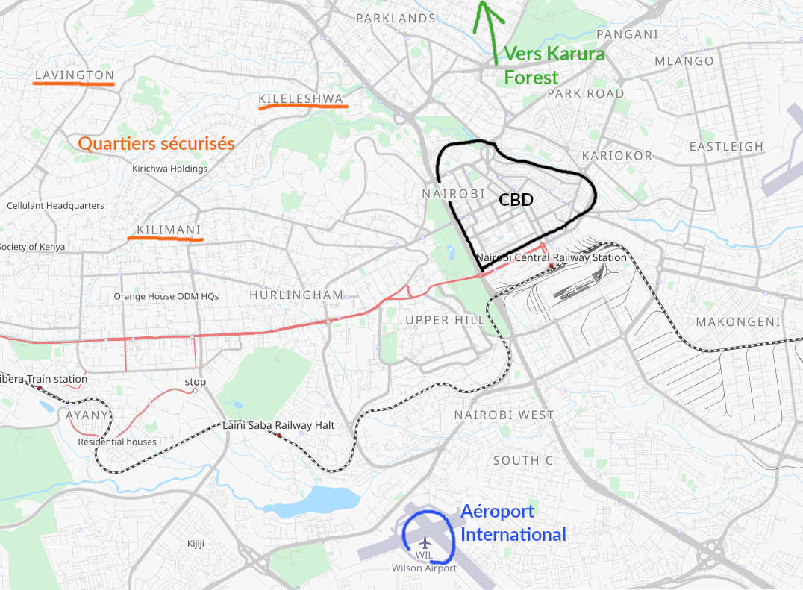
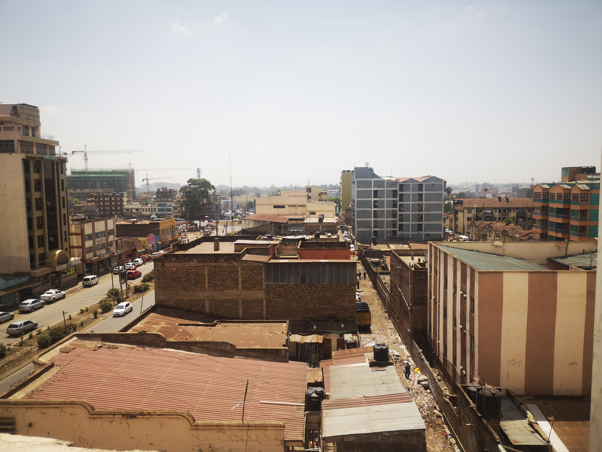

_Si vous prévoyez vous même de partir au Kenya pour y vagabonder ou y vivre, préparez vous un minimum mentalement à la différence des niveaux de vie et surtout, entraînez vous à négocier._

Alan, mon amour, va être assistant de langue française à la Technical University of Kenya (TUK) de novembre à mai, et comme je l'aime, j'ai décidé de le suivre pour cette année dépaysante, qui sera certainement aussi folle et extravagante. Nous partons avec un peu d'avance pour trouver un logement et prendre une première température de la vie locale. Le 10 octobre 2022 dans la nuit, notre avion se pose sur le sol africain à [Nairobi](https://fr.wikipedia.org/wiki/Nairobi).

## Premier face à face avec Nairobi

Arrivée à l'hôtel le 11 octobre à 2h du matin après un long stand up commencé à 22h à l'aéroport. La chambre est plus que spartiate mais j'avoue n'être guère surprise: ~10€ par nuit dans une capitale, le prix est bas. Nous sommes au centre de Nairobi (quartier Central Business District - CBD) à River Road. Ici il ne vaut mieux pas sortir la nuit, le taxi driver nous le confirme et pour une fois cela vaut pour tout le monde, pas seulement pour les personnes à la peau blanche. Des expats rencontrés quelques jours plus tard nous avouerons même n'être jamais allés dans ce quartier en 3 ans.

> _Tips: pour faire le trajet de l'aéroport à votre point de chute à Nairobi vous pouvez: soit tirer de l'argent à l'ATM (gardé par la sécurité) juste devant l'aéroport et prendre un taxi (demandez au préalable le prix moyen de la course à votre hôtel), soit utiliser un bolt / uber grâce à la bonne connexion wifi de l'aéroport (moins cher). Avec bolt, une course de 20 minutes est entre 300 et 400 ksh_

La première nuit est agitée par le bruit ambiant du quartier, le matelas de mauvaise qualité et l'appréhension / excitation qui nous guette. Manque de chance au matin il y a une coupure générale du système d'ouverture / fermeture des portes de l'hôtel (système très présent en Asie: la porte s'ouvre et se ferme grâce à une carte magnétique programmable) qui durera jusqu'au lendemain soir. Il s'agit de faire preuve de philosophie et d'une confiance peu assurée quand le réceptionniste nous assure que nos affaires (notre vie pour 7 mois) seront tout de même en sécurité dans notre chambre pendant notre absence.

Et il dit vrai. Ici la parole semble d'or et, hormis un cafard, personne ne vient fouiller dans nos sacs. **Quoique l'on puisse penser en voyant les chambres en mauvais état, le "restaurant" qui s'avère être une cuisine, la réception délabrée, malgré le bruit incessant du dehors et le confort rudimentaire, je garderai un bon souvenirs de cet endroit: nos premières nuits, notre premier repas - du délicieux pilau rice et petit pois en sauce (toujours notre meilleur repas depuis une semaine) et nos premiers mots en kiswahili avec la cuisinière et d'autres clients.**

Le quartier c'est autre chose. Nairobi s'improvise New Dehli, la comparaison me vient instantanément en tête. Nous sommes constamment sollicité et se frayer un passage sur le trottoir  parmi les vendeurs est difficile. Un peu par hasard il s'avère que j'ai réservé un hôtel dans le quartier le plus bruyant (mais aussi le plus vivant) de la capitale. On nous propose tout et n'importe quoi à chaque pas: acheter des vêtements, faire un safari, une coupe de cheveux... On nous demande de l'argent ou de la nourriture aussi. **Notre couleur de peau est une immense cible sur notre corps où clignote le mot "Argent".**

> _Tips: pour une expérience dépaysante et immersive dans la "vraie" face de Nairobi, il faut faire un tour ou passer une nuit près de River Road. Mais pas la nuit et pas trop longtemps. Pour un long séjour il vaut mieux privilégier d'autres quartiers (Kilimani, Lavington, ...): plus cher mais plus reposant._

En traversant une rue, toujours dans CBD, la vie se calme, un peu. Beaucoup de monde, encore, mais moins pressant. Nous rencontrons Lawrence qui nous indique une boutique Safaricom (notre première quête est d'acheter une carte SIM locale avec Internet) tout en essayant de nous vendre un safari. Il s'improvise notre guide du moment jusqu'à une agence de location qu'il connaît en haut d'un vieux building en face de l'Alliance Française (notre deuxième quête: trouver un logement durable). Difficile de savoir quel intérêt véritable il cache derrière sa gentillesse, uniquement la promesse de faire un safari plus tard en passant par lui? La méfiance reste de mise mais il faut aussi garder l'occasion de croire au "juste intérêt": bien sûr sous le sourire se cache le business, à nous d'éviter l'arnaque et d'entrer dans le "gagnant gagnant". Rendez-vous demain matin 10h avec Emmanuel, de l'agence, pour visiter des appartements.

> _Tips: la première chose à acquérir pour se débrouiller rapidement au Kenya et une carte SIM de Safaricom (meilleure couverture réseau). Il faut aller dans une boutique (officielle) de Safaricom au centre ville, acheter une SIM (besoin uniquement du passeport) et demander à la charger (5 GO = 1000 ksh). Demandez aussi à ce que m-pesa soit activé, cela permet de payer avec son numéro de téléphone et si vous restez longtemps cela s'avère plus que pratique._

Lawrence nous laisse devant la TUK, où Alan sera assistant d'ici une quinzaine, et nous suivons Docteur Teresa Otieno, référente des assistants, qui nous fait la visite. Les étudiants du club de français sont enthousiastes et la rencontre, inattendue, est joyeuse. Nous sommes invités à voir leur adaptation du "Malade Imaginaire" de Molière à l'Alliance Française dans le cadre d'un concours le 13 à 9h. Peut être l'occasion de trouver des pistes pour un emploi pour moi même. Vivre 7 mois en me tournant les pouces n'est pas dans mes projets.

Notre première journée se clôture sur le toit inachevé de l'hôtel, à écouter le bruit de la ville.
Je fais taire cette petite voix en moi qui me demande ce que je fais là.   

## Rounds suivants

Le lendemain, après une nuit agitée malgré des boules quies salvatrices, Lawrence vient nous chercher à l'hôtel avec Emmanuel. Lawrence fait l'intermédiaire avec un taxi, payé bien trop cher avec le recul, que nous aurons pour la matinée. Avec Emmanuel et son sourire sans malice (nous apprenons plus tard que c'est sa mère, Lydia, qui gère l'agence et qu'il est pas encore très doué pour les affaires), Alan et moi, nous montons dans la voiture en lambeau et à l'odeur de gasoil très prononcée. Matinée chou blanc, les appartements ne sont pas dans la fourchette de prix que nous avions demandé. Dans des tours d’ivoire ils ressemblent à des AirBNB pour richards qui me mettent particulièrement mal à l'aise.

L'ambassade, l'université (et internet) nous ont conseillé de nous loger dans les quartiers avec des résidences hautement sécurisés. **J'ai du mal à m'y imaginer, derrière des barbelé au 16ème étage, je me sens plutôt privée de liberté, presque mise en cage pour ma propre sécurité. Et dire qu'a ce moment même nos bagages sont dans une chambre ouverte au 3ème étage d'un hôtel délabré dans le quartier (dit) le plus craignos de Nairobi.** Je en me moque pas de la sécurité, elle est importante mais celle qu'on m'a proposé aujourd'hui dans ce quartier de résidences grillagées me coupe de la ville, de son essence, de la rencontre avec le Kenya et ses habitants. Nous l'expliquons à Emmanuel et à Lydia de retour à l'agence. Ils ont compris que nous n'étions pas les businessmen habituels. Malgré cela nous commençons à comprendre qu'ils comptent nous demander de l'argent pour les visites si nous en sommes satisfaits.

Demain après la représentation du "Malade Imaginaire" nous retenterons notre chance dans un autre quartier, South B, apparemment moins cher et plus populaire.

Jeudi 13 octobre, 3ème jour au Kenya. La représentation est une bouffée d'air frais: des fous rires, le plaisir de la comédie et du théâtre. Un réel plaisir. Les appartements de South B c'est autre chose... À peine dans notre fourchette de prix, ils sont petits, étouffants, des fenêtres où la lumière passe à peine. L'environnement est bruyant et promet des nuits agitées avec l'aéroport tout proche. En 2 jours nous avons vu 10 appartements et dans aucun d'entre eux je n'ai pu voir le reflet d'un séjour paisible à Nairobi. Nous annonçons à Lydia que nous allons prendre la nuit pour réfléchir.

Dernière option - avant d'en trouver des nouvelles - Naïda, une francophone qui quitte Nairobi à la fin du mois et laisse donc son appartement à Kilimani. Tout juste dans notre budget mais non meublé. Nous pourrions lui racheter ses meubles et les revendre en partant. J'étais frileuse à cette idée mais après toutes ses déceptions et le mobilier kitsch à mourir des appartements visités, cela parait être avisé.

Retour aux tours d'ivoire donc? Un peu. Cependant le Kilimani de Naïda est plus arboré et les arbres me charment. Depuis son balcon il y a une magnifique vue sur un parc. L'endroit est lumineux, spacieux et donne envie de se poser. Et Naïda est une rencontre rafraîchissante.

Il va falloir être prêt à payer cher... Mais que vaut le prix du confort pendant 7 mois? La nuit nous le dira. Je suis tiraillée: je veux voir le Kenya, le vrai, pas seulement depuis la fenêtre d'un uber entre ma résidence et un restaurant. Je veux pouvoir aussi me sentir bien, dormir confortablement, avoir le confort qui me permettra d'avoir l'envie et l'énergie de vivre pleinement les journées ici. **J'ai de la chance et le privilège d'avoir le choix, de pouvoir choisir le confort. Et je n'ai pas assez de force pour m'en passer. Pas pour 7 mois, pas aujourd'hui.**

## Repos de fin de semaine

Pour le 4ème jour, le besoin de nous ressourcer a mené nos pas jusqu'à Karura Forest, une étendue d'arbres assez grande pour enchaîner 10 km avec de l'air frais et de l'espace. **Voir loin, voir des arbres, entendre des oiseaux, le bruit de l'eau m'a fait beaucoup de bien. Nous oublions vite ses petits plaisirs et ils nous paraissent immenses lorsque nous en sommes privés.** C'était la dose d’apaisement qu'il me fallait pour avancer dans mon acclimatation / adaptation et pour éclaircir mon esprit après 3 jour dans le brouhaha de la ville, l'air de pot d'échappement et les trottoirs bondés.

> _Tips: Toutes les informations sur Karura sont disponible en ligne: [https://www.friendsofkarura.org/](https://www.friendsofkarura.org/). L'entrée est de 600 ksh pour les étrangers._

Nous avons dit "oui" pour l'appartement de Naïda et le fait de reprendre ses meubles, nous attendons maintenant un retour du propriétaire. Nous attendons surtout avec espérance une conclusion positive et définitive à la quête appartement qui nous permettra de se pencher plus sereinement sur la suite. J'ai hâte de pouvoir poser définitivement mon énorme sac et d'en prendre un plus petit pour commencer à vagabonder dans le pays.

Samedi, nous zonons à l'hôtel toute la journée, marre des interactions. Lydia nous demande de l'argent pour les visites maintenant qu'elle sait que nous traiterons pas avec elle et qu'elle ne sera donc pas payée par les propriétaires (nos contacts kenyans nous ont expliqué le processus et précisé qu'il n'était pas légal ici de faire payer pour voir s'il n'y avait pas d'accord ensuite). Je comprends sa manœuvre même si le fait qu'elle cherche à nous rouler me crispe. **Everything is about business here.**

> _Tips: contrairement aux pays occidentaux tout se monnaye et se marchande (le fameux bargain). Il faut se préparer mentalement à négocier pour ne pas se faire rouler dans la farine que se soit pour acheter des bananes ou pour partir en safari. Et si quelqu'un veut vous aider, soyez conscient qu'il y aura toujours une part d’intérêt, à vous de faire en sorte qu'elle soit juste. (Ou alors refusez)._  

Exercices de yoga et respiration pour lâcher le stress, voir ma chance, trouver ma force.

Pour le dernier jour de la semaine nous rejoignons des français sur place depuis 2 ans pour aller manger dans un petit marché local (et protégé) de Kilimani. Quasiment que des expats mais d'excellents raviolis chinois et du jus de canne à sucre succulent. **Il faut faire la part des choses et l'accepter dès maintenant, je suis et je resterai une étrangère blanche et le confort, la sécurité me pousserons toujours dans des endroits comme celui là. Pas déplaisant mais sans âme à mes yeux. Je me dois d'en rester consciente et apprendre le plus possible pour casser ce mur.** Je profite du copain kenyan, Sakwa, d'une de nos concitoyennes, Maria, pour apprendre des nouveaux mots et prendre des marques au niveau des prix. Une déception lorsqu'il me dit avoir payé 100 ksh le jus qu'on a voulu me vendre à 250 et que j'ai négocié à 200. **Il me faut apprendre le vrai prix des choses et apprendre le kiswahili, pour peut être en apprendre plus du vrai visage du Kenya.**

**Une banane = 10-15 ksh** | **Une pomme = 30-50 ksh** | _Le 17 octobre 2022, 1€ = 119 ksh_

La suite: [Un premier mois au Kenya](https://lolejeun.github.io/p/un-premier-mois-au-kenya/)
