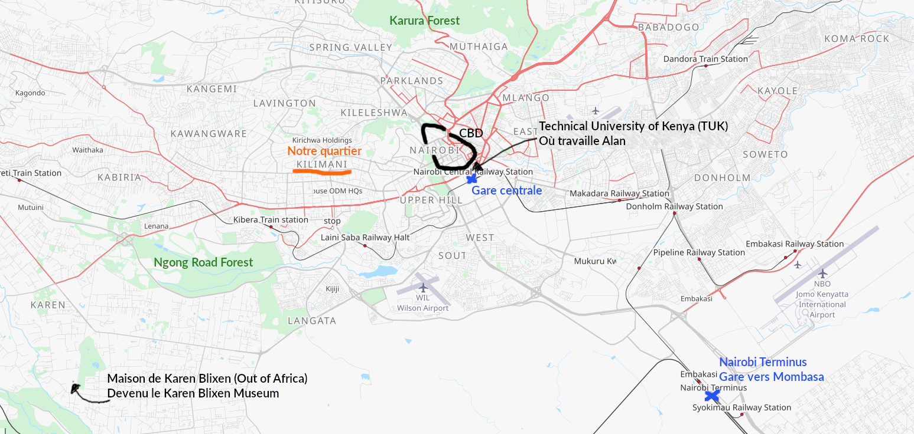

_Encore en adaptation et en recherche de repaires. Out of Africa est un très beau film, d'un autre temps, qui fait rêver mais n'apprend rien du Kenya d'aujourd'hui. Hormis pourquoi un des quartiers de Nairobi s'appelle Karen._

Previously: [une première semaine au Kenya](https://lolejeun.github.io/p/une-premi%C3%A8re-semaine-au-kenya/)

Nous avons arrêté de répondre à Lawrence, c'est lui qui nous a mis en contact avec le taxi bien trop cher, Lydia et Emmanuel. Pas envie de me prendre la tête à chercher où est l'arnaque dans ce qu'il nous propose. Move on.

Fin de la quête "trouver un appartement": la rencontre avec le propriétaire de Naïda c'est bien passée et nous emménagerons le 31 octobre. J'ai hâte. Nos gros sacs sont déjà au chaud dans l'appartement et cela va nous permettre de bouger plus rapidement. Demain, le 20 octobre, nous prendrons le train pour Mombasa et l'océan indien. Diani Beach, la plus belle plage du Kenya d'après Le Petit Futé. Let's see.

Les jours ont passé semblables aux autres depuis notre première semaine. **Nous nous sommes quelque peu habitués aux bruits et aux vapeurs. Au bout de 10 jours on oublie la gorge irritée par la pollution, on laisse glisser plus facilement les regards sur nous dans la rue et on en oublierait presque la misère. Mais on oublie pas, ou alors il faudrait emmurer notre cœur. Comme à Paris et partout ailleurs. Et non, la misère n'est pas plus belle au soleil.** Aujourd'hui dans le centre ville une petite fille de 5 ans à peine, puis un petit garçon nous on suivi en demandant de l'argent et plus loin, une dame rongée par la maladie est restée avec nous sur plus de 500 mètres à nous quémander.

**Ce n'est pas un discours dans le métro, une pancarte brandie, c'est quelqu'un qui te suit entre les étals de fruits et les breloques sur le trottoir: "Boss, savior, mama, Help me savior". Je souhaiterais ne pas voir, ne pas entendre. Je souhaiterais que cela n'existe pas.** Certainement pour ça aussi que très peu d'expats viennent dans le centre ville, je comprends. Je n'ai pas les mots pour l'instant, je sais juste qu'il faut voir, qu'il ne faut pas nier et certainement qu'il en va de notre responsabilité à tous de reconnaître nos frères et sœurs qui souffrent sur Terre. Pourtant je n'ai rien fait: peur de donner et de me faire entourer en quelques secondes par d'autres. Je ne sais pas ce qui aurait été "bien". Je me contente de ne pas oublier et mesurer ma chance à chaque fois que je croise un corps endormi allongé dans la poussière du trottoir...

## Trajet de Nairobi à Diani

Le 21 octobre, réveil sous d'autres bruits: coq, âne, pluie sur le toit de palme. Ici l'atmosphère n'est pas la même. L'air est beaucoup plus humide, notre peau est un peu moite. En vérité cela me convient bien mieux, je n'ai plus les yeux qui piquent. Hier a été une longue journée de trajet. Je ne savais pas qu'il y avait 2 gares à Nairobi: la gare centrale près du centre ville et celle dédiée au trajet Nairobi-Mombasa près de l'aéroport. Nous nous présentons donc 1 heure en avance - heureusement - mais à la mauvaise gare. Un agent de sécurité nous explique notre erreur et nous indique un matatu qui part dans l'instant à Nairobi Terminus.

> _Tips: Le billet de train entre Nairobi et Mombasa coûte 1000 ksh (3000 pour la première classe), il est possible d'acheter en ligne via m-pesa sur le site de la compagnie. Pleins d'infos utiles pour le trajet en train: [https://livinginnairobi.com/sgr-train-nairobi-to-mombasa/](https://livinginnairobi.com/sgr-train-nairobi-to-mombasa/)_

> _Tips: Prix d'un matatu entre la gare centrale et Nairobi Terminus environ 300 ksh. Un matatu c'est une sorte de petit bus navette qui fait un trajet plus ou moins précis, s'arrête selon les besoins et se met en route uniquement lorsqu'il est plein._

Nous voilà donc, serrés, à 9 dans un minibus de 8 à filer à toute allure à travers les bouchons. Au moins ma confusion nous aura donné l'occasion de s'essayer une première fois aux matatus et à leur conduite dynamique.

La gare ressemble en tout point à une gare de Chine (le drapeau Chinois au côté de celui du Kenya dans chaque wagon accentue mes dires): multiples portiques de sécurité, fouille et douane, contrôle des passeports, fermeture des accès au train 15 minutes avant le départ.

5 heures de train sur un fauteuil dur, quelques gazelles au loin en traversant le parc de Nairobi, des steppes, des hameaux, beaucoup de troupeaux de chèvres.

Arrivés à Mombasa Terminus au Nord de la ville, nous prenons un autre matatu direction Diani à 50 km. Traversée de Mombasa, attente du ferry, de nombreux stops sur la route qui devient de plus en plus chaotique. Les heures passent. À 23h30 nous arrivons à "Bahati" et le propriétaire Youssef, nous montre notre logis. Nous avions réservé une tente équipée mais Youssef nous dit qu'il fait trop chaud et nous donne un bungalow à la place. Nous finissons notre soirée bien entamée à discuter avec lui - qui parle un peu français - et ses employés: des rires francs, une douce détente et du reggae dans la tête.

> _Tips: Prix d'un matatu entre Mombasa Terminus et Diani environ 600 ksh_

## Bahati, une enclave de sérénité à Diani

Après les premiers bruits donc, c'est la lumière du matin qui nous permet de savourer la paix des lieux. De la verdure partout: palmiers, bananiers, papayers; le bleu d'une petite piscine au milieu de tout ce vert. Nous avons hâte de voir l'océan mais la pluie nous retient, nous oblige au repos.

 

 

La côte et son calme - du moins le calme de Bahati - nous font énormément de bien. Les chemins de terre qui mènent à l'océan sont bordés de fleurs. L'océan est calme, le sable blanc et la plage immense parsemée de quelques algues. C'est agréable de se baigner et de marcher le long de la plage. Je pense que durant nos trois jours ici nous ne feront pas grand chose d'autre et c'est bien.

 

À Bahati nous rencontrons aussi Momo qui nous emmène voir un petit match de foot dans le village. Avec un de ses amis il entraîne une des équipes d'enfants. Il nous demande si on pourra revenir avec une balle neuve la prochaine fois pour remplacer l'actuelle en piteux état. Nous nous promenons ensuite avec lui et Ernest, un autre coach, à travers les villages alentours. Ils nous font goûter le vin puis l'eau de coco. La promenade est paisible. Les enfants que nous croisons (nous sommes dimanche) nous demandent des bonbons. Souvent les européens, les "Muzungu" donnent des petits cadeaux et maintenant les enfants en réclament à chaque passage. Momo nous explique que l'école est gratuite sans l'être: il faut payer les livres, les uniformes et donner de l'argent aux professeurs qui ne sont pas assez nombreux pour surmonter seuls la charge de l'enseignement. Nous passons le reste de l'après-midi à Bahati avec Youssef et sa sœur à jouer aux dames chinoises en écoutant du reggae. La vie est douce.

Pour notre dernier jour sur la côte il fait grand soleil et nous goûtons pleinement la chaleur de l'Est du Kenya. Lors de notre dernière soirée à Bahati nous apprenons à Youssef et son neveu à jouer à la Crapette. J'ai hâte aussi de jouer à des jeux kényans mais il n'y en a pas ici.  

Sur le trajet du retour nous apercevons au loin nos premiers éléphants et nos premières girafes.

## Retour à Nairobi

Dernière semaine dans un hôtel bruyant du centre: 7 jours d'attente longue et pesante. Des passages à l'université et à l'ambassade pour Alan, pour moi un premier cours de soutien en mathématiques à un élève de seconde. Et enfin le 31 octobre, nous entrons dans notre appartement. Je suis vraiment heureuse d'en finir avec les nuits à CBD et de trouver le calme à Kilimani. Naïda nous laisse ses meubles jusqu'en janvier, pas besoin donc de se presser pour trouver un frigo et un lit.

Malgré le calme de cette première nuit mon sommeil est agité. De questions et des doutes se bousculent dans ma tête. Qu'est ce que je vais bien pouvoir faire ici? J'ai besoin de trouver un place qui me conforte dans cet ville qui souvent me rebute. Je craque un peu au plus noir de la nuit, assaillie par un malheureux moustique qui fini en charpie sur un mur. **On a beau se répéter "ça va aller, relativise" de temps en temps ça ne va pas. Alors on se dit "du repos et ça ira mieux" et on essaye vraiment d'y croire. La volonté et l'envie prennent des places importantes, il faut les trouver et les garder.**  

Nous avons été mis en contact avec des personnes sur place prêtes à nous faire visiter leur monde, notamment les bars et les clubs de Nairobi, le monde de la nuit kényan que nous n'avions pas encore eu l'occasion de goûter. Sortir autour d'un verre de bière, écouter de la musique, discuter avec de nouvelles personnes, tant de choses que je fais naturellement en France et qui, je crois, me manquaient ici.

C'est surtout l'insécurité qui me pèse, même se balader dans la rue dans notre quartier est déconseillé. Hier un uber nous a encore dit de faire attention, qu'il y avait beaucoup de vol à l'arrachée en ce moment: une moto qui vous frôle et le passager arrache votre téléphone; ou encore menace à l'arme blanche quand il n'y a pas trop de monde dans la rue. Déjà en un mois tant d'histoires d'agression nous on été racontées. Cela donne envie de rester continuellement chez soi, dans une résidence sécurisée et de ne sortir que pour faire le trajet jusqu'au travail. **L'angoisse n'est jamais loin et il est difficile de ne pas y céder. Difficile de ne pas faire le choix de la peur, de choisir de ne pas avoir peur, continuer à vivre, à sortir, à marcher.** Ne pas laisser gagner la paranoïa.

Cette semaine un homme s'est fait descendre dans la rue, tué parce qu'il avait essayé de voler un téléphone. Nous l'avons appris via un groupe WhatsApp de français, l'information est aussi sur Twitter relayée par une chaîne d'information kényane. Dans les commentaires les gens se félicitent de cette justice immédiate et irréversible, ils en ont marre des vols, cela entache leur ville et leur quotidien. Et cet homme mort, comme m'explique un chauffeur, a certainement essayé de voler parce qu'il n'a pas assez pour se nourrir, se loger. Pas de travail, trop de taxes, trop de corruption me dit t-il: **"certains pense ne plus avoir le choix." Et peut être ne l'ont-ils pas.**
Quoiqu'il en soit l'atmosphère est pesante.

## Début du "travail"

Mardi 1er novembre, premier jour de travail pour Alan qui se transforme en administratif. Le visa tourisme que nous avons pris, normalement de 3 mois ne dure finalement qu'1 mois. Apparemment 1 mois suffit pour le tourisme au Kenya alors malgré ce qui est écrit sur internet et dans les guides, à l'aéroport l'agent de l'immigration marque automatiquement (en illisible et tout petit) 1 mois sur le passeport. Dans 10 jours donc nous seront en situation irrégulière. Heureusement le chargé administratif de l'université est efficace et cette affaire rapidement close. Alan signe même son contrat de travail le 2 novembre, 1 jour seulement après sa prise de poste ce qui est pas si mal. Cependant il n'a toujours pas d'emploi du temps, ni de visa de travail. Les informations arrivent au compte goûte. Pas par mauvaise volonté mais par manque d'organisation.

Pour nous qui ne connaissons pas le système en place, l'accueil de l'université nous a paru léger mais je pense sincèrement que les personnes concernées font de leur mieux. Il manque un process clair et une compréhension de nos attentes. En mangeant avec Teresa, la Directrice du département de langue et le contact privilégié d'Alan, nous abordons ce sujet. L'idée de faire un petit guide pour aider les futurs assistants de langue est mise sur la table et adoptée.

Alan commence donc doucement à prendre ses marques à l'université, assiste et intervient à un premier cours de français avec des premières années. Sa binôme, Aude, vient également d'arriver au Kenya. Encore un peu de temps et la routine devrait pouvoir se lancer. Restera encore les démarches administratives pour le permis de travail et surtout obtenir un emploi du temps à peu près défini.

Moi je me cherche encore ici. Je commence à réviser la mécanique pour l'agrégation. Je fais du yoga aussi. La vie engendre des coûts et je n'arrive pas à me sortir de la tête l'idée que je dilapide mon argent dans une ville qui ne me plaît pas. Et pourtant je ne veux pas me retrouver enchaîner à un 35h et passer à côté de ma vie ici. Je ne veux pas non plus travailler à tout prix pour des miettes. **Il faut que je sorte de ce schéma. J'ai du temps pour moi, il me faut l'apprécier et quitter ma culpabilité.** Pour le moment je donne 1h de cours de maths par semaine, quelque chose qui me plaît et à un prix correct. Si je peux trouver plus, tant mieux et sinon tant pis. Je me prends la tête alors qu'en réalité je crois avoir déjà fait mon choix.

L'attente active et la sérénité payent car finalement, le mercredi 9 novembre, j'ai un entretien au lycée français où l'on me propose de faire du soutien en mathématiques de la 6ème à la terminale, environ 5h par semaine avec un taux horaire intéressant. Quel doux apaisement d'avoir trouvé une source de revenu fiable - comme quoi l'argent est toujours le nerf de la "guerre", du moins la porte vers une sécurité appréciable - et qui me laisse aussi le temps de réviser l'agrég, pratiquer mon yoga et visiter le Kenya.

**Aujourd'hui, 11 novembre, cela fait un mois que nous sommes arrivés au Kenya. Je me sens plus forte et plus assurée qu'il y a encore quelques semaines, avec l'envie et l'énergie de jeter un regard nouveau sur le Kenya, de l'arpenter et le découvrir plus encore. La méfiance traîne sur mon épaule mais il y a du soleil, j'écoute la reprise de [Cascada par Lorenzo](https://open.spotify.com/track/0RAeV4QzrdHzsn4R0Pdgcp?si=f7ac6d0d072948bc) et je me dis que la vie est belle.**

Le weekend des sorties en forêt, en semaine le travail et des cours de danse africaine, un équilibre à trouver comme toujours, comme partout.

