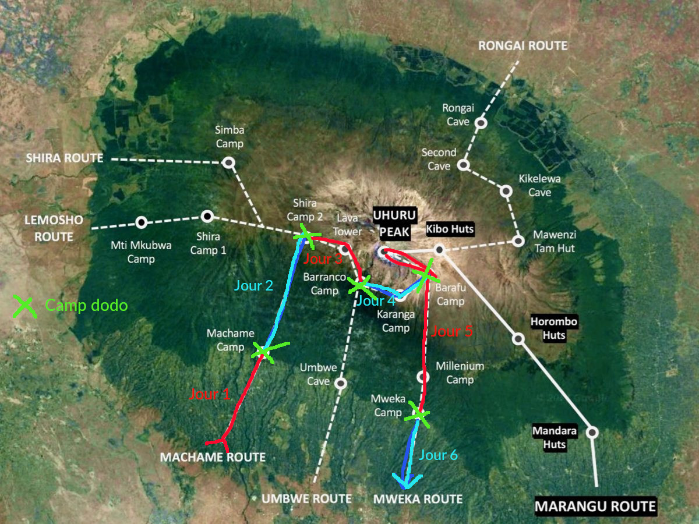
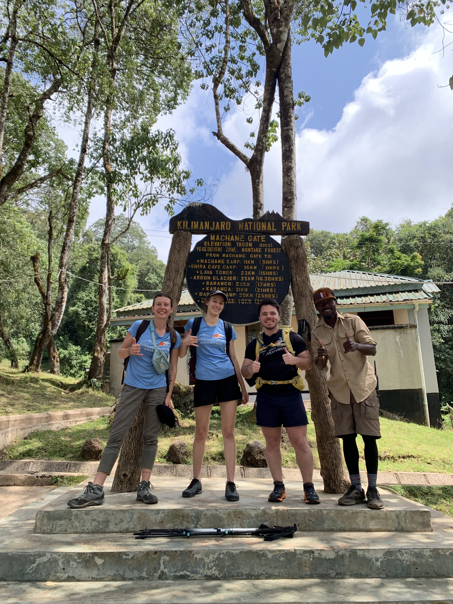
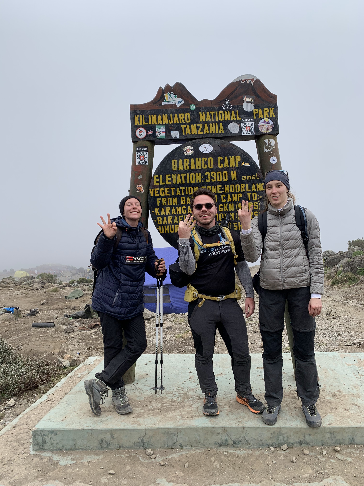
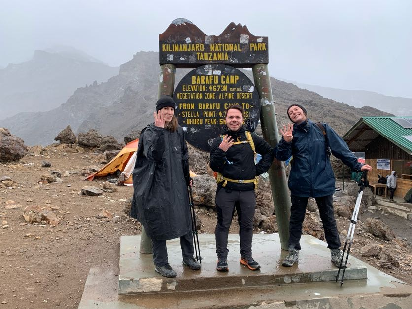
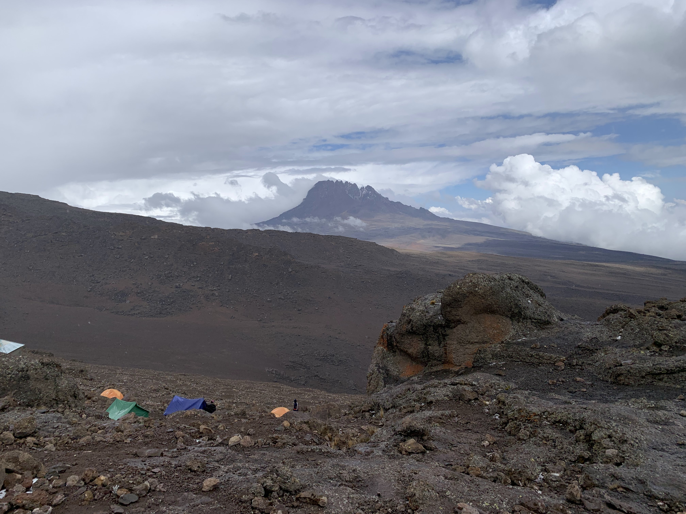
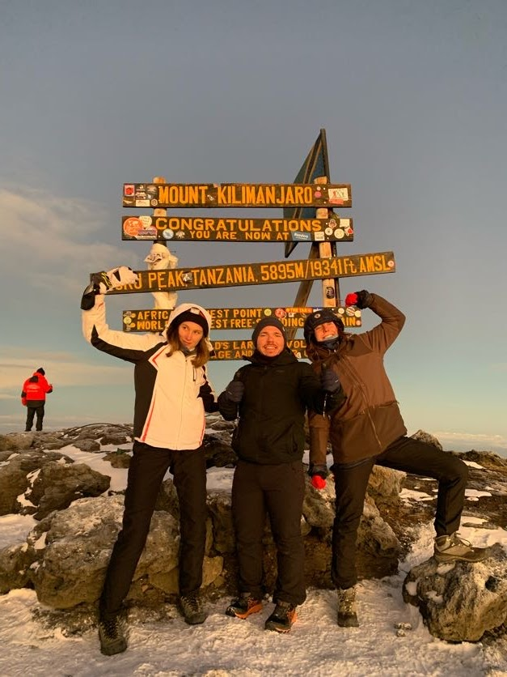
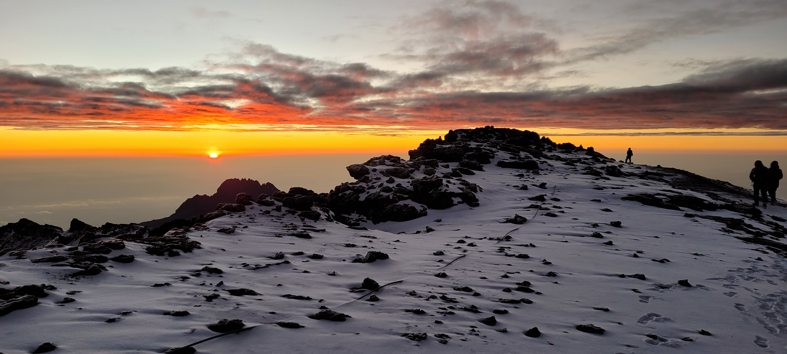
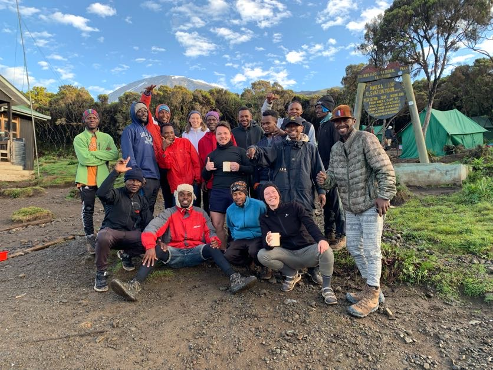

> _"Le voyage avant la destination" (Brandon Sanderson et tant d'autres dans la même verve de pensée)_

Pendant mon séjour au Kenya j'ai la chance d'accueillir deux potos venus me rendre visite: Jo et Henri. En décembre dernier, je crois, Jo m'appelle pour me dire qu'avec Henri, ils prévoient de faire le Kilimandjaro avant de se balader au Kenya. Est ce que je suis disponible et intéressée? Bien sûr! Et me voilà donc à bord de cette expédition.

## J-1, Nairobi -> Moshi (Tanzanie)

Départ de Nairobi en navette avec Henri et Jo le dimanche matin, le lendemain de leur arrivée de nuit sur le sol africain. Le paysage kényan défile à la fenêtre. La fraîcheur du matin laisse place à une chaleur pesante. De temps en temps nous ouvrons les fenêtres pour avoir une légère brise mais l'air est plein de poussière. Au Kenya cela fait un mois qu'il n'a pas plu. Il est difficile d'imaginer que dans 4-5 jours nous aurons froid, que nous verrons de la neige sur la plus haute montagne d'Afrique.

Notre navette passe la frontière tanzanienne. Nous sortons pour la vérification des visas et la fouille des bagages. Sur le parking où nous attendons, le soleil cogne. Henri se fait ses premiers coups de soleil. Des dames masais essayent avec insistance de nous vendre des bracelets. Nous mettons enfin de la crème solaire. Encore une fois, le froid paraît inenvisageable, si loin. Je me demande ce que j'en penserai bientôt.

Ce sont maintenant les paysages tanzaniens qui défilent: le mont Meru un peu perdu dans la brume, la ville d'Ashura et enfin au loin le [Kilimandjaro](https://fr.wikipedia.org/wiki/Kilimandjaro). La base plutôt. Le sommet est totalement perdu dans les nuages, les neiges éternelles sont hors de vue. Difficile de s'imaginer en haut de cette montagne que je ne vois même pas. Difficile tout court de s'imaginer que demain l'ascension commence. Mon cerveau ne connecte pas. Trop de temps en suspens depuis mon arrivée en Afrique. Sûrement.

Mes camarades se réveillent pour zyeuter eux aussi les brumes et tenter dans voir un peu plus. Il s’avéra que nous n'aurons pas une seule image nette du Kili avant le début de l'aventure. La première sera un cadeau pour notre journée de demain.

Une fois à l'hôtel nous rencontrons Rama, notre guide de l'ascension. Il nous parle de la montagne comme on raconte une histoire: Kilimandjaro, la montagne qui produit de l'eau ou la montagne qui est blanche, ses trois pics
- Shira ("sweet" en Swahili) qui était le plus haut il y a longtemps et qui s'est désagrégé dans une éruption. On ne sait pas exactement quelle était sa taille.
- Mawenzi, la "petite" pointe à l'est.
- Kibo ("wahou" en Swahili) où l'on trouve le point le plus haut Uhuru Peak (5895m, "liberté" en swahili) et là où on devrait se trouver dans 6 jours.

Durant notre marche nous aborderons quatre type de paysage/ végétation:
- "Raining forest" de 2000m à 3200m: beaucoup de végétations, très humide.
- "Moorland zone" de 3200m à 4000m: quelques arbres, des buisson, un air frais et du gel le matin.
- "Alpine desert" de 4000m à 4900m: grosses variations de températures (négatives le matin jusqu'à potentiellement 35°C dans l'après midi), quelques lichens, majoritairement des cailloux.
- "Summit" de 4900m à 5900m: rocks et neige, le taux d'oxygène est quasiment diminué de moitié par rapport au niveau de la mer.

Il nous détaille ensuite les étapes de nos 6 prochains jours de voyage (Nous montrons par Machame Road et redescendrons par Mweka Road qui sert de voie de sortie pour quasiment toutes les expéditions), tout paraît encore lointain mais il nous assure que ce sera bientôt plus tangible: "Quand tu écoutes tu oublies, quand tu vois tu apprends, quand tu fais tu comprends".

Vérification des sacs avec Rama, dernière douche et nuit dans des draps doux, demain est un autre jour.

> - Trajet Nairobi - Moshi de 7h30 à 17h avec [Riverside Shuttle](https://www.riverside-shuttle.com/) 33$
> - Visa pour la Tanzanie indispensable à la frontière avec vaccin covid et fièvre jaune : [evisa](https://eservices.immigration.go.tz/visa/)
> - Pas besoin de refaire un visa pour re-rentrer au Kenya si vous avez un visa tourisme (même single entry) et que vous sortez du pays par la route (bus, navette, voiture).
> - Agence pour le Kilimandjaro: [Kilimandjaro Heroes Agence](https://kilimanjaroheroes.com/) prix moyen pour les 6 jours par machame road 1700$
> - Indispensable pour le Kili: des bâtons de marche (pour moi c'était vraiment la révélation), des vêtements bien chauds, ses jambes et un mental positif.

## Premier jour, 11km, Machame Gate (1800m) -> Machame Camp (2835m)

Nous commençons notre marche à 11h30 après la pesée de nos bagages, un bon petit déjeuner à l’hôtel et 45 minutes de route de Moshi à Machame Gate. Nous marchons avec Ehmed (notre second guide). Rama est resté avec le reste de l'équipe: le cuistot et 11 porteurs (oui oui) pour superviser le départ. Les porteurs portent nos tentes, celle de l'équipe, nos affaires et de la nourriture pour tout le monde pour 6 jours. Ils portent maximum 20kg, les rangers à l'entrée du parc vérifient les charges.

Dès le début nous attaquons la montée, sur une pente douce pour le moment. Nous marchons dans la "raining forest", forêt tropicale aux grands arbres peuplés de lianes et de mousses. Il fait doux et il ne pleut pas. Henri manque d'écraser un caméléon qui arpente d'un rythme lent le sentier. Des singes noirs et blancs secouent les arbres par leurs bonds rapides de cime en cime. La forêt est magnifique.  

Nous arrivons au camp à 16h30. Nos tentes (une pour moi et une autre pour Jo et Henri) et celles de l'équipe sont déjà montées. Petit goûter, une bassin d'eau chaude pour nous laver sommairement: le grand luxe pour de la rando de montagne.

Le trajet a été ponctué de courtes pauses pour se sustenter et prendre des photos, rien de difficile aujourd'hui. Je suis heureuse de cette première journée, belle et plaisante. Le rythme de marche était agréable et la pente, abordée lentement, ne demandait pas d'efforts conséquents. Les pieds sont légèrement douloureux, il faut se faire la main.

Le soleil se couche, le froid monte tout léger pour cette première soirée. Des belles lumières orangées se reflètent sur les montagnes. Un bon repas chaud sous notre tente "salle à manger", quelques parties de cartes (les seules du voyage) et un bon dodo.

## Deuxième jour, 5km, Machame Camp (2835m) -> Shira Cave Camp (3750m)

Le réveil est doux, vers 6h30, avec un thé au gingembre ramené dans la tente par Mohamed Ali (le serveur de notre expédition avec le sourire facile). La nuit a été reposante, je n'ai pas eu froid, presque chaud. Après un petit déjeuner copieux, nous commençons à marcher à 8h30. Le rythme est très doux et agréable une fois encore. Nous montons dans un paysage de garrigue encerclé de nuages. De tant en tant, un coin de ciel bleu pointe le bout de son nez accompagné par le soleil. Le mont Meru disparaît et réapparaît à une vitesse folle. Avec l'effort et le soleil pas loin, il fait bon et nous sommes une fois encore en T-shirt.

Ce matin nous avons pris notre première pilule (Diamox) contre le mal d'altitude, de manière préventive. Elle permettra de booster notre captation d'oxygène et d'évacuer plus facilement les toxines. Effet secondaire: envie fréquente d'aller aux toilettes. Henri détient le record de la journée avec au moins une trentaine de pauses pour "send an email" (pour la grosse commission, le mot de passe est "send a fax").

L'ambiance est au beau fixe avec Rama et son enceinte. Nous chantons sur Aya et Ramenez la coupe à la maison, et bougeons sur les hits tanzaniens. Je suis heureuse et enthousiasme, les amis aussi.

L'arrivée sur le camp se fait à 12h45 après 4h15 de marche. J'ai une faim de loup et je me sens super bien. Maintenant repos.

Après un repas copieux, la fatigue tombe doucement entre le soleil et le vent. Lessive dans notre petite bassine d'eau, lecture ou petite sieste jusqu'à 16h30 où nous allons faire une mini marche pour profiter du paysage. Le soleil couchant s'annonçait magnifique mais une mer de nuages masque la vue. Très beau tout de même.

Jo retrouve même la chaussette perdue de Henri, supposée emportée par le vent ou les corbeaux.

Nous allons sous la tente de notre team pour apprendre les techniques de cuisine de Mayo, le chef cuisto, et nous finissons par faire des jeux et répéter des mots en swahili sous l'hilarité des porteurs. Dont "Jamba" ("pet", oui il nous en faut peu pour rigoler) proche de "Jambo" qui veut dire "bonjour".

Nous profitons d'un bon diner sous notre tente pendant que le vent souffle. La nuit est douce encore une fois dans la chaleur de nos duvets mais le vent est tellement puissant que j'ai l'impression qu'il se glisse dans ma tente. Il faut trouver le sommeil, demain, un autre jour.

## Troisième jour, 10 km, Shira Cave Camp (3750m) -> Baranco Camp (3900m)

Première fois au dessus de 4000 mètres aujourd'hui. Après un bon petit déjeuner, nous partons vers Lava Tower, un énorme bloc de lave refroidie situé à 4600m. Nous y déjeunons avant de redescendre à 3900 pour la nuit. C'est la technique du "walk high, sleep low" pour limiter le mal des montagnes et s'acclimater en douceur. Nous gravissons doucement la pente en 4h sans difficulté respiratoire ni nausée. De nombreuses pauses pipi pour Jo et Henri liées au Diamox. J'y échappe curieusement. Peut être les médicaments achetés à Nairobi sont de la camelote, ou je me suis déjà faite à l'altitude africaine.

En arrivant à Lava Tower, l'altitude ne nous a pas fait perdre l'appétit et nous mangeons comme des ogres. La descente, estimée en 2h, est avalée plus rapidement même si elle est un peu douloureuse pour moi: l'arrière de mon genou gauche tire sur les flexions - extensions de trop grande amplitude. Le paysage perdu dans les brumes est encore une fois magnifique.

Une fois encore, en arrivant au camp nos tentes nous attendent. Une brume épaisse entoure la montagne entière et je suis contente d'être à l'abri quand l'averse commence. Moins quand je découvre la petite rivière sous mon matelas... Une légère accalmie et Ehmed et Mohamed Ali creusent d'efficaces tranchées autour de ma tente à l'aide d'un bâton. L'averse suivante n'empire pas les dégâts et Ehmed me prête un matelas gonflable pour m'isoler du sol mouillé. J'appréhende cette nuit mais je garde un esprit positif. Jo et Henri ont échappé à la rivière mais leur double toit colle faute de tendeur. Avec des bâtons de marche ils arrivent à la garder décollée et éviter que l'humidité s'infiltre.

Au fur et à mesure que l'obscurité ce fait, le ciel se dégage et avec lui, le risque de pluie. Ce fut cependant la nuit la plus éprouvante pour moi jusqu'alors. Je me réveillai plusieurs fois avec un début de froid à cause de l'humidité infiltrée lors des averses. À 4h30 je me tenais réveillée pour de bon pour constater que mon duvet extérieur (oui, 2 duvets couche sur couche c'est pas mal pour dormir au chaud en montagne) était carrément mouillé. Ma tente me gouttait dessus depuis le début de la nuit... autant commencer à se préparer et s'activer lentement à tout et rien (par exemple brosser ses cheveux gras pendant un quart d'heure) pour conserver la chaleur. Aujourd'hui sera une longue journée.

## Quatrième jour, 10km, Baranco Camp (3900m) -> Barafu Camp (4673m)

Le début de la journée est très agréable: un mur à "grimper" avec la fameuse kissing rock (une pierre qu'il faut enlacer à presque l'embrasser pour pouvoir passer). Un poil d'escalade nous met tous les trois en joie. En haut nous arrivons dans le désert montagneux inondé par le soleil. Nous prenons de belles photos de Kibo.

La brume apparaît avant que nous arrivions à Karanga où a lieu notre pause repas, en tente et au chaud, du luxe encore. Sur ce début d'après midi, le brouillard est toujours présent et se change en grêle sur notre dernière heure de marche. Heureusement les vêtements de pluie font l'affaire. Ehmed sort un petit parapluie rose pour se protéger ce qui à le mérite de me faire rigoler.

Avec un départ à 7h30 nous arrivons à 15h30 à Barafu, notre camp de base pour l'ascension de cette nuit. Nous avons du temps pour nous reposer et faire la sieste avant de repartir marcher à minuit accompagnés de Rama et Ehmed. Le soleil se couche et le froid est mordant. Cette nuit, un pas après l'autre, une respiration à la fois et des belles pensées plein la tête. Comme l'a dit Rama, félicitons nous que la montagne nous ait déjà permis d'aller jusque là.

## Cinquième jour, 17.5km, Barafu Camp (4673m) -> Uhuru Peak (5895m) -> Mweka Camp (3100m)

Nous allons bientôt commencer à monter. Il est 11h du soir, Mohamed Ali n'est pas encore venu me réveiller mais je n'arrive plus à dormir. Je prend donc ce temps pour écrire mes impressions avant de me lancer dans vers le point culminant de notre voyage.

Je suis un peu comme une enfant la veille de la rentrée: dans l’excitation et l’appréhension. Même si je n'arrive pas en haut, je serai fière de moi parce que j'aurais fait mon maximum et avec joie. Oui, ce que je retiens de ce voyage c'est la joie. Je crois que ce qui nous a le plus aidé, outre notre super équipe, ce sont nos moments de rire et avec ça l'envie et le bonheur. Lorsque quelque chose n'allait pas: le froid, la nuit, des maux de tête, un peu mon genou ... , nous nous le disions mais sans s'appesantir, sans en faire tout un plat. Se confier, comme pour que ça parte mieux et rigoler ensuite à une blague sur le caca.

Avant de partir je n'ai pas de doute que cette aventure va se terminer comme elle a commencé dans les rires, la joie, les chants. Il est minuit, il faut sortir de la tente, de son duvet et se préparer à marcher.

...

On l'a fait! on y est arrivé! 6 longues heures de marche (5h30 précisément) jusqu'au point le plus haut du Kilimandjaro, d'Afrique, Uhuru Peak à 5895m. Et le lever du soleil sur la montagne... Je n'ai pas pu m'empêcher de verser des larmes d'émotions: tant de beauté, d'efforts, de force, de joie. C'est seulement au début de la descente que je réalise que je suis en haut, les étoiles dans les yeux. Enfin, les étoiles c'était plutôt il y a quelques heures: à minuit et demi au début de l'ascension.

Petit retour en arrière sur cette nuit de marche:

Debout au dehors avec un thé chaud, j’attends Henri et Jo en contemplant le ciel. Sa splendeur conne de l'énergie. Jo verra même une étoile filante. Le début de l'ascension est pentu mais il ne fait pas encore froid. Puis, petit à petit, la neige apparaît et s'accroche à nos chaussures. Nos pieds commencent à devenir froid malgré la marche. Pour moi, les mains ça va mais pour Jo c'est mister freeeze au point d'abandonner l'idée de marcher avec les bâtons de marche. Bâtons qui ont été une découverte et une bénédiction pour moi tout au long du trajet. Henri, no need, il aura emprunté (et surtout porté) des bâtons depuis Moshi pour rien.

Nous avons un très bon rythme (pour des gens marchant à 5000m) et nous doublons quantité de groupes partis avant nous. Petit plaisir pour l'ego et le moral, et aussi pour notre chaleur corporelle qui reste plutôt constante grâce à l'effort. Nous ne faisons presque pas de pauses afin de ne pas s'endormir ou refroidir.

 

Après 5h de marche nous atteignons Stella Point. Le vent quoique léger est perçant. Le ciel est maintenant rougeoyant. Il nous reste une demi heure pour arriver au sommet. Un peu avant 6h30 et le lever du soleil, nous atteignons Uhuru: la joie monte. Un mal de tête pour Henri mais pas de symptômes graves liés à l'altitude dans le groupe. Rama nous presse tout de même. Il ne faut pas rester trop longtemps ici et vite retourner en dessous de 5000m, zone estimée plus sûre.

Bien évidemment nous prenons plein de photos avant de débuter notre descente. Le soleil s'est levé alors que nous commencions le trajet retour entre Uhuru et Stella, nous offrant un panorama magnifique.

La neige glisse mais nous descendons rapidement, tellement que nous mettons 1h de moins à atteindre le camp de Barafu (2h au lieu de 3h prévues). Je sens que mes genoux ne sont pas heureux d'un tel traitement et ils commencent à me lancer malgré l'utilisation des bâtons.

L'énergie liée à l'excitation de la montée et de notre "victoire" s'éteint finalement devant notre tente. Seulement deux précieuses heures de dodo avant de se remettre en marche. C'est un sommeil second qui me tend les bras: la chaleur du soleil sur la tente, les tensions musculaires qui fondent, le visage chaud et rougit par le froid.

Nous avons décidé, avec Rama, de pousser jusqu'à Mweka Camp, le dernier avant la porte. Trop vite, il faut se dépêcher de faire son sac, manger et partir avant que la pluie nous rattrape. Et elle nous rattrape... Par intermittence dans un premier temps. Lente avec mes genoux mais euphorique, je regarde le paysage défiler sous mes pas, indifférente aux petites averses de grêle.

J’aperçois Mohamed Ali et le porteur aux converses se fumer un bon joint de beuh dans un recoin. Ils essayent de se cacher mais je rigole en mimant le geste et ils rient aussi avant de partir d'un rythme rapide à travers la brume.

Après 2h de marche, c'est de la pluie froide en continu. Des ruisseaux de boue se forment entre nos pieds et glissent sur les cailloux. Je reste concentrée, une marche après l'autre, avec mes bâtons pour ne pas me faire davantage mal. Régulièrement je quitte le chemin de pierre et de béton pour aller marcher en zigzags dans la terre molle et dénudée par un incendie survenu quelques mois plus tôt.

Je repense à cette nuit: un pied après l'autre, le plus dur toujours devant nous. L'étape la plus difficile qu'un homme puisse franchir reste toujours la suivante (pour citer Brandon Sanderson), peu importe les miracles précédents. Le lever du soleil de ce matin est encore dans mon coeur pour me porter.

Arrivée sous la pluie après 3h de marche, il est presque 15h, et le soleil réapparaît pour nous laisser profiter de sa chaleur et sécher nos vêtements. Comme un cadeau.

Demain dernier jour, retour à Moshi.

## Sixième jour, 10km, Mweka Camp (3100m) -> Mweka Gate (1640m)

J'ai décidément un abonnement avec les nuits humides... Dernier ginger tea du matin avec le lever du soleil avant de faire son sac et de prendre un rapide petit déjeuner. Aujourd'hui je marche avec mes sandales de rando. Mes chaussures sont encore trempées, inondées même, de la veille. Nous n'avons que 10km à faire aujourd'hui (3h que nous ferons en 2h20), ça ira.

Avant de partir de notre dernier camp nous prenons des photos avec toute l'équipe avec en fond le sommet où nous étions la veille. Viens ensuite le moment perturbant où il faut donner les tips... Même si la compagnie nous a dit que ce n'était pas obligatoire et que tout le monde avait un salaire, les tips restent monnaie courante. La compagnie avait même fourni à Henri les fourchettes des tips à donner par jours aux membres de l'équipe selon leur rôle (15$/j pour les guides, 10$/j pour le cuistot, 8$/j pour les porteurs).

> Même si les prix sont donnés en dollars à titre indicatif, les porteurs les changent ensuite en tanzaniens shillings. Donc ne pas s'embêter à prendre des dollars pour les tips (possibilité de retirer des shillings à un ATM après la rando).

La veille au soir, Rama était venu nous voir avec un bout de papier sur lequel figuraient les noms des 14 personnes de notre équipage. Il nous fallait y inscrire les montants pour chacun. Même si nous savions que c'était de coutume, nous avons l'impression que l'agence s'est jouée de nous en faisant passer cela comme une option alors que pour l'équipe il s'agit d'un deuxième paiement clairement attendu. Et pour nous qui s'ajoute à un premier déjà exorbitant.J'aimerais savoir le salaire que l'agence donne aux porteurs. Rama m'a juste dit que ce n'était pas assez mais n'a pas voulu me donner plus de détails. Au vu de leurs équipements de montagne, je repense à notre porteur en converse, j'ai vraiment envie de le croire.

S'en suit une marche rapide à travers la "raining forest". Henri et Jo comme des petites chèvres et moi sautant de marche en marche avec mes bâtons.

Nous arrivons à Mweka Gate à 10h et clôturons notre marche avec une petite bière peu fraîche mais ô combien agréable.

Le retour jusqu'à l'hôtel se fait dans un mini-van au milieu des porteurs: de la musique joyeuse, converse-man qui a l'air toujours autant défoncé et qui chante, Mohamed Ali hilare qui finit la bière de Jo et Ehmed qui me montre les plantations de café à la fenêtre. Comme je l'avais imaginé: dans les rires et la joie.

Merci à mes amis Jo et Henri sans qui je ne me serais jamais lancée dans une telle aventure. Merci pour ces moments de partage et pour l'énergie que j'ai chapardée dans vos sourires. Merci à nos deux guides Rama avec son assurance et son sérieux, Ehmed avec son calme et sa gentillesse. Merci à Mohamed Ali pour nous avoir assister tout au long de ce périple avec son sourire. Merci à Mayo, chef cuistot qui nous a régalé, merci à toute l'équipe (dont j'ai récupéré les noms sur la feuille des tips): Eddy, Sigi (el famoso converse-man), Matei, Amisi, Mwinyi, Kajole, Frenk, Mgalami, Mlenda.

Jamba!
