Je ne vous conseillerai pas de faire les mêmes étapes que moi. J'ai bénéficié d'une acclimatation à l'altitude plutôt extraordinaire que je ne peux expliquer que par les raisons suivantes :
- Les jours précédents le trek, je parlais à mon corps pour lui dire que nous allions monter très haut. Que ça allait être magnifique, mais dur, qu'il fallait se préparer. Une sorte de visualisation. C'est Emma, une rencontre sur le chemin qui m'a donné ce mot qui est très juste. (Je connaissais le concept, je n'avais pas fait le lien). Je ne pourrais pas dire pourquoi, mais je savais intimement que l'altitude ne serait pas un problème.
- Chaque jour de mon périple, j'ai médité le matin et le soir pour demander aux montagnes de me laisser passer et pour les remercier de l'avoir fait. Pourquoi pas ?
- Aussi souvent que ma condition humaine me le permettait, je marchais de manière consciente, écoutant ma respiration et le rythme de mon cœur. Je crois que le yoga comme art de vivre a aussi beaucoup aidé.

<iframe style="width: 100%; height: 450px; border: 0;" allowfullscreen allow="geolocation" src="//umap.openstreetmap.fr/en/map/trek-nepal-region-de-leverest_1319969?scaleControl=false&miniMap=false&scrollWheelZoom=false&zoomControl=true&editMode=disabled&moreControl=true&searchControl=null&tilelayersControl=null&embedControl=null&datalayersControl=true&onLoadPanel=none&captionBar=false&captionMenus=true"></iframe>

[La carte](https://umap.openstreetmap.fr/en/map/trek-nepal-region-de-leverest_1319969?scaleControl=false&miniMap=false&scrollWheelZoom=false&zoomControl=true&editMode=disabled&moreControl=true&searchControl=null&tilelayersControl=null&embedControl=null&datalayersControl=true&onLoadPanel=none&captionBar=false&captionMenus=true): en bleu les étapes, en rouge les points d'intérêts.

__9 jours, 133 km, 9290 dénivelé positif cumulé.__

## Premier et deuxième jour au Népal : départ de Katmandou

Je pars de Katmandou laissant derrière moi une personne chère. Mon cœur est lourd et léger. Lourd de la clôture d'une relation, du manque et d'une pointe d'appréhension de partir finalement seule ; léger de ce magnifique voyage qui me tend les bras, d'un sentiment de justesse que je n'explique pas.

Je suis stoïque dans la jeep qui m'emmène vers la région de l'Everest. Je me sens dans un demi mirage. Il est 4 h du matin. 18 h de voyage de prévu. La jeep de 9 places se remplit peu à peu. Nous sommes 12 finalement. Quatre à l'arrière : moi serrée à la fenêtre avec 3 Nepalis; une famille de 5 au milieu, une brésilienne, Talita, que j'apprendrai à connaître, un népalais et le chauffeur à l'avant.

Je regarde les premières lueurs. Les montagnes sont tellement lointaines qu'on les aperçoit à peine. Le soleil rougeoyant sort a l'horizon. Partout des rizières avec des petites maisons aux toits de tôles. C'est bizarre, mais je me sens chez moi. L'atmosphère, l'humidité, la chaleur, l'odeur de poussière légère, tout m'est familier.

Le loquet de la fenêtre me rentre régulièrement dans l'épaule. Le Nepali a ma droite me donne un gros bonnet pour caler mon bras et me fait signe que je peux dormir sur lui si je veux. Tout le monde dort sur tout le monde dans la jeep. Les heures filent.

Nous nous arrêtons manger dans un boui-boui. Les Nepalis m'offrent mon repas. Ils me tendent une fourchette, mais je préfère manger à la main comme eux. Ils m'expliquent en rigolant par geste.

Nous roulons encore et encore jusque Salleri. Là, la route change, plus chaotique. Je dis au revoir aux Nepalis et je monte dans une autre jeep avec Talita. Cette fois-ci il n'y a que de futurs randonneurs en herbe (ou aguerris) dans la voiture. Nous nous arrêtons au milieu de la nuit et nous dormons dans un petit lodge. Des petites chambres de 3 mètres sur 3, une planche avec un matelas sommaire contre chaque mur. J'adore, je n'ai besoin de rien de plus. Je partage ma chambre avec Talita pour diviser les frais.

Le périple reprend dès 6 h. La jeep gravi les montagnes sur des routes de terre puis les descend pour passer d'une vallée à l'autre. Au loin, nous apercevons enfin Surke, notre destination, et au-dessus Lulka, la ville de départ du trek. La plupart des marcheurs arrivent à Lulka en avion et passent par des agences : ils ont un guide et des porteurs pour leurs expéditions. Je n'avais pas envie de ça. Pas un besoin de prouver en portant toutes mes affaires, plutôt l'envie de ne pas suivre. De me suivre moi.

C'est la première fois que je pars marcher seule. Lorsque je m’en suis rendue compte, car ce n'était pas initialement prévu, j'ai eu un tiraillement de peur. Je dis toujours que je préfère voyager avec quelqu'un par envie de partager. En réalité, danse avec cette envie, la peur de la responsabilité entière de mes pas, l'envie de déléguer à l'autre le cap, le besoin de s'accrocher à une autre vie, une autre flamme. Pour apprendre, réapprendre, à partager, il faut apprendre la solitude. La solitude qui est, pour moi, une porte vers la confiance en soi : la responsabilité de choisir une voie.

À 10 heures, nous arrivons à Surke. Je dis au revoir à Talita. Elle me dit que nous nous reverrons. Je commence à marcher.

_Trajet Katmandou - Salleri : 2000 rps environ 8 heures, trajet Salleri - Surke : 3000 rps environ 8 heures. Possibilité de demander une jeep via son hôtel, mais souvent, ils prennent des commissions. Je peux vous transmettre des numéros de téléphone pour passer en direct.
Chambre vers Salleri 500 rps, possibilité de partager la chambre pour payer la moitié. Repas riz / pâtes autour de 400 rps_

> Sac pour le trek (environ 10 jours) - 30 L:
> - un pantalon chaud, un caleçon en mérinos (nuit), un pantalon léger (sur-soi)
> - un sous pull mérinos manche longue (nuit), un débardeur + t-shirt en mérinos (sur-soi)
> - une veste soft-shell (polaire épaisse), une veste hard-shell (imperméable léger), une doudoune très chaude
> - une paire de chaussette jour et une nuit, 3 sous vêtements
> - un drap en soie, cache cou, bonnet, gants
> - gourde filtrante 600 ml (j'avais aussi une 1 L mais je ne m'en suis pas servie tellement les points d'eau étaient fréquents)
> - lampe frontale, chargeur, téléphone, écouteurs, passeport, un stylo, un bloc note, lunettes de soleil (cat 3)
> - brosse à dent, dentifrice, un bout de savon, un baume pour les lèvres, beurre de karité, huiles essentielles pour les courbatures
> - bâtons de marche, quelques snacks, chaussures de trail, sandales de marches (sur-soi)

## Premier jour de marche : de Surke à Manjo, dans la vallée

Je marche vite et doucement. L'envie d'avaler des kilomètres me pousse. Être un maximum dans le mouvement, dans le corps pour échapper au mental. Les réflexions parasites s'effacent, remplacées par le paysage qui entre par mes yeux. Les projections et les suppositions disparaissent dans l'incarnation de la marche. Je suis en pleine fuite en avant, en fuite par le mouvement et par les sens. Peut-être que le terme "fuite" n'est pas le bon. Les pensées ne sont pas refoulées, elles se dissolvent, les émotions ne sont pas enfouies, elles s'expriment.  

Je traverse plusieurs petits villages de lodges plus ou moins animés. À l'entrée et la sortie de chacun, il y a des murs pleins de moulins à prières et des pierres immenses couvertes de mantras. Quelques fois, il y a un ou deux enfants qui tentent de me donner une fleur contre quelques billets. Je les esquive avec un sourire, ne sachant comment prendre cette interaction. Pour ce premier jour de marche, je n'ai quasiment pas pris de photos, je remplissais mes yeux et je voulais juste être là : profiter du début de la montagne, des vallées de jungle et de cette douce solitude.

Je regarde les groupes qui marchent. Depuis que j'ai dépassé Lulka il y en a beaucoup. "L'autoroute" comme on dit. Il y a ceux qui descendent un peu hébété de fatigue, parfois un demi-sourire de réussite aux lèvres. Il y a des visages fermés et usés, d'autres qui ont trop pris le soleil. L'atmosphère autour d'eux est un peu pesante. Certains sont un peu plus enjoués et plaisantent de leur aventure passée ou à venir. Ceux qui montent sont souvent déjà essoufflés par leur matinée. Quelques-uns sont paisibles, beaucoup surexcités. J'entends des guides conseiller de marcher lentement, raconter des anecdotes sur les premiers sommets, sur la culture tibétaine. L'un me fait rire en expliquant à son client que le mantra " Om Mani Padme Hum" ([mantra de la grande compassion ](https://fr.wikipedia.org/wiki/Om_mani_padme_hum)) à tendance à se transformer en "Oh money come to my home". Le tourisme et l'argent qu'il amène dénature les rapports humains. C'est "normal". Comme dans beaucoup de pays, il y a une forte corruption des élites au Népal. L'argent circule mal et la population profite finalement peu des retombées du tourisme.

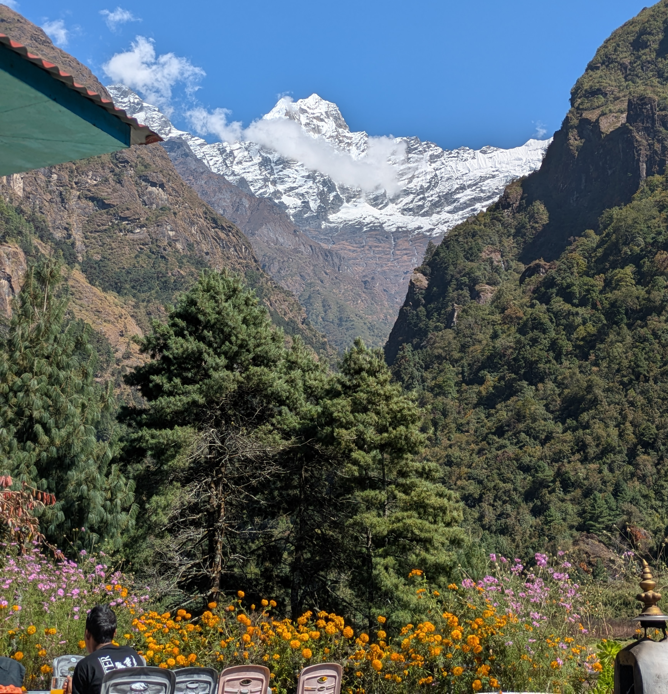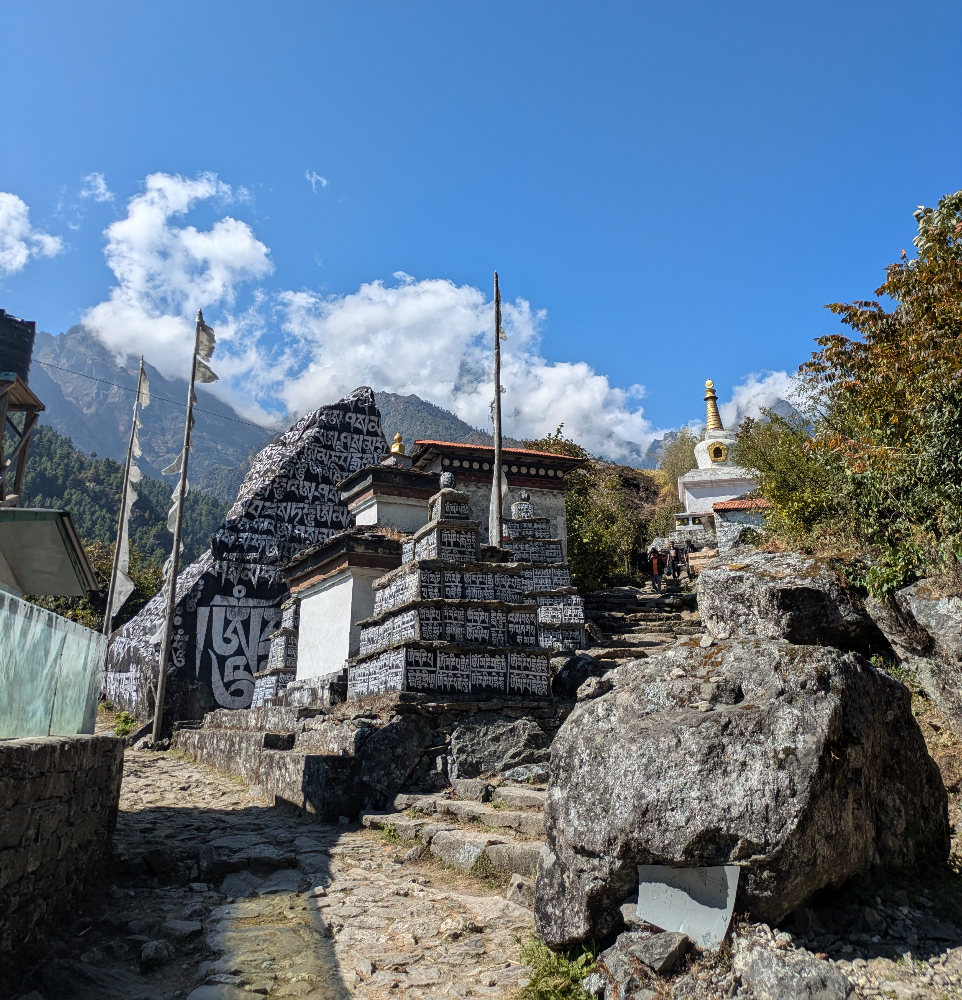

En milieu d'après midi, je rencontre deux soldats du parc qui vont jusqu'à Manjo. Je décide d'en faire aussi ma destination de la journée. C'est le dernier village avant l'entrée dans le parc national. Il est 15 h et il reste une heure de marche. Ils sont surpris que je marche seule sans guide et sans porteur. Ils me disent aussi que je suis forte parce que je marche "vite" sans être essoufflée et qu'ils ont presque du mal à me suivre. Je leur réponds que je ne porte que 6 kgs alors qu'ils en ont 10 sur le dos. Nous rigolons. La communication est une succession de petites phrases et de mimes pour essayer de se faire comprendre. Ils me disent combien je dois payer pour l'entrée du parc. Ils demandent combien j'ai payé pour venir en voiture à Surke. Il s'avère que j'ai payé le même prix qu'eux, je suis donc à leurs yeux une bonne négociante et une débrouillarde. Ça me fait plaisir.  

Nous rencontrons encore des enfants qui vendent des fleurs. À ma surprise, ils en vendent aux soldats qui en achètent. Je fais de même. Les soldats m'expliquent que c'est une fleur qui donne du "power". Je commence à comprendre que c'est un échange d'offrande. De l'argent contre une fleur sacrée prise des mains d'un enfant et que l'on pourra offrir selon son cœur. Malgré mon envie de ne pas faire de suppositions, je m'étais demandé s'il ne s'agissait pas d'une petite mendicité déguisée : des enfants "vendant" des fleurs aux touristes. J'aime d'autant plus cette petite leçon de vie qui rappelle de ne pas se filer aux apparences et de ne pas faire de suppositions hâtives. D'autant plus pour juger la culture d'un pays qui n'est pas le sien. Les soldats m'expliquent comme ils peuvent. Les offrandes sont liées à une fête majeure : [Divali](https://fr.wikipedia.org/wiki/Divali). Nous mettons tous les 3 notre petite fleur orange sur notre oreille et nous continuons notre route.

À l'entrée de Manjo, je laisse mes deux amis d'une après midi. J'entre dans le premier lodge (guest house ou encore maison de thé) qui m'attire. Je me fais plaisir avec une chambre luxueuse : matelas sur une planche avec une prise électrique au mur et une douche chaude (la seule du voyage). Je prends un temps pour essayer d'imaginer la suite de mon itinéraire. Je ne souhaite pas planifier, mais je dois m'assurer de pouvoir revenir à temps pour ne pas rater mon vol pour la France. Grâce à une guide, je peux avoir une place dans un avion pour faire Lulka - Katmandou au retour. De cette façon, je peux transformer mes 16 h de jeep en 45 minutes de vol. Cela me permettrait de gagner du temps et rester plus longtemps en montagne.

Je passe une partie de ma soirée à discuter avec une équipe de cinq indiens partis entre amis. L'un d'eux est leur "leader", le plus expérimenté en montagne et donc l'organisateur de leur expédition de vacances. Ils n'ont pas de guide non plus, juste un porteur pour celui d'entre eux qui n'a pas l'habitude de marcher. Je discute aussi avec un guide un peu antipathique qui essaye de me faire peur parce que je marche toute seule : je pourrais me perdre ou rencontrer des bêtes sauvages. J'écoute ses "conseils" et lui dit au revoir rapidement. Je comprends vite que certains guides essayent de décourager les touristes seuls pour les inciter à recourir à leurs services. Le doute est si facile à distiller. En échangeant avec le propriétaire du lodge le discours est tout autre. Je lui demande conseil sur mon idée d'itinéraire pour le lendemain : partir faire le pic de Khunde (4 200 m) à une dizaine de kilomètres puis descendre dormir dans un des villages lodges un peu plus bas. Il me dit que c'est faisable et que je peux me faire confiance.

_Lodge à Manjo : chambre (potentiellement à partager) 500 rps avec eau chaude, sinon 250 rps; plats autour de 500 rps_

2 299 m ↗️ 2 776 m - 14,4 km, jour 1

## De Manjo à Khumjung : les premiers sommets

Pour ce deuxième jour, j'avais l'envie de monter vite bien plus haut, de faire un premier 4000 pour m'acclimater aux hauteurs. Je n'imaginais pas encore que ça allait être aussi beau : une vue magnifique sur des géants de 6 000 m, des drapeaux de prière aux confins du ciel, de l'extase et du bonheur.

À 7 h, à l'entrée du parc, j’aperçois au guichet un des soldats de la vieille. Il me fait mon permis, un dernier sourire et me voilà entrée dans le [parc national de Sagamatha](https://whc.unesco.org/fr/list/120/). Après 2 h bonnes heures de marche, j'arrive à Manche Bazar (3 400 m), une vraie ville sans voiture dans la montagne. Tout y arrive à dos de yak, mules et porteurs. Je sillonne vite dans les ruelles emplies de musiques et d’encens. Partout des cafés, des bars et des boutiques. L'atmosphère détonne, presque électrique, elle respire la fête et l'impulsivité. Je suis contente d'avoir choisi de ne pas m'arrêter ici, j'ai envie de calme. Sur quasiment tous les itinéraires, les agences passent à Manche Bazar pour l'acclimatation : deux jours entre Lulka et Manche, puis deux jours à Manche avant de partir faire les premières nuits au-dessus de 3 500. Ce n'est pas vraiment mon programme…

Je n'ai pas envie de me presser, mais je n'ai pas non plus énormément de temps. Évidemment, c'est la montagne et mon corps qui décideront. Je tiens vraiment à préciser que je ne cours pas inconsciemment vers les sommets. Je suis le plus possible présente dans mon corps. Au moindre mal de tête persistant, je descendrais d'au moins 500 m pour me faire une journée de pause. D'ailleurs aujourd'hui, j'ai en tête de faire un pic à 4 000 qui surplombe deux villages Khunde, Khumjung puis de redescendre en contrebas. Le fait de marcher haut en journée et de dormir bas, contribue à une bonne acclimatation et habitue le corps.

En arrivant au surplomb qui abritent les villages de Khunde et de Khumjung, je sens une différence dans mon souffle. La sensation d’essoufflement est plus rapide et je ralentis mon pas en conséquence. Je poursuis à travers le village de Khunde. Dans une ode à la lenteur je commence mon ascension, toujours en rythme lent, veillant à ne pas augmenter trop mon rythme cardiaque et à garder une respiration ample et régulière. J'arrive à "Hillary view point" et je suis subjuguée : 3 stèles blanches immaculées et quelques offrandes. Il s'agit d'un monument à la mémoire d'[Hillary](https://fr.wikipedia.org/wiki/Edmund_Hillary), de sa femme et de sa fille. Edmund Hillary et le Sherpa Tensing Norgay sont les premiers hommes à atteindre le sommet de l'Everest en 1953. Après son ascension de l'Everest, Edmund Hillary se consacre à aider le peuple sherpa du Népal : construction d'écoles, de ponts et d’hôpitaux dans la région. Sa femme et sa fille sont mortes ici dans un accident d'avion alors qu'elles participaient à l'organisation du futur hôpital. Je suis prise d'une immense émotion. L'altitude et la beauté peut être. Je dépose sur le monument ma petite fleur orange acquise la vieille. Elle continuait de distiller un doux parfum autour de ma tête. Je ne peux même pas vous partager visuellement la beauté de ce lieu, prise dans un élan de recueillement inexplicable, je n'y ai pris aucune photo. J'ai fini par en trouver une sur Google Maps :

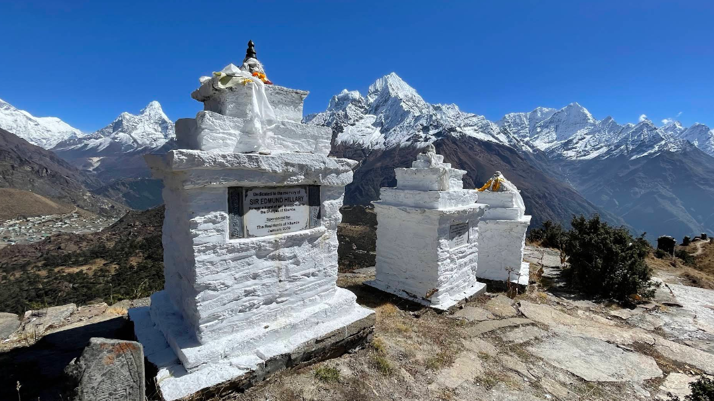
[Hillary view point via les contributeurs de Google Maps](https://www.google.fr/maps/place/Sir+Edmund+Hillary+viewpoint/@27.8140452,86.7011367,3a,75y,90t/data=!3m8!1e2!3m6!1sCIABIhAwQ4IAkEOdrW7bjXulcOGM!2e10!3e12!6shttps:%2F%2Flh3.googleusercontent.com%2Fgps-cs-s%2FAG0ilSyPvKVXXcLfZiAqyCPc9jlR9Fxx9DYH0irhHT9RVMw8GFoiSYFbUYTT2FP6_y0dDte_UF5IKt8N8Qjw-bN9JvnWjVDHgkpIBXqqkQF88-o2FjQ936pWDXFjJPp6QLCs-3kI-FHnqeznnL8%3Dw203-h152-k-no!7i4032!8i3024!4m7!3m6!1s0x39e909382cd3aa15:0x5d6204f4ff73f79d!8m2!3d27.8140452!4d86.7011367!10e5!16s%2Fg%2F11jbcbmss1?entry=ttu&g_ep=EgoyMDI1MTExMS4wIKXMDSoASAFQAw%3D%3D)

Je poursuis sur les crêtes jusqu'au pic. Je suis entourée par les drapeaux de prières. C'est magnifique. Je me sens à la fois chahutée et portée par le vent. Plus rien n'existe à part ce moment. Cette fois-ci, je prends quelques photos et vidéos :

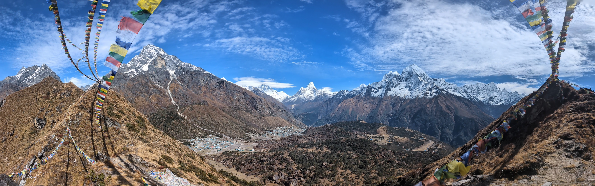

La descente est rude et extrêmement pentue. Je suis contente d'être montée par les crêtes et non par le chemin classique comme je l'avais initialement prévu. Depuis deux jours, j'essaye d'écouter mon intuition pour ce genre de petits choix. C'est devenu assez vite un jeu avec moi-même : quel chemin prendre ? où m'arrêter ? où manger ? Je pose la question dans ma tête et j'essaie d'écouter si une réponse intuitive arrive. Peut-être que je me l'invente, peut-être qu'une réponse apparaît vraiment, qui sait ? En réalité, cela n'a pas réellement d'importance.

Après le pic de Khunde, je me sens fatiguée et un peu ailleurs. J'arrive comme par magie devant le magnifique monastère de Khumjung. Je demande à un moine si je peux méditer quelque part. Il m'indique un escalier qui mène à une grande salle au parquet vitré. Je perds quelque peu la notion du temps. Méditer est un acte simple qui m'apporte beaucoup de calme et de sérénité. Avec la paix intérieure, des ailes poussent pour nous porter, nous soutenir et nous guider. J'en oublie même de faire des photos de l'intérieur (décidément pas beaucoup de photos aujourd'hui), je ne les ferai cinq jours plus tard en repassant (mais pas avec le même temps 👀 🌨️). Je ne visite même pas la salle inférieure qui apparemment abrite un scalp de yéti.

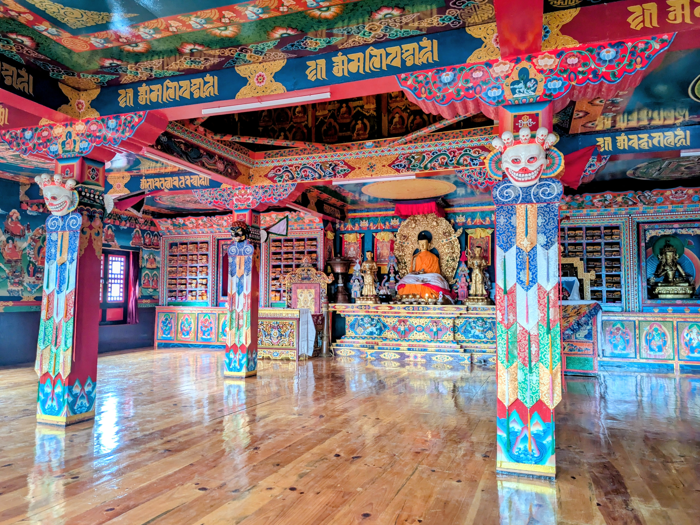 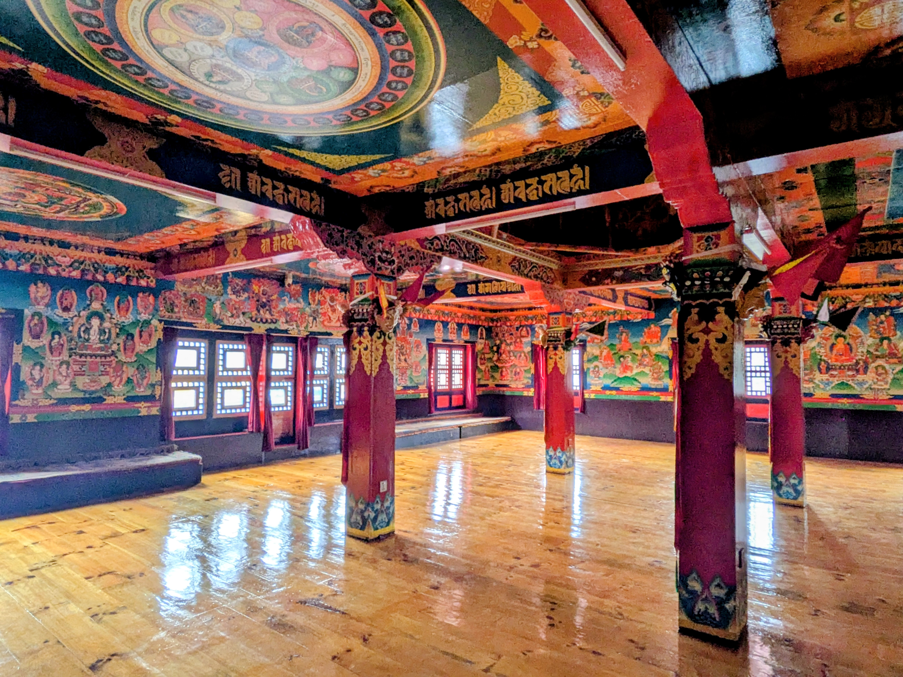

Je croise Adam, un anglais, à la sortie du monastère. Je me souviens encore de ça façon de m'aborder : "You were so still there !". J'ai envie de me reposer alors je lui demande s'il connaît un lodge sympathique. Je me retrouve donc à le suivre parmi les ruelles jusqu'à une bâtisse en haut du village. Un népalais sympathique m'accueille et me propose une chambre gratuite si je mange sur place. J'accepte et me commande une énorme portion de riz fris. Je n'ai pas mangé depuis ce matin et je dévore le plat.

Avec Adam nous retournons au monastère admirer un coucher de soleil magnifique. En réalité le soleil est caché derrière les sommets des monts Kongde Ri, on ne peut que le deviner disparaître au delà des montagnes. Le ciel passe du bleu à l'orange puis au rose.

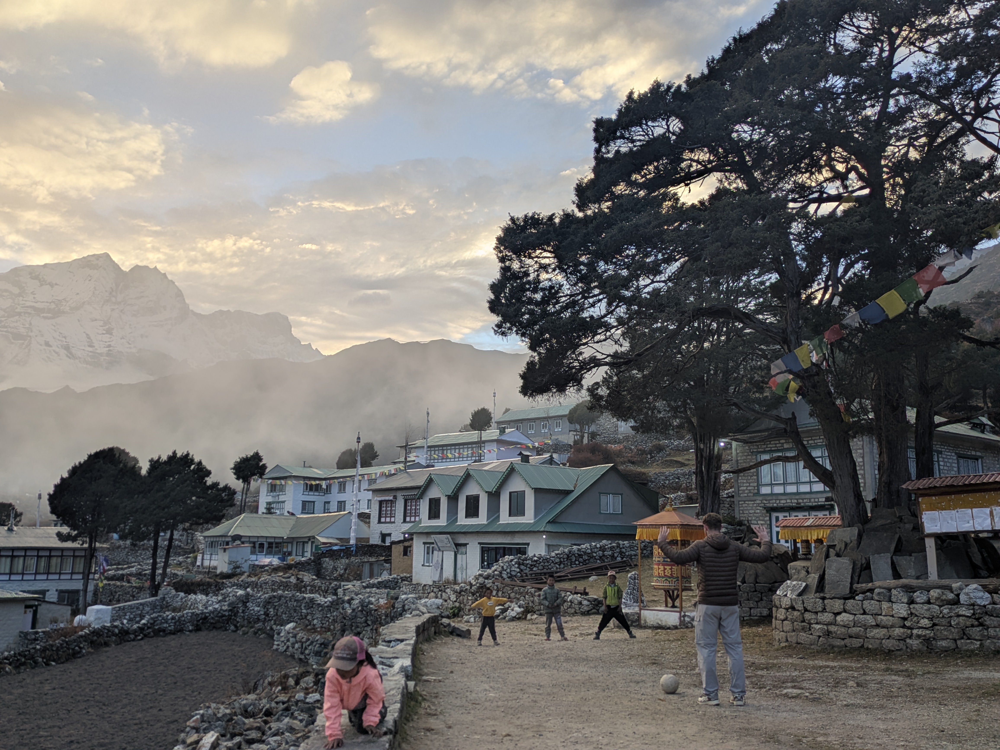 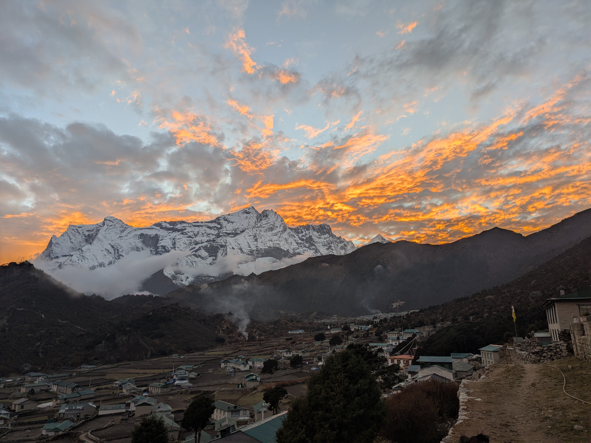

Je fais la chouette rencontre de Lulu et Kevin, un couple d'une cinquantaine d'années, anglais eux aussi. Ils voyagent avec Adam et se sont rencontrés via l'agence. Nous partageons le dîner entre discussion sur la méditation, l'alimentation et une ambiance festive. Lulu s'intéresse beaucoup au bouddhisme et à la méditation. Elle me demande des conseils pour méditer. Je suis touchée et honorée de son intérêt. Je lui explique l'importance de la respiration pour s'ancrer en soi et la visualisation classique d'une petite flamme ou d'une sphère de lumière sur laquelle se concentrer.

C'est la dernière soirée de Divali : les népalais lancent des chants que nous répétons avec eux. Les hommes dansent en cercle. Je rigole avec Lulu. Avant même 21 h, je me sens épuisée. En revenant du monastère, je sentais un léger mal de tête qui est passé rapidement avec une demi aspirine. J'ai envie de continuer à faire la fête, mais je vais me coucher.

2 776 m ↗️ 4 230 m ↘️ 3 800 m - 13.7 km, jour 2

## Khumjung à Pangboche : une journée de monastères

Pour ce 3ᵉ jour, je ne sais pas où je m'arrêterai. C'est une journée tranquille en perspective. Le matin, je reste avec la petite équipe anglaise et ses guides, pleine d'enthousiasme et d'énergie. Adam lance des ["Tashi Delek"](https://fr.wikipedia.org/wiki/Tashi_delek) à chaque Nepalis que nous croisons. C'est une formule de salutation tibétaine moins connue pour changer un peu du "Namaste". J'aime bien et j'adopte aussi la formule. Je finis par les laisser à Tengboche, après la visite d'un autre magnifique monastère. J'ai le plaisir de pouvoir y méditer avec Lulu. C'est un moment très doux et très beau.   

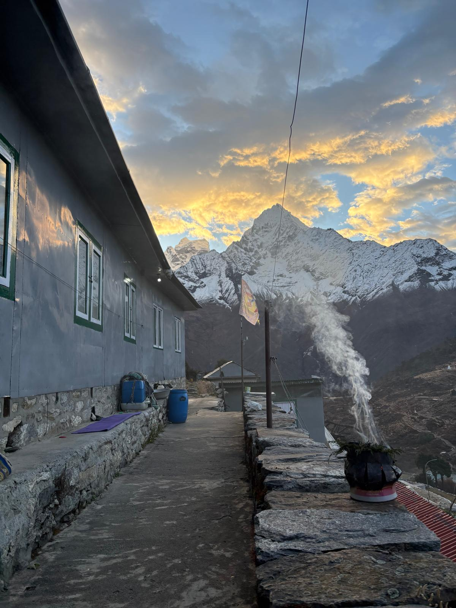 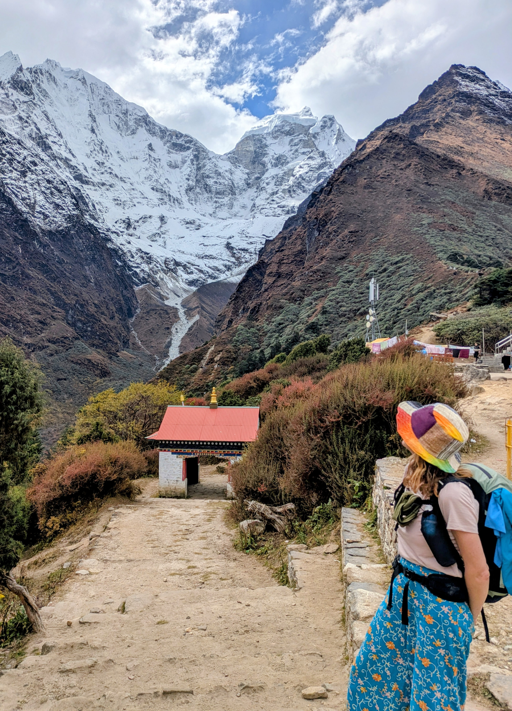

Malgré la beauté du lieu, encore une fois, je ne prends pas beaucoup de photos. J'ai besoin d'être là. Nous échangeons un dernier repas avec Lulu. Je lui explique que, selon moi, la plus belle méditation est celle du cœur. Méditer avec le cœur, c'est invoquer en soi un sentiment d'amour profond et l'habiter. Au début, elle peut s'en approcher en pensant à des souvenirs heureux, et avec le temps, arriver à cet état sans diriger l'amour dans une direction. Nous nous disons en revoir à la Népalaise : les mains jointes avec un "Namaste".

Je reprends la marche à travers la vallée. Je discute avec un français, Collins, je crois. Nous parlons du rapport à l'argent. De notre habitude en occident d'économiser. Dans la culture bouddhiste il faut que tout circule, l'argent aussi. Ce que tu donnes, quelqu'un d'autre te le rendra, peut être dans longtemps, peut être d'une autre façon. Tout fait parti d'un grand cycle, l’estuaire rempli la source.

En fin d'après midi, à l'approche d'un village, j'arrive à une intersection. Je poursuis mon jeu d'intuition pour choisir la direction à prendre : le chemin du haut. Un autre monastère, par hasard sur ma route, m'ouvre les bras. J'en profite pour faire une longue pause et contempler le paysage.

Je m'arrête dans ce village : Pangboche où je retrouve Talita du premier jour. Nous nous étions croisées ce matin et elle m'avait proposée de partager une chambre le soir. Nous passons notre soirée à discuter. Elle me raconte qu'elle a été très génée par les enfants qui lui demandaient de l'argent pour des fleurs ou des grains de riz. Je lui explique ce que m'ont dit les soldats. Elle est assez étonnée, contente de se rendre compte qu'il ne s'agissait pas de mendicité enfantine.

J'hésite pour la suite de mon itinéraire : soit je vais vers l'est pour ensuite revenir à ouest en passant un col, soit je continue à monter par les vallées vers l'Everest. Après plusieurs échanges avec des locaux, je me tourne vers la deuxième option. Elle me demandera moins de temps, si je continue mon acclimatation expresse sans encombre. J'aimerais pouvoir aller voir l'Everest, faire un autre col (Chola pass) et peut-être même pousser vers des lacs de haute altitude. C'est un parcours ambitieux pour seulement 10 à 11 jours de marche : le temps maximum dont je dispose (en réalité je n'aurais que 9 jours pour cause de tempête de neige, spoiler).   

3 800 m ↗️ 3 950 m - 10,9 km, jour 3

## De Pangboche à Thulka : premier 5 000 m

Départ de Pangboche avec l'idée de gravir NangkartShang 5 000 m et de finir dans un petit village 10 km plus loin : Thulka 4600 m. Peut-être, peut-être pas. En partant le matin, aucune idée de jusqu'où je vais finalement aller. Je me suis décidée sur cet itinéraire la veille après plusieurs discussions avec Talita, des guides et l'écoute de mon cœur.

Le ciel est magnifique, la montagne est belle. Il y a tellement d'énergie dans l'air. J'ai l'impression de voler jusqu'à Dingboche, au pied de NangkartShang. Je choisis un petite guesthouse toute peinte de jaune et je demande à une jeune fille si je peux laisser une partie de mes affaires le temps de gravir le pic. Elle me désigne un coin avec un anglais approximatif. Je lui promets de revenir et de manger ici à midi.

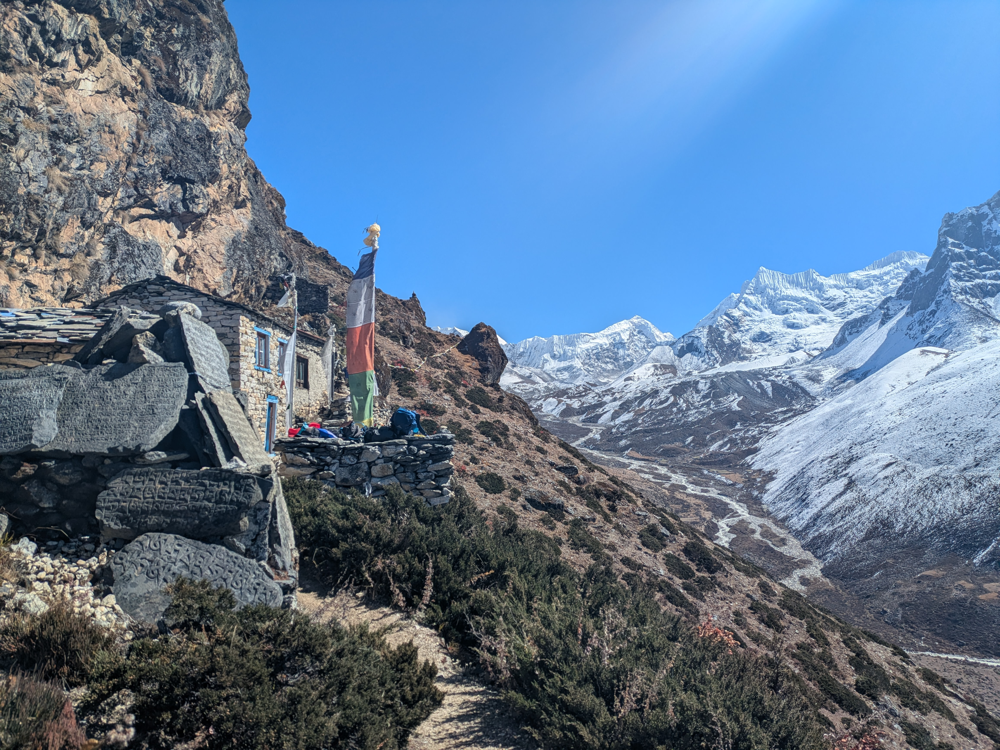

À la sortie du village, je trouve un petit sentier oublié qui mène à une bâtisse pleine de drapeaux de prière à mi-hauteur. J'invente mon chemin jusqu'au sommet sur une parallèle en zigzag à la voie la plus empruntée. Je ris de temps en temps et je respire doucement. Beaucoup de belles discussions sur la respiration consciente et la spiritualité avec des personnes étonnées par ma vitalité à une telle altitude. Des élans de fierté que je m'efforce de garder bien placés. Je m'offre une méditation au soleil en face de l'Ama Dablan. Je vous souhaite à tous d'expérimenter un moment de paix en nature, face au soleil, les yeux fermés devant un paysage splendide. Sans le voir, vous pourrez pourtant le ressentir et vous en remplir.

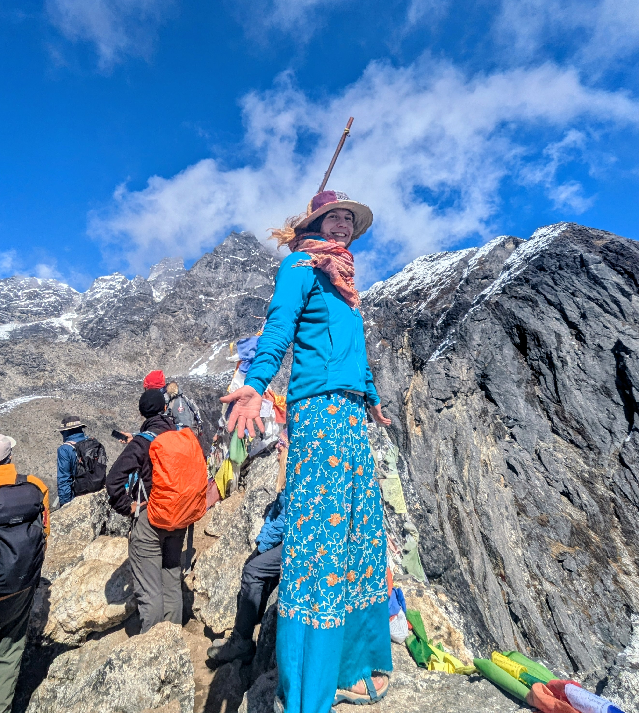 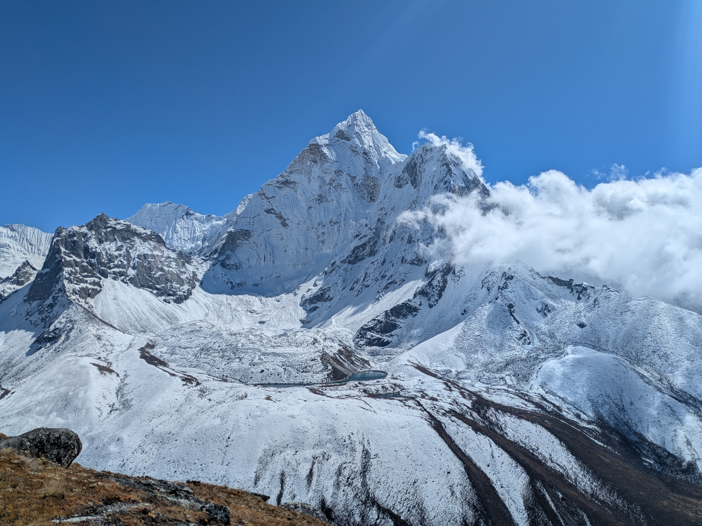

Je crapahute avec mes sandales : cela interpelle ou fait rire, selon la mentalité des personnes que je croise. Un monsieur m'appelle même "le petit Bouddha bleu". Je suis toute de bleue vêtue avec un grand châle rose et orange. Apparemment, j'ai l'air d'un moine venu d'une autre dimension. Je prends même des photos avec des norvégiens, j'ai l'impression d'être une petite attraction sur cette montagne. Plusieurs fois, je croise une taïwanaise avec un bel imperméable rose : c'est elle qui me prendra en photo au sommet et même durant la montée.

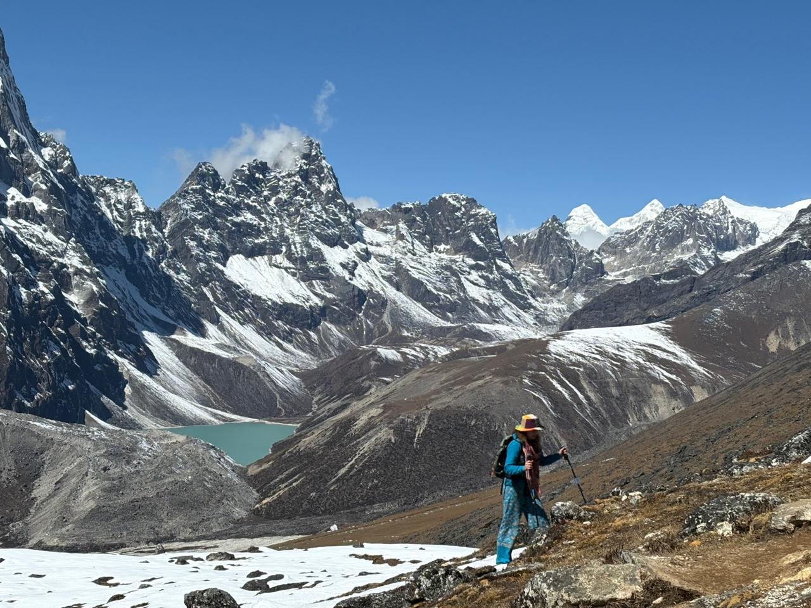

Je chante "I choose to live in love" en descendant de la montagne. Je n'écoute pas souvent de la musique en marchant, mais pour une fois une petite playlist m'accompagne : [pause](https://open.spotify.com/playlist/2lzGfSDkFSlOFaTHex0Ilm). Arrivée en bas, je retrouve le lodge jaune où je me régale de riz fris. Malgré cette expédition à plus de 5 000 mètres, je n'ai pas mal à la tête. Je reste tout de même un moment à me reposer avant de reprendre ma route.

Je ne pensais pas que l'après midi allait être aussi magnifique que ma matinée. J'emprunte une vallée déserte hormis quelques yaks. Le chemin est plat et propice à la contemplation.

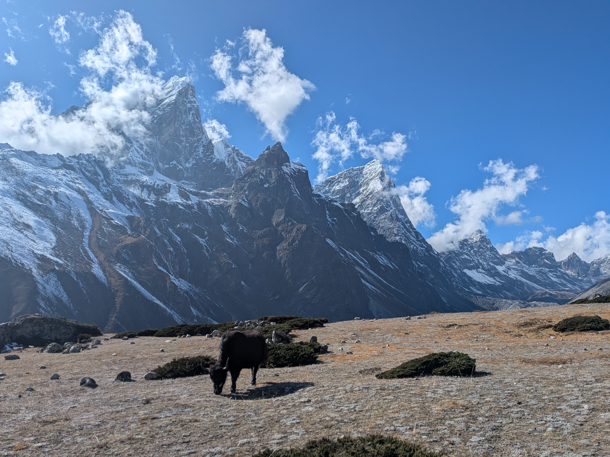 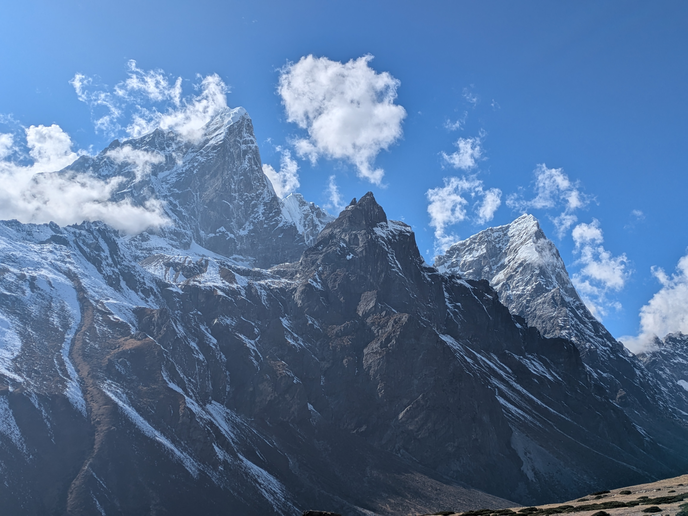

J'avance doucement et j'arrive finalement dans le minuscule village de Thulka (ou Tholka). Il n'y a que 2 guesthouse. Je tente le Yak Lodge où l'on me propose une chambre gratuite que j'accepte avec plaisir. Je déguste une soupe à l'ail en faisant la rencontre deux belges. Encore une fois, nous discutons des plaisirs de la montagne. Eux aussi ont médité sur les pentes de NangkartShang qu'ils ont gravi hier. Mes amis d'un soir sont un peu surpris que je n'en prenne pas de diamox. Ils demandent l'avis de leur guide. Il a un discours très différent de la plupart des guides que j'ai pu rencontrer. Selon lui, la confiance en soi, l'intention et la détermination sont primordiales en montagne. Associées à une écoute active du corps, elles peuvent nous mener bien plus loin que ce que nous nous pensions capables d’accomplir. Il ajoute que le pire ennemi est le doute. Dans les hauteurs, douter de soi et de ses capacités mène au péril. Il faut être lucide et présent. Je cherche justement à approcher ma confiance en moi. Ce discours résonne et me rend vraiment heureuse.

Je retrouve aussi l'équipe d'Indiens de Manjo à ma grande surprise. Nous rigolons de l'étroitesse du monde. Demain, ils se rendent aussi à Gorak Shap, le dernier "village" avant le camp de base de l'Everest. Ils me proposent de faire la route avec eux demain. Je décline, ils prévoient de se lever avant l'aurore pour gravir tôt le surplomb au-dessus de Thulka.

3 900 m ↗️ 5 070 m ↘️ 4 600 m - 15,6 km, jour 4

## Le camp de base de l'Everest

Aujourd'hui c'est la première journée où je me décide à troquer mes sandales contre mes chaussures de trail ! L'air est très frais ce matin et malgré le soleil prévu, j'imagine qu'il le restera au-dessus de 5 000 mètres.

Je partage mon petit déjeuner avec Philippe et Rudy, les deux belges de la veille. Leur guide, Prakash, nous rejoint et explique le trajet du jour. Ils prévoient de s'arrêter à Lobuche à 4 900 m pour continuer leur acclimatation douce. Ils ne sont donc pas pressés. L'itinéraire commence par une montée jusqu'à un petit col : Thukla Pass. Au niveau de ce sol se trouve un mémorial. Le sommet du col de Thukla abrite plus de 100 monuments commémoratifs dédiés aux alpinistes et aux Sherpas qui ont perdu la vie en montagne. Prakash nous explique que c'est un endroit particulier où il prend toujours un moment de recueillement.

Je dis au revoir, peut-être à bientôt, et je commence ma journée. Je me sens remplie d'énergie et je gravis la pente jusqu'aux monuments assez facilement. En fin de montée, je retrouve même mes amis indiens. Je comprends mieux l'émotion dans la voix de Prakash lorsque j'arrive au mémorial. Partout des stèles et des petits cairns commémoratifs. Il règne une atmosphère de recueillement paisible. Même si je connais personne, je prends un temps de pause. Je dresse un petit cairn. J'ai même une larme qui me vient. Une belle larme : douce et légère, un partage silencieux et ineffable.

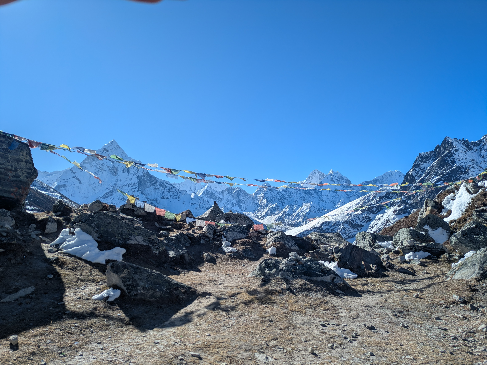 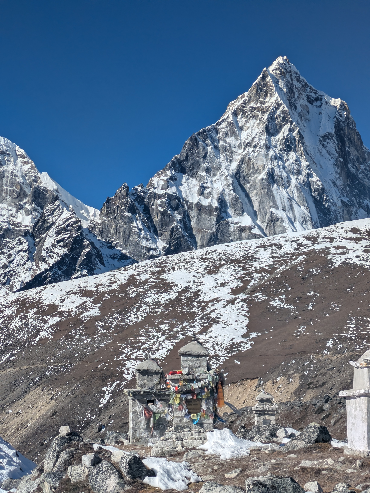

Je poursuis sur le "nepali flat": faux plat montant dans le jargon du coin. À Lobuche (4 900 m) je fais une pause pour boire un bon thé chaud. Je discute avec un guide. Il est seul : il est descendu pour raccompagner en contrebas trois personnes de son groupe qui avaient le mal des montagnes. Il doit rejoindre le reste de son équipe qui devrait arriver à Gorak Shap aujourd'hui. La tenancière nous rejoint pour discuter. Elle raconte que certaines personne mettent parfois huit heures à gravir ce que j'ai dévoré en deux heures ce matin. Elle voie passer beaucoup de gens pour qui la montagne est totalement étrangère. Pourtant, elle les respecte : ils veulent réaliser leur rêve de voir l'Everest au moins une fois dans leur vie. Il me reste quelques carrés de chocolat que je partage avec eux. "Sharing is caring" me dit-elle avec son petit sourire sage. Le guide part devant. Je me bois un deuxième thé. Encore un au-revoir accompagné d'un "peut-être à bientôt ?".

Le chemin sillonne le long du flanc de la montagne. Je comprends au bout d'un moment qu'il s'agit de la fin du glacier de Khumbu que je longe déjà depuis un moment. J'arrive à Gorak Shap vers midi en même temps que le guide de Lobuche qui vient de retrouver son groupe. Je fais le tour des 3 lodges pour essayer de trouver une chambre abordable : toutes sont à 1 000 rps. Je vais à Buddha Lodge recommandé par le guide. C'est de nouveau le moment pour un repas copieux bien mérité.

Il n'est que 13 h et je tourne un peu en rond. Pas de discussions à l'horizon, pas de réseau et je n'ai pas non plus de livres… Je me décide pour le camp de base de l'Everest. Initialement, je pensais ne pas y aller et faire uniquement le pic de Kala Patthar demain matin. Comme j'ai du temps, c'est l'occasion de faire les deux. Le guide que j'ai rencontré auparavant me dit qu'à mon rythme le camp de base est à 2 h. J'ai suffisamment de temps pour faire l'aller-retour avant la nuit.

Le camp de base se trouve tout au fond de la vallée. Il faut continuer à longer le glacier de Khumbu sur trois kilomètres. Je croise et je dépasse quelques groupes. Au fond de la vallée, j'entends presque de la musique et des cris. Au lieu de descendre sur le glacier pour trouver le monument symbolisant le camp de base de l'Everest, je continue sur le surplomb pour me trouver un spot où admirer paisiblement le paysage. Je grimpe sur un gros rocher. En contrebas j’aperçois une petite foule. En levant les yeux, je vois la petite pointe de l'Everest cachée par d'autres montagnes. À mon avis, l'Everest n'est même pas visible depuis le camp de base. La vue la plus hypnotisante est celle de la vallée : le glacier et les montagnes lointaines à perte de vue.

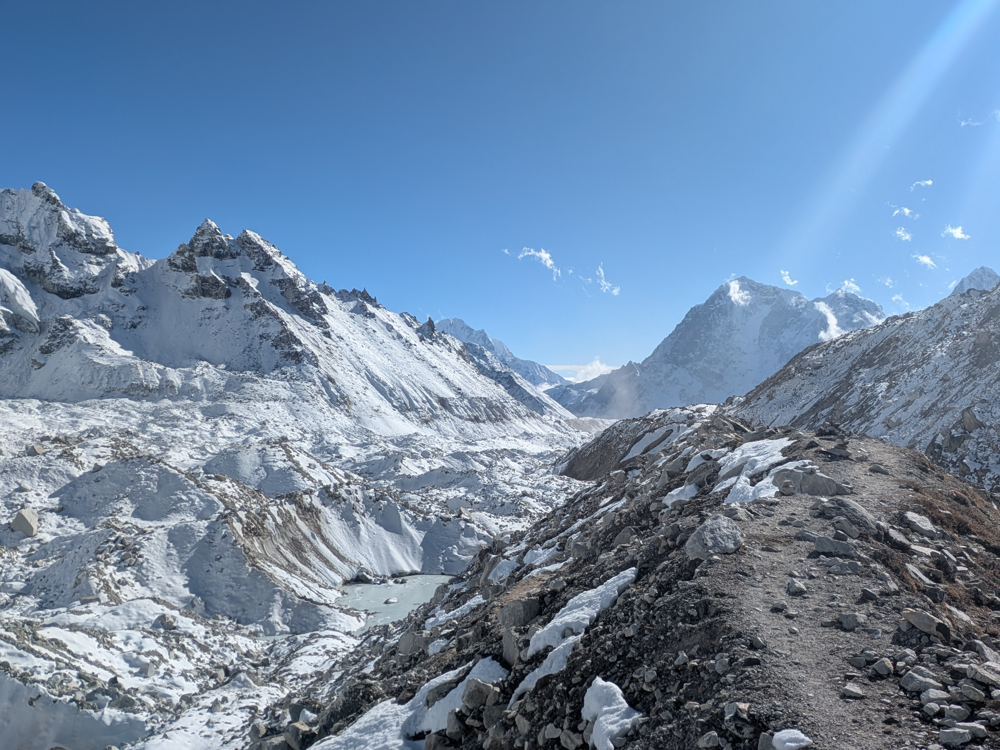 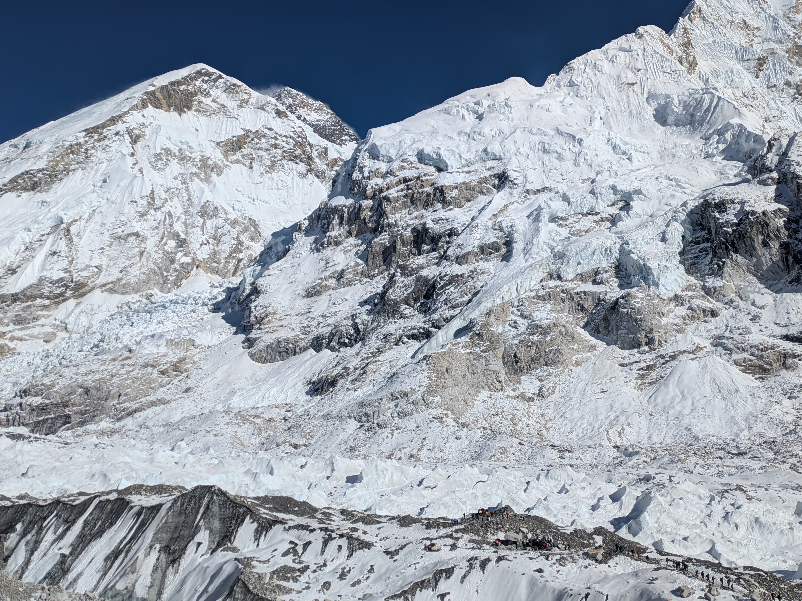

De retour au lodge, je rencontre Borge, un norvégien d'une cinquantaine d'année. Nous passons la soirée à discuter. Demain lui comme moi avons prévu de faire l'ascension du Kala Patthar 5 600 m. Lui avec son guide et moi toujours en solo. Ils ont prévu de commencer l'ascension vers 4 h. Je pense partir un peu plus tard. Apparemment le soleil se lève vers 6 h 30. J'estime pouvoir monter en un peu moins de deux heures : il y a 2 km et 430 de dénivelé.

4 600 m ↗️ 5 150 m ↗️ 5 300 m ↘️ 5 150 m - 13,7 km, jour 5

## Le point culminant : Kala Patthar

À 4 h 40, me voilà partie, habillée le plus chaudement possible, ma lampe frontale sur la tête. Je me souviens de mon ascension du Kilimandjaro où je ne souhaitais qu'une chose : que le soleil se lève tellement j'avais froid. Cette fois je pense être mieux équipée : une doudoune en plume que j'ai achetée à Katmandou et qui est particulièrement chaude. Assez vite, j'ai les doigts gelés : mes gants sont trop serrés et me coupent la circulation. Je décide de mettre mes bâtons de marche dans mon sac et mes mains dans mes poches. Les bâtons sont bien utiles, mais je préfère sentir mes doigts.

Le long du sentier il y a de temps en temps un banc pour se reposer. C'est curieux et amusant. Je dépasse plusieurs groupes qui font des pauses très régulièrement. Je préfère ne pas trop m'arrêter. En altitude, il est recommandé de beaucoup boire, mais avec le froid, l'eau est gelée et fait mal au ventre. Mon seul regret : ne pas avoir pris de thermos dans mon sac. Je crois que c'est la seule chose qui me manque. Je me boirai un bon thé avec une soupe de pâtes après.

Je prends une pause pour admirer le ciel étoilé. Mes yeux se perdent à des millions d'années lumières.

L'obscurité décline peu à peu. Il reste 100 m de dénivelé quand j'arrive à la hauteur de Borge et son guide. Nous faisons la fin de l'ascension ensemble. La joie me saisit en haut du pic : les premières lueurs du jour, la beauté de la montagne, la neige, l'effort physique qui se transforme en exaltation… Je me trouve un bon gros caillou en hauteur pour admirer la vue. Il est 6 h, 1 h 20 d’ascension. J'avoue avoir une belle montée de fierté. Même si je ne suis pas là pour ça, c'est un bel exploit physique à cette altitude. Je suis vite rejointe par Borge sur mon caillou. Il a amené un tout petit drapeau norvégien, ça me fait bien rire. Nous blaguons pour se réchauffer. J'ai le bout des orteils (voir les orteils entiers) congelés.

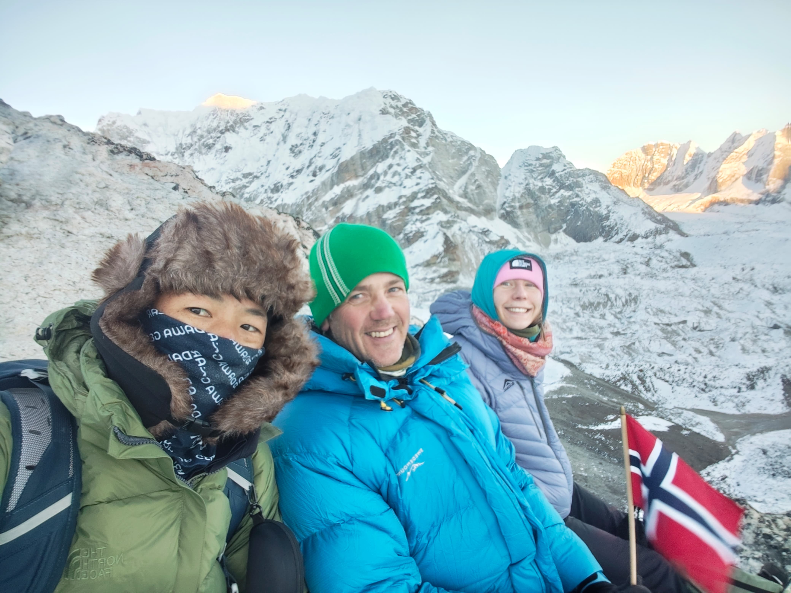 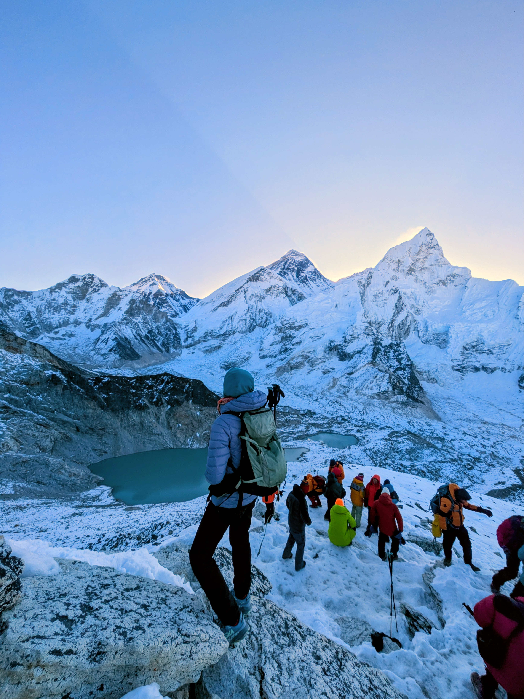

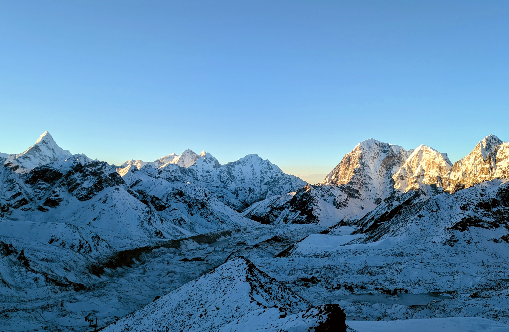

Le temps passe et nous nous rendons compte que le soleil est derrière l'Everest. Il ne risque pas d'apparaître pour nous avant au moins 8 h ... Peut-être que l'option Kala Patthar pour le coucher du soleil aurait été meilleure. Au moins le soleil nous aurait réchauffé le temps de sa rencontre avec l'horizon. Vers 6 h 40, les yeux et le cœur plein, je propose une redescente (surtout parce que j'ai froid). La descente est assez marrante : des zigzags dans la neige, cette fois-ci aidée par mes bâtons.

Contrairement au Kilimandjaro, je crois que je n'ai jamais douté d'arriver en haut. Je n'avais rien imaginé de particulier. J'appréhendais tout de même un peu : je pensais que ça allait être plus difficile. J'avais la profonde certitude que j'allais le faire. Rarement, j'ai senti le doute aussi loin de moi. À chaque fois, l'esprit dans le présent, j'ai goûté au plaisir de la marche. Ce matin était évidemment plus rude à cause du froid. C'était aussi le moment censé être le plus difficile de mon voyage : la plus haute altitude et avec une pente raide. Et pourtant, encore une fois, je suis arrivée en haut exaltée, souriante, pleine de joie et d'amour, loin de la douleur et la peur. Toute cette montée encore, j'ai cultivé un souffle ample, veillé à ce que mon rythme cardiaque ne s'emballe pas.

Dans cette descente, j'ai une première vision de la fin de ce voyage. Il y a deux jours, je me disais : "après Kala Patthar, le plus dur sera fait, après ça, si j'y arrive, je peux tout faire". C'est plutôt vrai : après 5 600 m, une ascension fulgurante, pas de mal de l'altitude, j'étais libre de tout faire. Sensation d'immensité, d'un vide infini où l'on a envie de sauter. Il me restait la contrainte du temps. Déjà plus de la moitié de mon chemin… Je m'étais posée la question - évidemment - de ne pas rentrer. J'avais vite écarté cette possibilité. J'aurais eu l'impression de trahir : trahir mon métier, mes élèves, mes proches, moi-même. Ce n'est pas encore le moment.

De retour à Buddha Lodge, je récupère mes affaires et je prends ma soupe et mon thé comme prévu. Je n'ai pas envie de trop traîner à Gorak Shap. Ce n'est pas mon ambiance préférée : ici, c'est le business en premier. J'ai encore une journée de marche complète devant moi. Je prévois de descendre la vallée et de bifurquer dans la voisine. L'objectif : le village de Dzonglha et demain un col à 5300 m.

Je dis un "au revoir et peut-être à bientôt", un de plus, à Borge et je file avec lenteur. Il n'est que 10 heures, et je n'ai "que" 10 km à faire. Je prends mon temps. Sur le chemin vers Lobuche, je croise Philippe, Rudy et Prakash. Ils me demandent si j'ai réussi à faire le camp de base et le Kala Patthar. Prakash me dit qu'il avait aucun doute sur ma réussite. Cela me fait vraiment plaisir de les recroiser. Prakash m'explique qu'il y a une autre Lola dans la montagne aujourd'hui : [Lho la](https://fr.wikipedia.org/wiki/Lho_La), un col au sud-est de l'Everest que l'on aperçoit au loin. Peu après, je rencontre également les norvégiens avec qui j'avais pris des photos sur les versants du NangkartShang. Les aller-retours inattendus des retrouvailles sont vraiment amusants.

Un premier arrêt à Lobuche pour le repas du midi et un coucou à la tenancière. J'ai du mal à me rendre compte que j'étais là hier. Nous discutons une fois encore de la montagne, des gens et de la vie. Elle me dit qu'il va certainement neiger bientôt. À chaque fois qu'il neige, elle encourage les touristes à aller dehors pour jouer dans la neige. Souvent le froid les rebute. Elle trouve ça dommage : ce n'est pas tous les jours que l'on peut faire une bataille de boules de neige en plein milieu de la montagne !

Je ne sais pas si la neige est une bonne nouvelle pour moi. S'il y a du mauvais temps, aucun avion ne décollera de Lulka et rentrer à Katmandou à temps deviendra assez complexe. J'ai un vol de réservé dans quatre jours. Je verrai bien en temps voulu. Je continue à cultiver le lâcher prise : je ne peux pas agir sur ce point alors, il n'y a aucune utilité à ce que je me triture la tête. Après le repas et la discussion, je me sens rattrapée par le sommeil. Une petite sieste sur les banquettes pleines de coussins me semble appropriée.

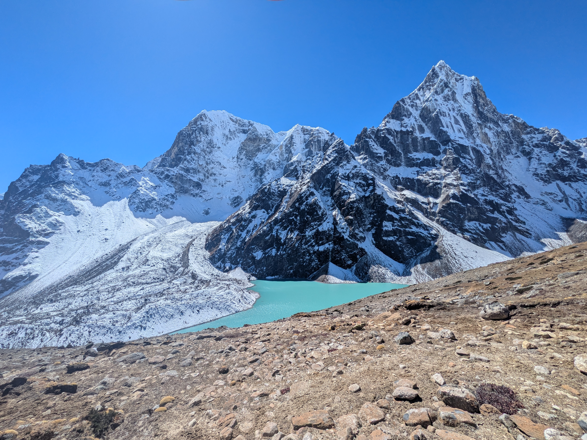

La suite de la journée est douce, heureusement, car je suis bien fatiguée. Je m'arrête plusieurs fois pour lézarder au soleil en face des pics Taboche et Cholatse. Avant d'arriver un groupe de français m'indique le chemin: un pont est en construction mais il est possible de traverser au niveau d'un guet un peu plus haut. Quand j'arrive à Dzonglha il est à peine 15 h. Je me trouve une petite chambre sympathique face au soleil et je m'offre une autre petite sieste bien méritée. L'appétit me tire de mon lit et fidèle à mes habitudes, je dévore un plat de nouilles aux légumes cuites avec une portion non négligeable d'huile. Je zone dans la salle commune en griffonnant les rencontres et les étapes de mon parcours.

J'achète une carte sim qui me permettra d'avoir internet en montagne pour 24 h (~10 €). Demain, c'est l'anniversaire de maman et j'ai envie de pouvoir lui envoyer un petit message. En plus je me sens un peu morose et j'ai besoin de me changer les idées avec le bruit des réseaux.

En début de soirée, un petit groupe de français du Jura fait son apparition. Nous jouons au Président avec leurs guides népalais. Ça donne l'impression d'être à la maison. Jouer me remonte un peu le moral. J'étais tombé sur un guide durant l'après-midi qui m'avait dit que ce n'était pas une bonne idée de faire le col toute seule. Que j'allais me perdre et que c'était une journée d'au moins 8 h pour arriver au village de Dragnak en bas du col. Alors que j'avais prévu en plus de traverser un glacier et d'aller jusqu'à Gokyo. J'hésite, si la journée est vraiment si longue, peut-être faut-il que je change mes plans ?

Les français ont justement passé le col aujourd'hui. Ils me disent qu'il faut vraiment être motivé pour se perdre et qu'ils ont mis un peu moins de 6 h avec une de leur camarade qui n'était pas très bien. Pour le glacier, ils me racontent que même leur guide n'était pas sûr de la route parce qu'elle change tout le temps. La seule chose à faire c'est de suivre les cairns. Avec la fatigue, le doute continu à m'assaillir. Jamais je n'ai passé un col aussi haut et dans la neige. J'invoque le détachement dans mon esprit : je verrai comment je me sens demain matin et comment est le ciel. Réveil prévu pour 6 h.

5 150 m ↗️ 5 536 m ↘️ 5 150 m ↘️ 4 820 m - 14,4 km, jour 6

## Chola pass : passage du col et marche sur un glacier

Je me réveille pleine d'énergie. Je m'assois dans mon petit lit comme tous les matins pour une courte méditation. Je ferme les yeux, mon châle sur les épaules et, je respire doucement : j'invoque le vide, le calme et une sensation de paix et d'amour. Et à haute voix, je dis : "Merci pour cette nouvelle journée qui m'attend. Je demande à la montagne de me laisser passer aujourd'hui encore, de m'accueillir et de me soutenir dans chacun de mes pas." Après, c'est la technique d'habillage sous la couette parce qu'il doit faire -5 °C. Il y a du givre sur les fenêtres à l'intérieur de la chambre.

Soupe de nouilles au petit déjeuner pour bien se réchauffer et pour une bonne hydratation. J'ai du mal à boire mon eau quand je marche le matin. Dans ma gourde, elle est glacée et j'ai l'impression que cela refroidit d'un coup tout mon corps.

Le ciel est un peu nuageux, mais pas vers le col. Je me sens de nouveau pleine de confiance, prête à gravir la pente un pas après l'autre. Je sors du lodge. L'air est froid. Le soleil est doux. Je vois deux porteurs qui commencent leur périple. Ils vont dans la même direction que moi. Je me décide à les suivre. Avant de rejoindre le col, je traverse une longue plaine, tantôt dans l'herbe, les cailloux et bientôt la neige. Il y a des petits ruisseaux partout. C'est magnifique, plusieurs fois, j'ai les larmes au bord des yeux. Je me trempe maladroitement un pied. Heureusement, je suis tellement de bonne humeur que ça me fait juste rigoler. Je continue à suivre les porteurs. Y n'y a personne d'autre. Juste le groupe du guide d'hier après-midi que je dépasse rapidement avant une première ascension.

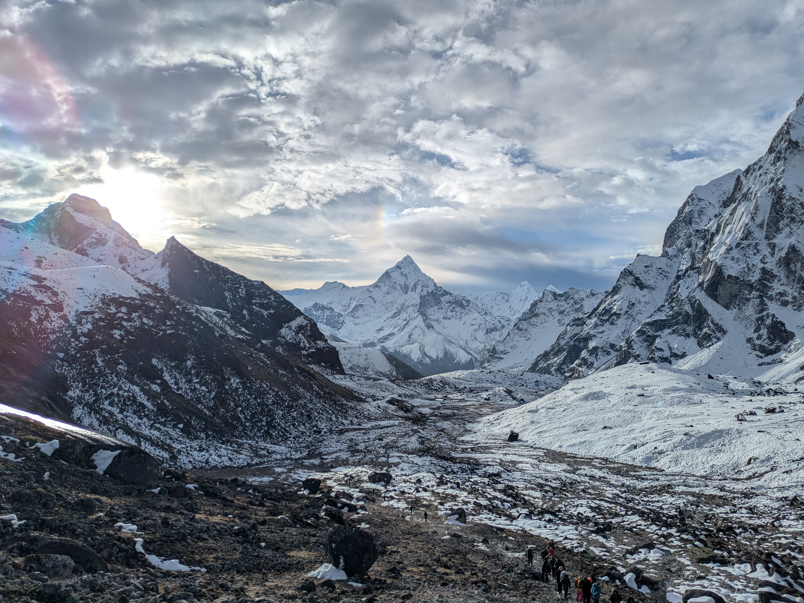 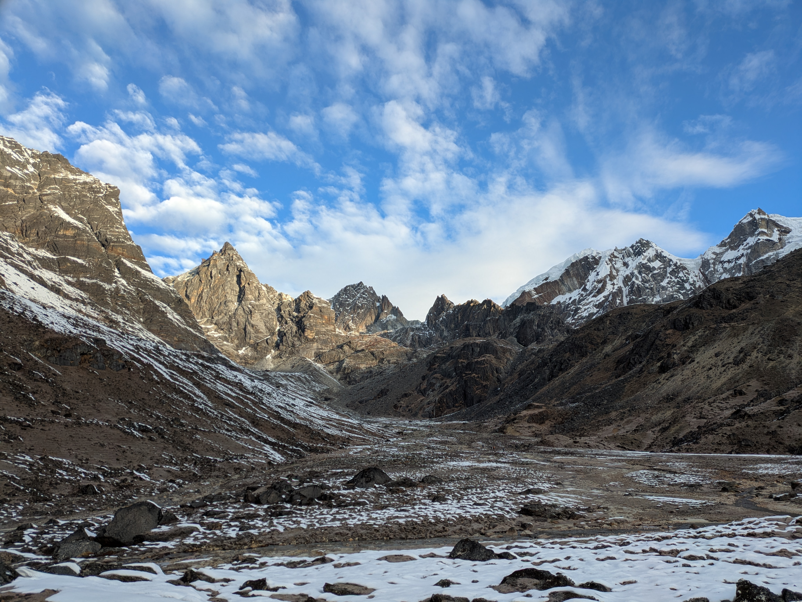

Avant le col les deux porteurs s'arrêtent, je les dépasse avec un "Tashi Delek" qui me rendent en rigolant. J'apprécie de plus en plus tenter de discuter avec les porteurs. Ils ne parlent souvent pas bien anglais, mais on peut toujours échanger un peu. J'ai appris à dire comment je m'appelle et que je viens de France "Mērō nāma Lola hō. Ma phrānsēlī hum̐." Parfois, je partage des noix avec eux. C'est chouette. Sans les mots, juste un échange authentique face à la montagne.

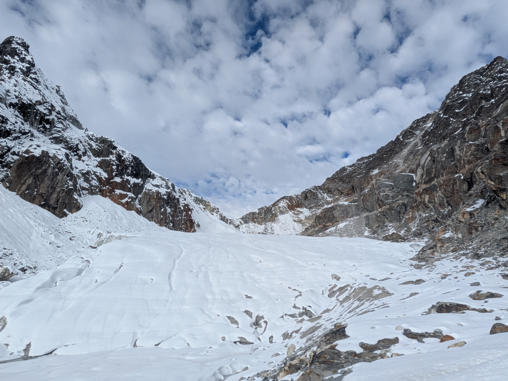 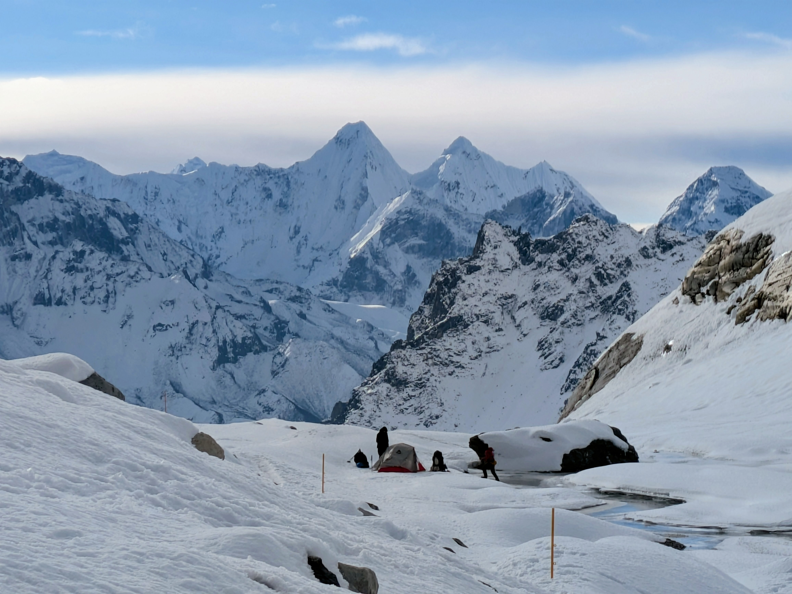

J'arrive en haut après 2 h de marche. Je repense au guide qui m'annonçait au moins 4 heures. Je suis pleine de fierté encore une fois. Un peu trop peut-être.

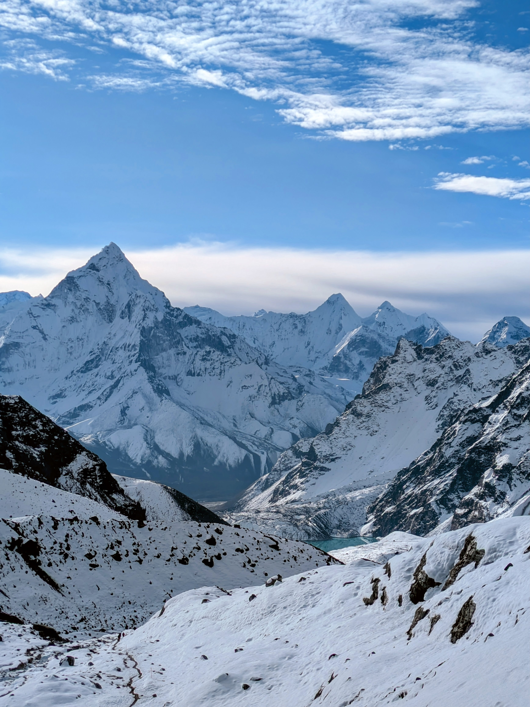 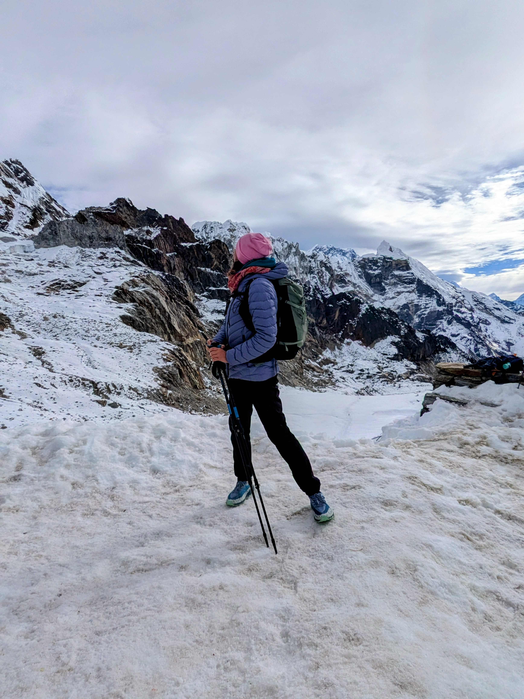

La descente du col est très technique. Heureusement, mes chaussures de trails ont une semelle au rendez-vous et je dévale la pente enneigée sans aucune glissade. Les guides conseillent des petits crampons, mais avec des bonnes chaussures, ils ne sont pas utiles. De toute façon, il suffit de regarder le matériel des porteurs pour savoir ce qui est vraiment utile ou non. Lorsque j'arrive à Dragnak 2 heures plus tard, je suis évidemment affamée.

De ce côté du col, le ciel est plus couvert. Je préfère ne pas trop traîner pour être à Gokyo en début d'après midi. Dès la sortie du village, la traversée du glacier débute. J'ai adoré ce moment : un vrai petit jeu de piste. Il faut chercher les cairns au loin parmi les creux et les bosses puis estimer le chemin à prendre.

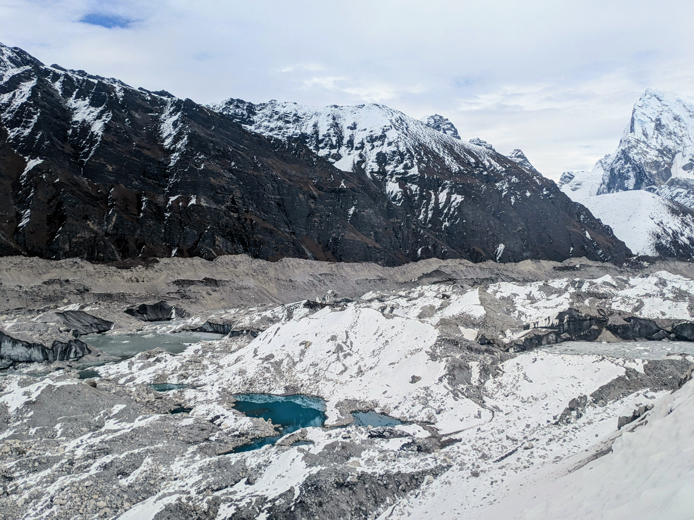 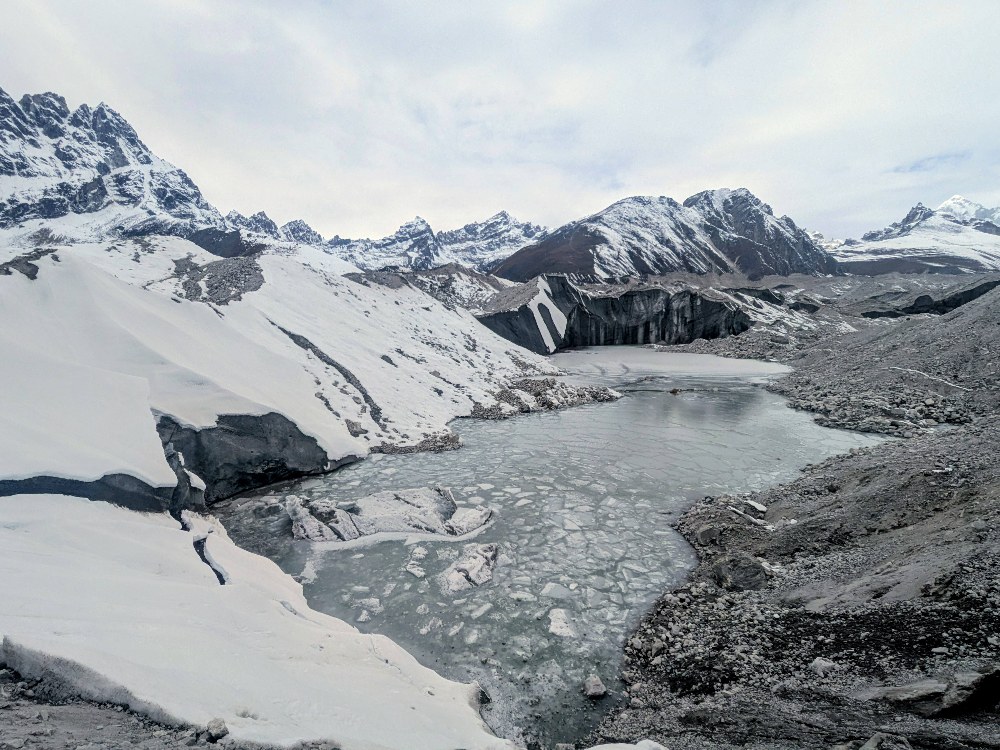

Une belle pente raide au niveau de la moraine pour sortir du glacier et j'arrive à Gokyo. Ici, il y a les [lacs](https://fr.wikipedia.org/wiki/Lacs_Gokyo) les plus hauts de monde. Demain, j'aimerais me faire un aller-retour jusqu'au fond de la vallée pour aller les voir.

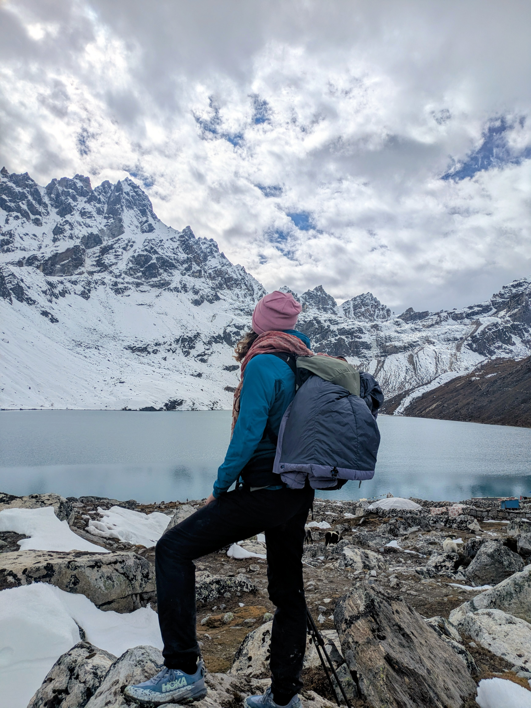 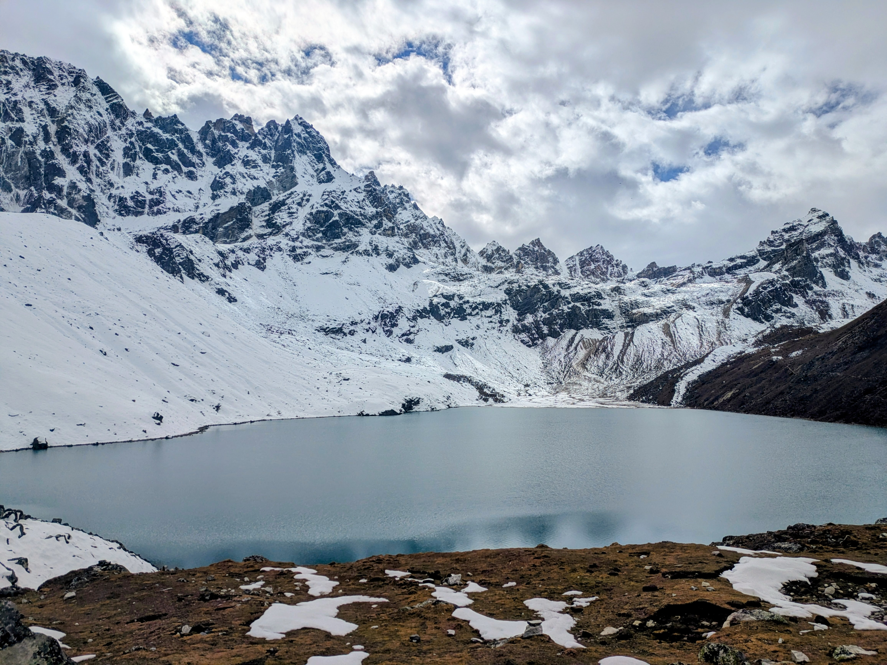

Il est encore loin d'être l'heure du goutter, mais une boulangerie me fait de l’œil. C'est assez surprenant, dans quasiment chaque village, il y a une sorte de salon de thé boulangerie avec plein de pâtisseries. Enfin non, ce n'est pas surprenant, c'est un très bon business, n'importe quel touriste en montagne — dont moi — craquerait pour une grosse part de gâteau et un chocolat chaud. Je suis plutôt sur un combo cinnamon roll et gros cappuccino.

Je me rends dans un lodge juste devant le lac, qu'un groupe de polonais m'a recommandé. Apparemment demain, il va neiger. Le brouillard a commencé à envahir les lieux et on ne voit même plus le lac à la fenêtre. Hors de question de ressortir aujourd'hui pour se faire un petit sommet bonus (Gokyo Ri, 5 357 m) que j'avais dans le viseur. Je passe plutôt ma fin d'après midi avec Arlette, une française qui profite de sa retraite en allant randonner. Un peu d'inquiétude tout de même, son mari Bertrand ne va pas bien suite à ascension du Gokyo Ri ce matin. La mesure à l'oxymètre donne 60 %, il n'est pas en danger immédiat, mais c'est vraiment limite. Au-dessus de 80 % on considère que tout va bien. Par mesure de précaution, elle va l’emmener à la clinique du village où il y a une réserve de bouteille d'oxygène.  

4 820 m ↗️ 5 356 m ↘️ 4 769 m - 12,3 km, jour 7

## Descente de Gokyo dans la neige

Lorsque je me réveille, je ne me rends pas compte qu'il neige abondamment. C'est tellement blanc à l'extérieur que je ne distingue pas tout de suite les petits flocons dans l'air. Dans la salle commune règne une effervescence chaotique. Avec la neige, les plans de chacun sont bouleversés : impossible de passer le glacier Ngozumpa, le col de ChoLa est fermé et celui de Renjo La au-dessus du lac n'est pas conseillé. Même chose pour moi, je ne vais pas aller crapahuter au fond de la vallée sous la neige pour ne rien voir des lacs. Reste l'option de descendre un jour plus tôt. Cela ne semble le plus approprié. D'après les locaux, il va neiger au moins 3 jours. Nous sommes le 28 octobre et mon avion pour la France est le 2 novembre au matin. J'ai un avion de prévu entre Lulka et Katmandou le 31, mais il sera certainement annulé. D'ailleurs aujourd'hui aucun vol de prévu ni en avion ni en hélicoptère. Je recroise Arlette et son mari qui va mieux grâce à l'oxygène. Je suis soulagée pour eux. Ils vont pouvoir descendre un peu dans la vallée aujourd'hui.

La tenancière me dit qu'il n'y a pas de problème pour descendre : la piste longe quelques lacs et suit la rivière en ligne droite. Comme je n'ai pas de guide, le mieux et de suivre un groupe de Népalais. Trois indiens ont la même idée en tête et nous nous mettons d'accord pour descendre ensemble. Un peu avant 8 h la tenancière nous indique un groupe au bord du lac qui vient de partir : branle-bas de combat pour s'équiper et sortir sous la neige.

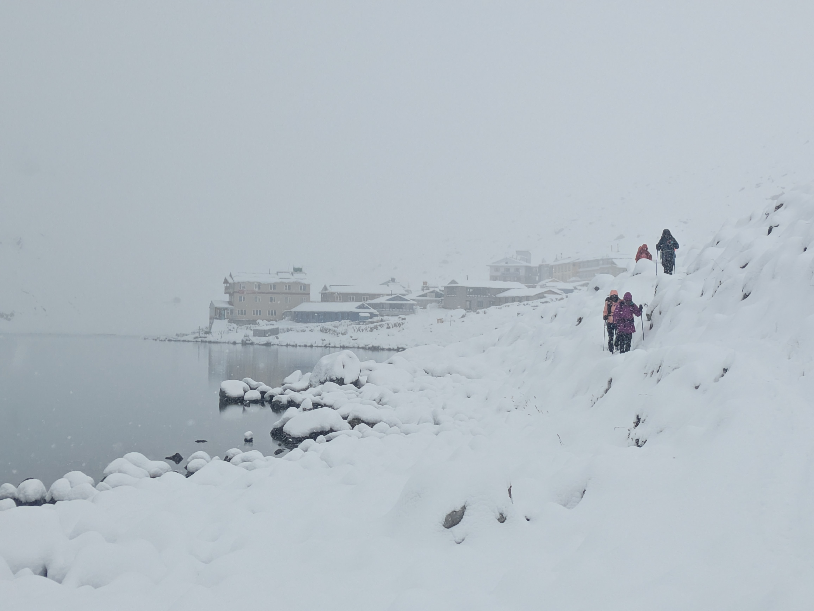

Je marche avec un rythme soutenu. Le groupe doit être 15 minutes devant nous, mais il neige tellement qu'une pellicule de neige fraîche recouvre déjà la trace heureusement profonde. Les indiens suivent avec un peu de mal et vite, nous sommes rejoints par un couple de Français.

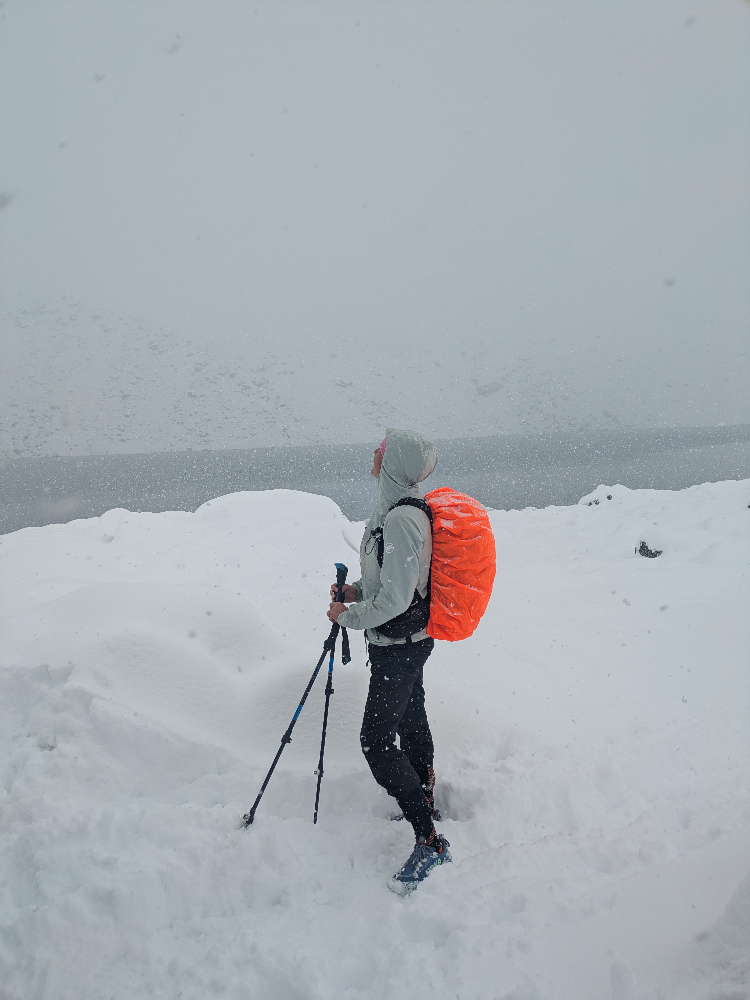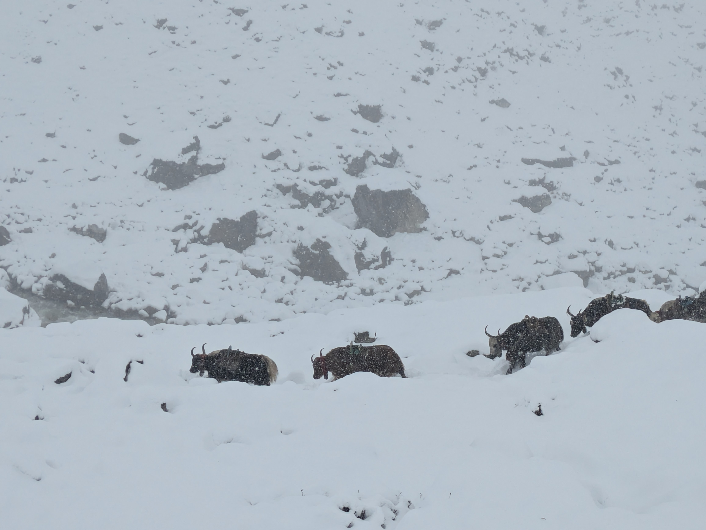

De l'autre côté du lac, nous retrouvons le groupe de Népalais sous un abri. Ils prennent une pause et nous disent que c'est à notre tour maintenant de marcher devant et de faire la trace. Emma et Erwan se prêtent au jeu et je les accompagne. Ils sont gardiens de refuge dans les Alpes et faire la trace dans la neige n'est pas un souci pour eux. Très vite, nous nous retrouvons tous les trois au milieu de la neige à s'inventer un chemin le long de la rivière. Des chiens qui étaient avec le groupe de Népalis nous suivent en sautant dans la neige. Eux aussi ont l'air de s'amuser.

La neige est poudreuse et légère. Un peu avant Macchermo, au bout de 6 km, nous retrouvons une piste plus grande qui vient du versant opposé. J'ai l'impression de revenir d'un coup à la civilisation en croisant d'autres personnes. Il y a un peu moins de neige qu'à Gokyo, environ 15 cm, peut-être 20. Une petite pause chocolat chaud et la descente continue. 6 km de plus et nous arrivons à Dhole pour un autre chocolat chaud. Ici la neige devient de plus en plus boueuse. Cela rend tout de suite la marche beaucoup moins agréable. Nous sommes sortis des nuages et au loin, on peut deviner les versants des montagnes.

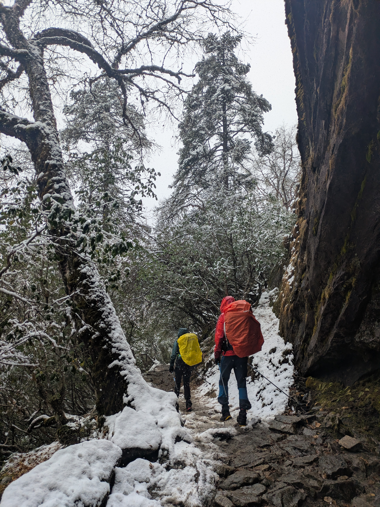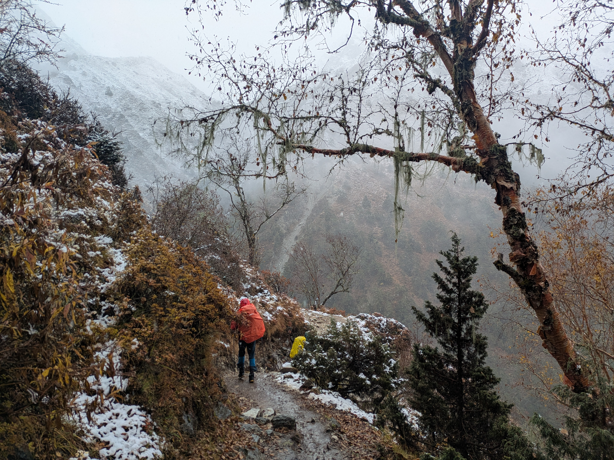

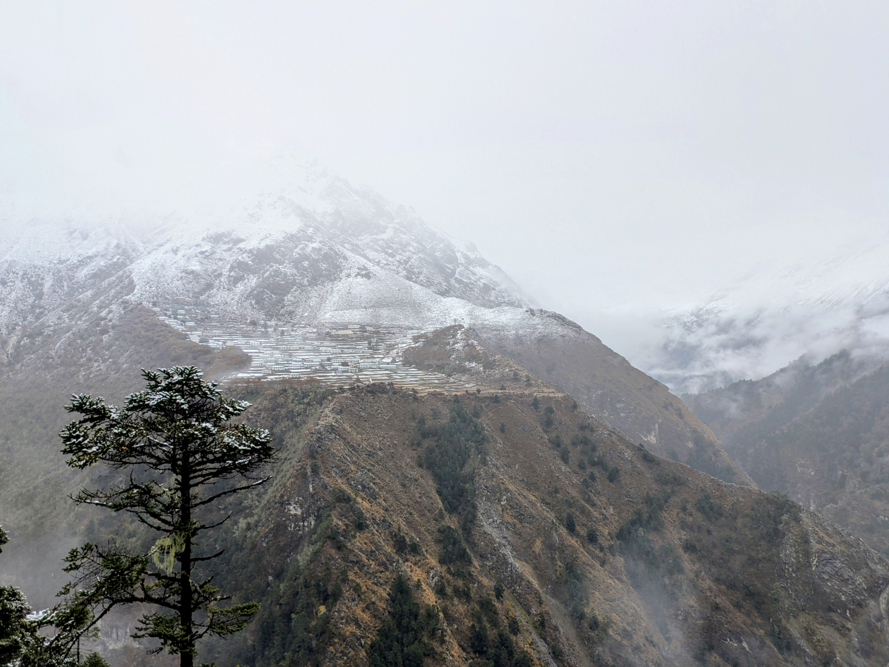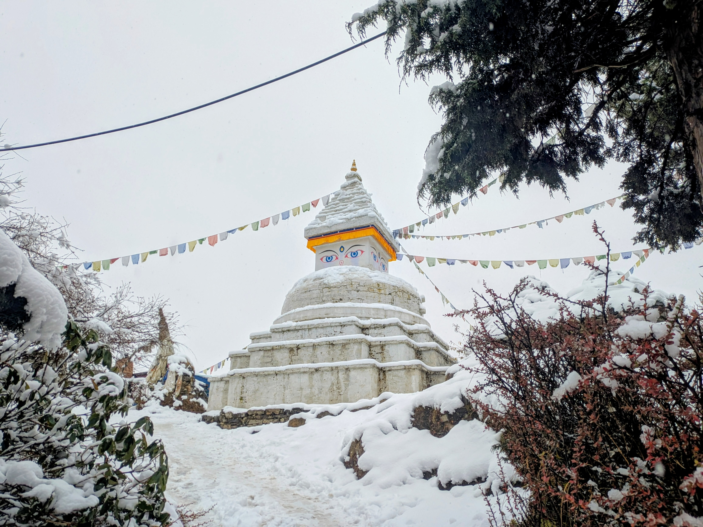

Maintenant la neige, s'est transformée en pluie. En face de Phorste, je laisse le couple de Français. Je ne sais pas trop pourquoi, nous avions pourtant prévu de jouer aux cartes ce soir. Peut-être l'envie d'être seule ? L'atmosphère du lieu où ils se sont arrêtés ? Je poursuis ma route encore un peu. Peut-être jusqu'à Mongla ? Quelques rencontres sur le chemin me poussent à aller encore plus loin : "Mongla ce n'est pas terrible, tu peux aller jusqu'à Kyangjuma, il y a une super boulangerie !". Finalement, je m'arrête à Sanasa, 1 km avant. De ce petit village part un embranchement qui permet de remonter sur le plateau de Khumjung. J'ai envie de retourner au monastère avant de sortir des montagnes. Peut-être un peu pour faire une sorte de boucle. Ne parlions-nous pas de cycle un peu plus haut ?

Dans la salle commune, c'est l'opération étendoir. Chaussures, chaussettes, gants, veste de pluie, pantalon, tout est plutôt humide voir carrément mouillé. Après une journée de marche dans la neige et la flotte, c'est cohérent. Avec moi une petite troupe de canadiens que j'avais croisé aussi à Gorak Shap. Ils sont exténués et pas très très loquasses. Petite soirée yoga, méditation et étirements en solitaire.

4 769 m ↘️ 3 580 m - 19 km, jour 8

## Retrouvailles avec la terre déjà foulée : Khumjung jusqu'à Lulka

Je me réveille avec l'espoir de retrouver mes vêtements secs. Ma veste, mes chaussures le sont, le reste est un peu humide. Pour le moment, il ne pleut presque pas. Au petit matin, j'ai entendu un hélicoptère, mais vu la couverture nuageuse, il n'y aura pas d'avion aujourd'hui. Hier soir, j'ai envoyé un message à mon contact à l'aéroport pour lui demander un vol si possible demain. Il m'a dit que c'était très incertain à cause du temps. Demain comme après-demain d'ailleurs. Je m'imagine déjà bloquée dans la montagne sans que cela m'inquiète le moins du monde.

Première étape de la journée : le monastère de Khumjung. Je passe avant dans un salon de thé boulangerie pour me faire un magnifique petit déjeuner à base de gros gâteau au chocolat. Moi qui n'avais quasiment mangé que des plats classiques depuis le début du périple, je ne retrouve sur les derniers jours à craquer en gourmandises. Il faut dire aussi que je ne voulais pas me trouver en manque d'argent en altitude. Maintenant que la fin se fait sentir, je n'ai plus besoin de budgétiser.

En arrivant au monastère, je croise le moine-gardien qui allait partir. Sans que j'insiste et dans sa grande gentillesse, il n'ouvre tout de même pour que je puisse aller méditer. Il doit partir, mais je n'aurai qu'à demander au vendeur de la boutique à côté de fermer derrière moi. Lorsque j'entre dans la salle au deuxième étage, je suis saisie par les mêmes frissons que la dernière fois. L'atmosphère est magnifique (j'ai du utiliser ce mot au moins 10 fois depuis le début du récit...).

Je remercie silencieusement le moine pour cet inestimable cadeau de solitude dans ce lieu. Lorsque je sors enfin, je marche avec une légèreté qui me fait douter de l'existence de la pesanteur.

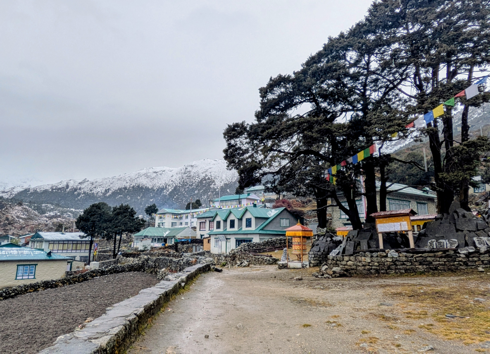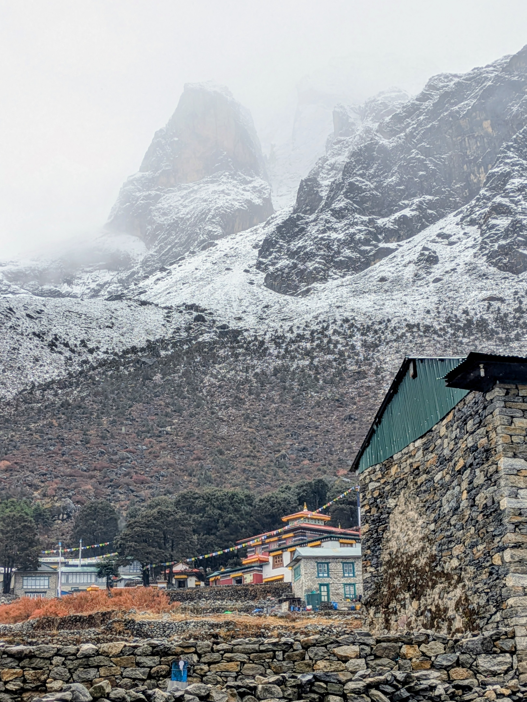

Je me rattrape sur les premiers jours où je n'avais pris quasiment aucune photo. Je prends la même photo devant l'entrée du monastère, là où Adam avait joué au foot avec des enfants.

Je commence ma journée de "au revoir" aux montagnes. En sortant de Khumjung, je me mets de la musique dans les oreilles : Joe Dassin, Balavoine, Jacques Brel ([la playlist](https://open.spotify.com/playlist/5qaxPB8rC0wHngdmwLbhZZ)). J'ai énormément de joie en moi et j'ai envie de chanter en marchant. Alors je chante.

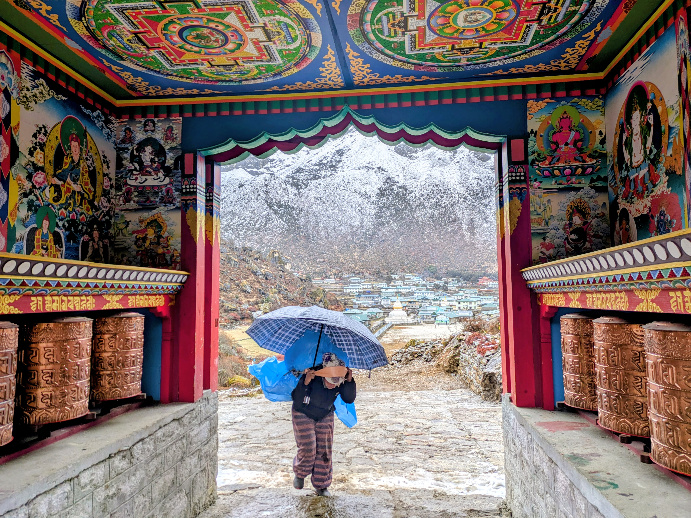

Je croise beaucoup de monde. Je regarde les gens : encore trop de visages fermés, quelques saluts sincères. J'ai l'impression de voir la tête un peu hébétée de mes élèves en début d'année. Lorsque je leur dis "bonjour" quand ils entrent dans la salle et qu'ils sont déboussolés par ma bonne humeur. Ça ne dure jamais longtemps, après quelques semaines, eux aussi, me répondent joyeusement.

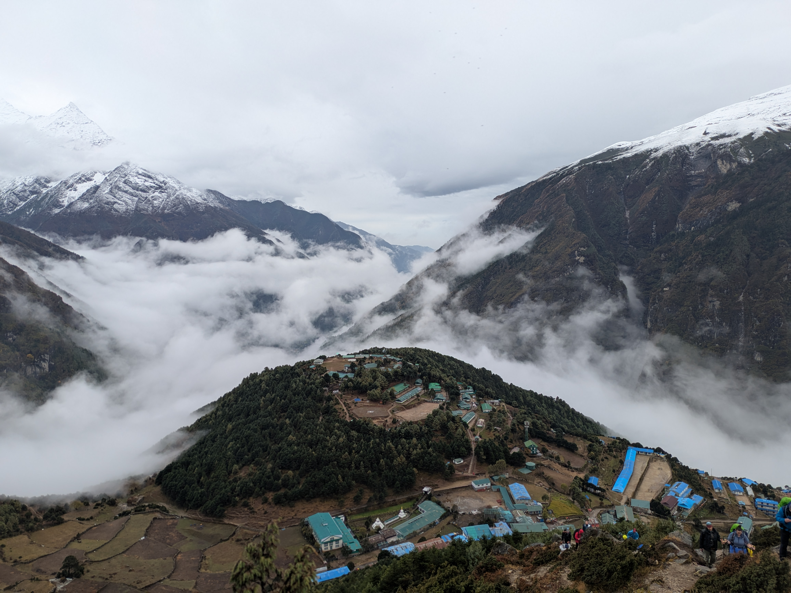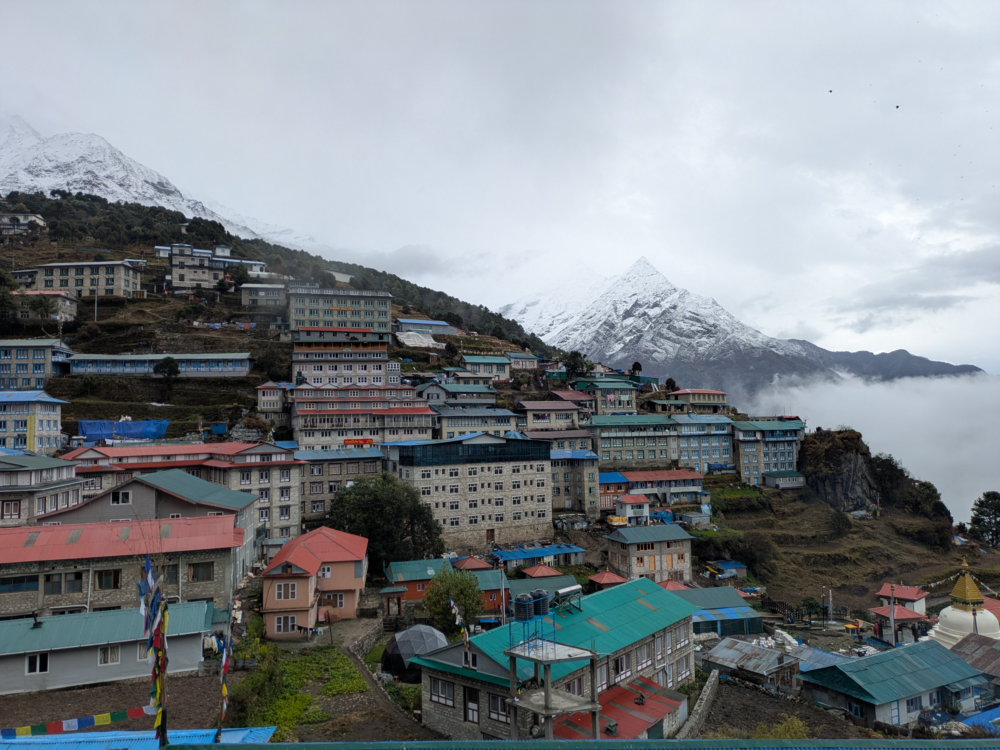

Je me laisse dériver dans la contemplation du paysage, dans les virevoltes de la brume et des nuages. Je descends. Je descends. Je descends. Je chante. Le temps s'étire. Il file, le chemin aussi. Je recroise des rencontres du chemin.

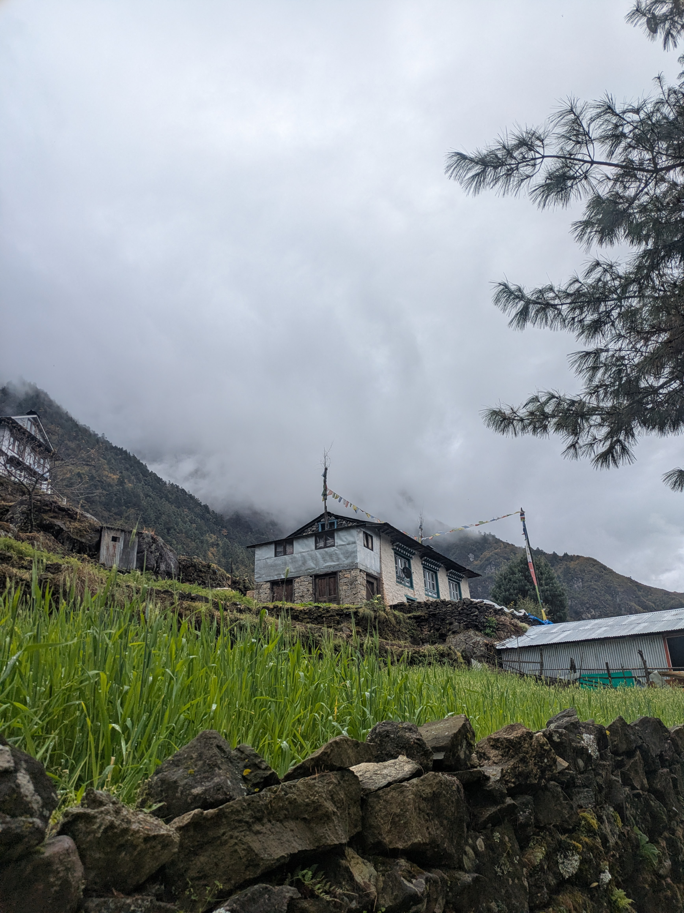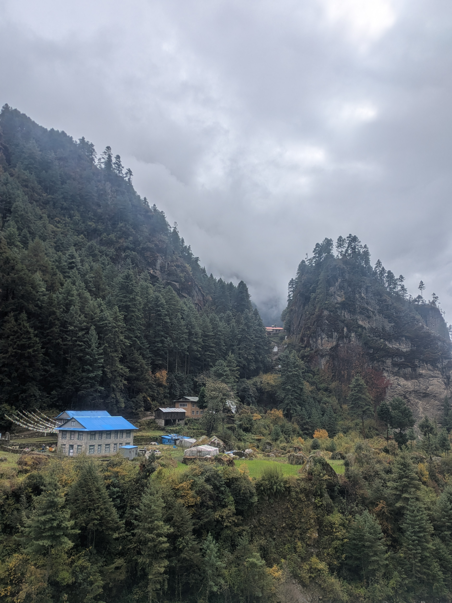

En arrivant à Lulka, je retombe directement sur Borge. Nous allons boire une petite bière, la première depuis longtemps. Je retrouve ensuite mon contact pour le vol. Il me fait comprendre qu'il n'y a pas de possibilité pour demain. Après-demain peut-être, mais avec les averses, c'est très improbable. Dans ma guesthouse, je retrouve aussi l'équipe d'Indiens. C'est décidément une journée de retrouvailles. Eux aussi veulent partir dès demain, ils doivent rentrer en Inde.

Je laisse de côté les aléas des trajets pour me glisser dans le sommeil et terminer cette journée d'au revoir.

3 580 m ↘️ 2 857 m - 22,8 km, jour 9

## La chaotique retour à Kathmandou

Je vais faire court : 32 heures de transports, quelques pauses restaurations.

Après nous être assurés que les transports aériens étaient suspendus, je me décide avec l'équipe d'Indiens à aller jusqu'à Surke pour prendre la voie terrestre. Apparemment, pour le moment, la route n'est pas trop entravée.

Le chemin jusqu'à Surke est assez boueux et glissant. Je laisse l'équipe après des passages très techniques (je finis les pieds entiers dans la boue). Il pleut abondamment et je n'ai guère envie de traîner.

Arrivée à Surke, je ne perds pas mon temps et je vais directement parlementer avec les gars du coin. Je leur dis que je cherche une jeep pour descendre jusqu'à Salleri. 10 minutes plus tard, me voici embraqué dans un gros camion bleu et peinturluré entre une japonaise et Santos, le chauffeur, un Népali avec de très longs cheveux et beaucoup de classe.

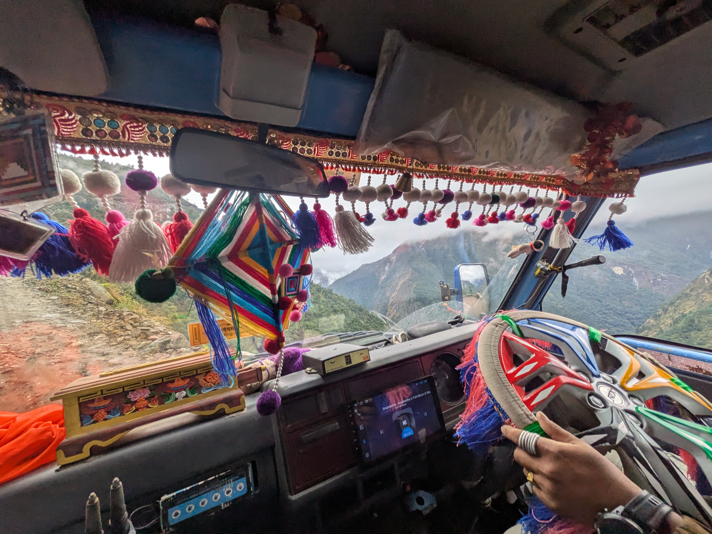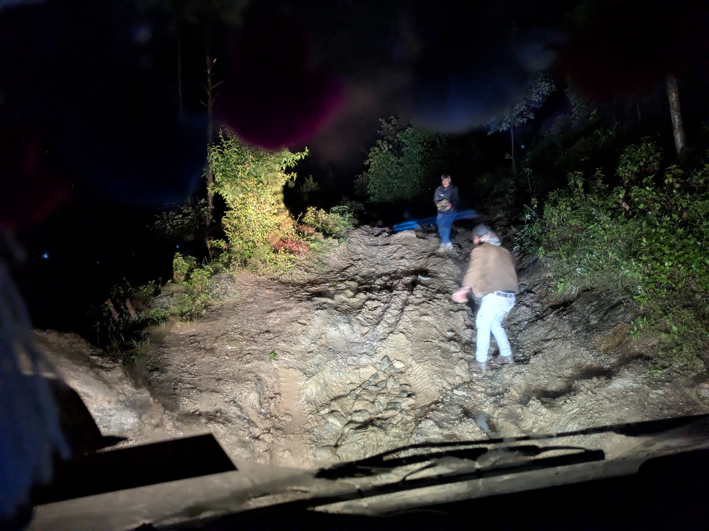

La route est aussi chaotique qu'à l'aller. Dans un gros camion, cela a un côté un peu amusant. J'essaye de rester dans un état d'esprit enfantin, car je sais déjà que le trajet sera long. En réalité, il le sera même deux fois plus… Assez vite, la nuit tombe et avec elle les premières vraies galères : des jeeps bloquées devant, des gros cailloux à déblayer, une roue embourbée… Je n'ai pas compté les péripéties, mais elles ont été présentes en abondances. Résultat : une arrivée à Salleri à 4 h du matin, juste à temps pour avoir le bus direct vers Katmandou.

Changement express de véhicule et c'est reparti pour un tour. Cette fois-ci c'est de la route, plus de la piste et il n'y a pas d'épisode embourbage. Malheureusement, le trajet est, lui aussi, doublé : la route directe pour Katmandou est coupée à cause des intempéries. Il faut faire un gros détour par d'autres vallées.

Lorsque à 19 h le bus arrive à Katmandou, je n'ai qu'une envie : foncer à dans un hôtel et aller dormir.

Au petit matin, je me félicite tout de même de cette option terrestre : à Lulka les avions sont toujours cloués au sol (ils le seront toujours le lendemain). J'ai toute la journée pour me balader à Katmandou avant de prendre mon avion pour la France tôt demain matin.

Quelques magasins, un massage, de la nourriture. J'ai un petit manque de sommeil et aucune envie de me presser. La seule chose que je veux vraiment aller voir c'est le [Buddha stupa](https://fr.wikipedia.org/wiki/Bodnath), un temple tibétain dont on m'a parlé. Je m'y rends au crépuscule. La foule tourne en cercle autour du stupa, actionnant au passage les moulins de prière. C'est fort et puissant. Une masse de gens allant dans le même sens tel une vague. Je distribue des sourires. C'est un bel endroit pour dire au revoir au Népal et se tourner complètement vers la fin du voyage. Le regard dans le vague, je reste assez longtemps pour voir la nuit tomber.

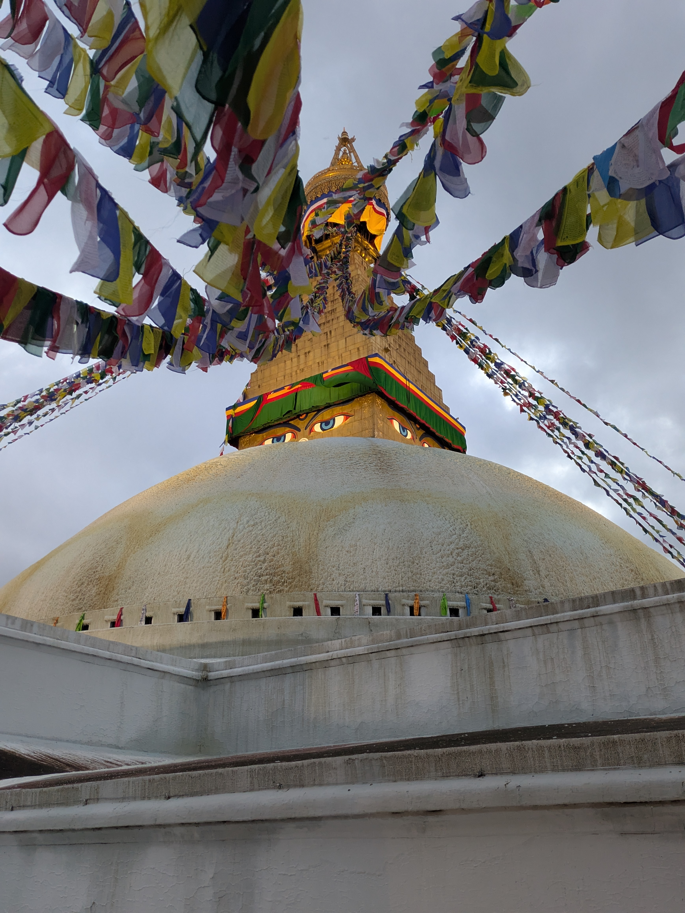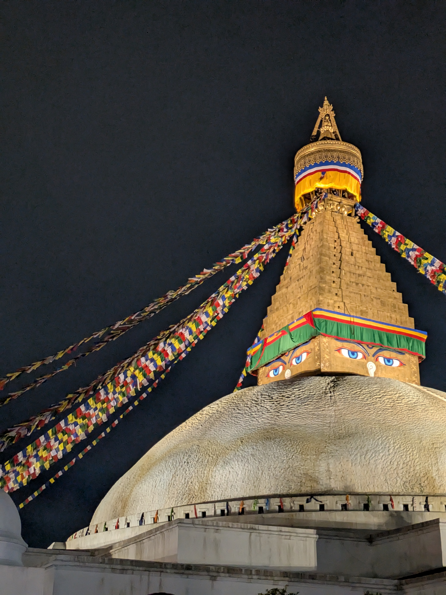

Finalement, j'arriverai tout de même en France un jour plus tard. Pas bloquée dans la montagne, juste une correspondance ratée à cause d'un vol retardé entre l'Inde et la France. Un retour, une suite plutôt, toujours sur le chemin de la vie.

## Dans la montagne, on n'est jamais seule 🌸

Déjà parce qu'il y a la montagne, ses torrents, ses ruisseaux, ses pierres qui roulent partout ; ensuite parce qu'il y a des rencontres éphémères, des retrouvailles inattendues d'un jour à l'autre, des prises de nouvelles, des encouragements.

Merci à toutes ces petites âmes vibrantes qui ont croisé mon chemin, je ne pourrai les nommer toutes mais je pense à : Talita (avec qui je n'ai pas de photos malheureusement), cette jolie taïwanaise au Kway rose ; Philippe et Rudy les belges déterminés ; Adam, Kev et Lulu les anglais adorables avec qui j'ai tant échangé, des norvégiens étonnés de mon rythme que j'ai recroisé plusieurs fois, ma super team d'indiens que j'ai retrouvés au moins 4 fois sur mon périple, Borge avec qui j'ai partagé le Kala Pathar et une bière à Lukla, des soldats du parc qui m'ont tout expliqué sur le permis et le parc, Arlette toute pétillante et au petit soin pour son mari Bertrand; Emma et Erwan avec qui j'ai tracé dans la neige; une team de Français que j'ai croisé à deux reprises et on s'est reconnu ; Santos le camionneur qui conduisait comme un king dans la nuit sur les routes effondrées ; tous les Nepali, notamment les porteurs avec qui j'ai rigolé en essayant de discuter : tashi delek !

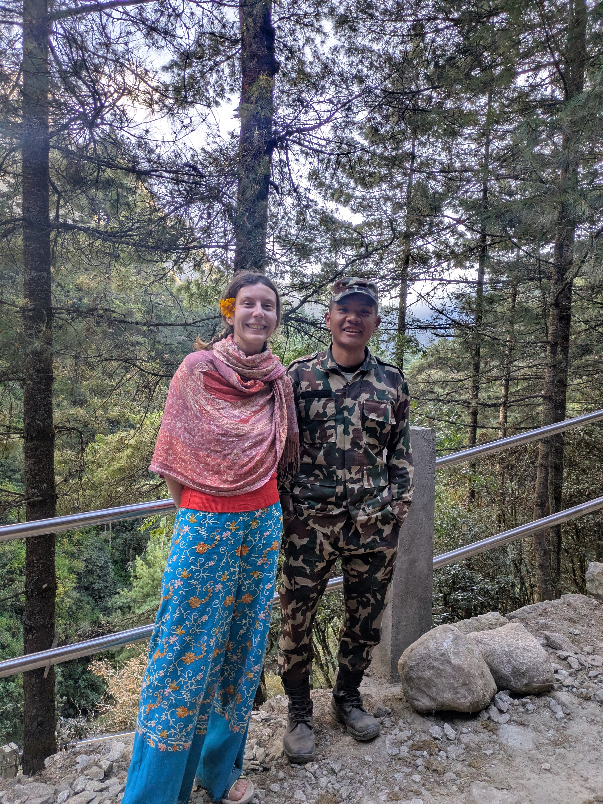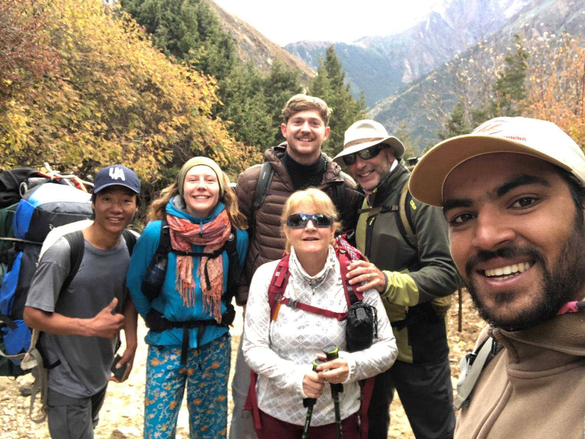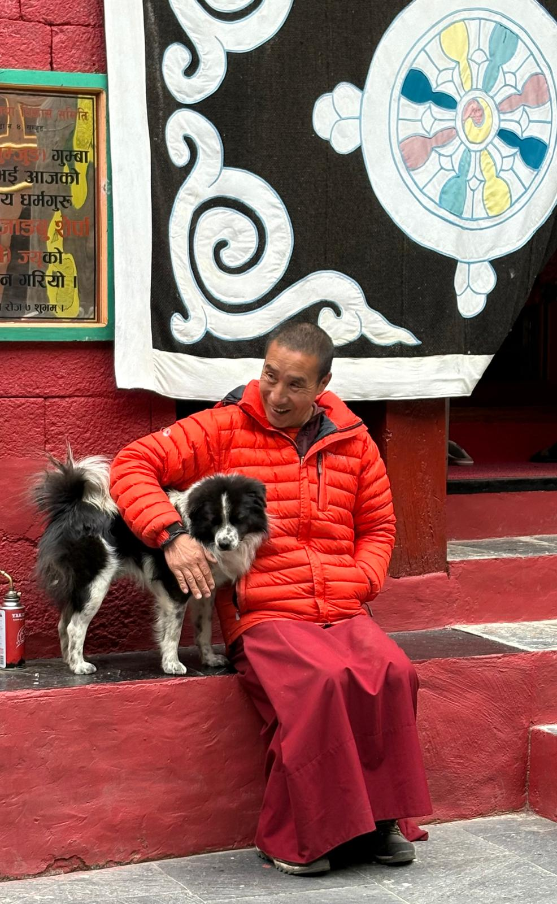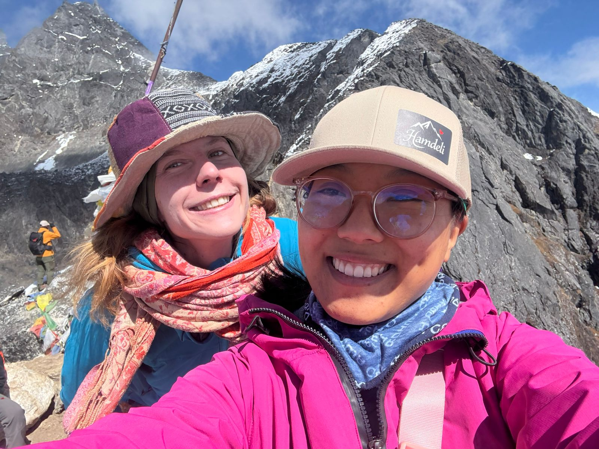

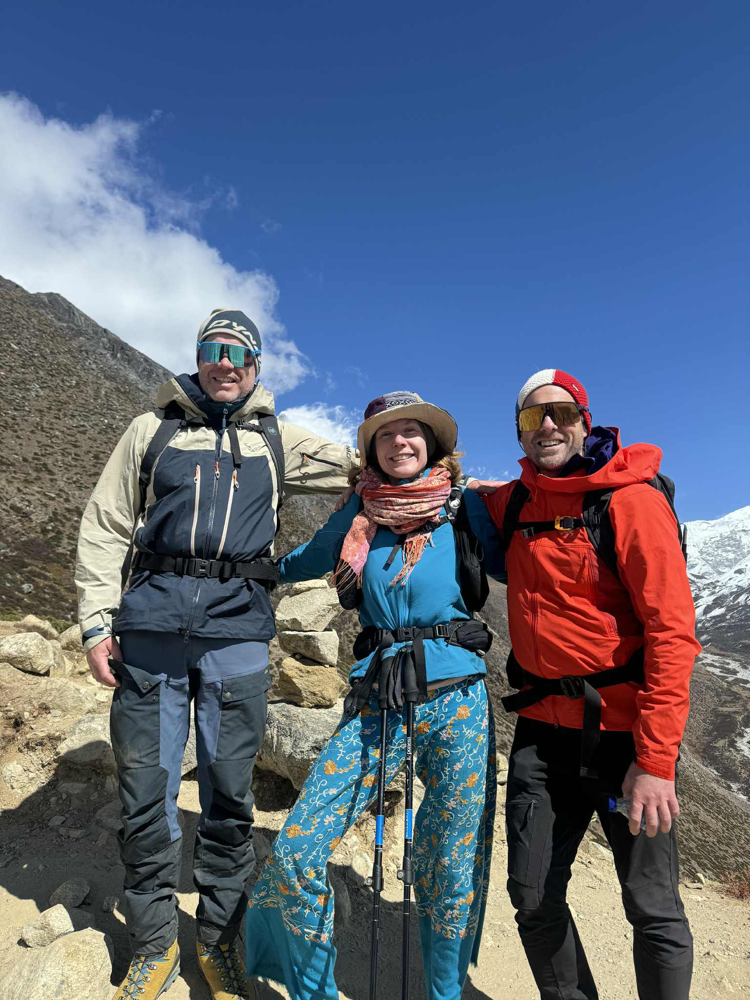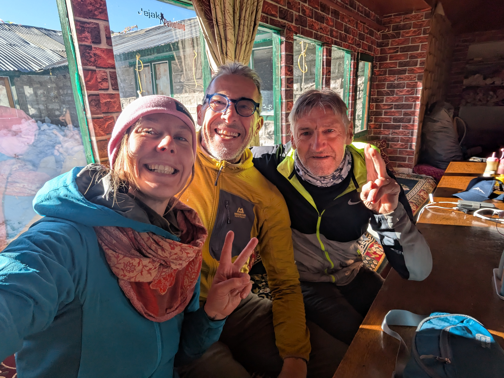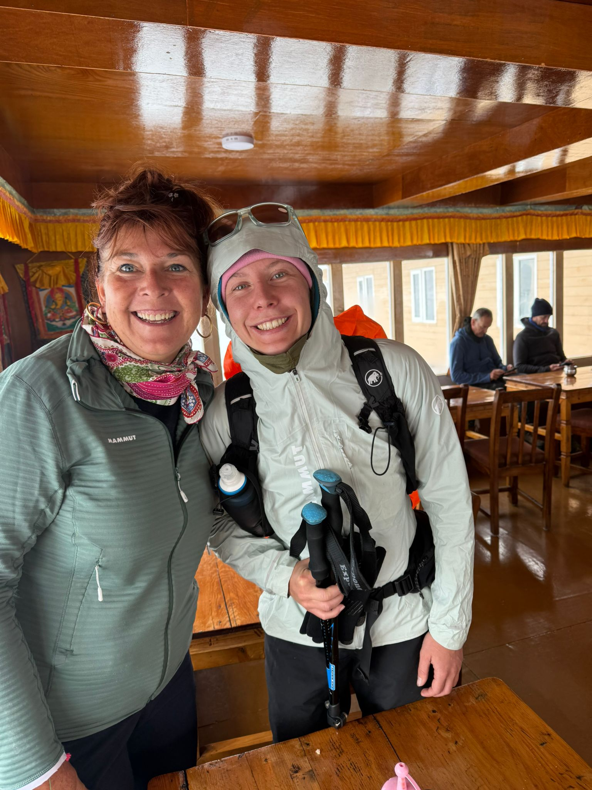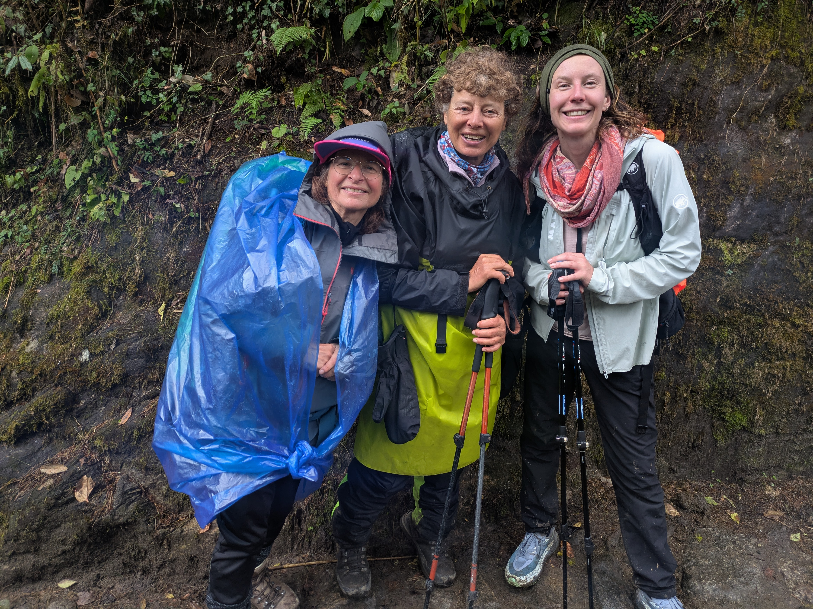

Merci pour tous les sourires, merci aux montagnes, merci pour ce présent.
