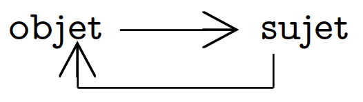

_Lorsque l'on me demande de parler de ce que je lis et que j'aborde La Méthode de [Morin](https://fr.wikipedia.org/wiki/Edgar_Morin), j'ai toujours énormément de difficulté à expliquer clairement de quoi parle cet écrit et pourquoi je le trouve autant intéressant et éclaircissant. Alors avant toute chose, je souhaiterai m'excuser par avance pour les réflexions qui se perdront et pour les argumentaires déviants. Je vous souhaite de voir en ces lignes un flambeau à passer et je ne peux que vous conseiller de lire Morin à votre tour, si vous le voulez._

_Je me trouve actuellement dans un long pèlerinage de lecture, je lis le premier tome, sur six, de la Méthode : La Nature de la Nature. C'est une lecture laborieuse : la moindre inattention et je recommence le début d'un paragraphe ; et paradoxalement excitante : les engrenages qui y sont décrits et expliqués font écho à ma propre expérience et tentative de compréhension du monde. Il n'est pas possible, et fort peu souhaitable, de paraphraser entièrement La Méthode, malgré mon envie de partager et de communiquer sur tout ce que j’apprends et j’apprends à conceptualiser en ces lignes. Je vais donc me "contenter" de rapporter, en bribes, l'introduction générale à La Méthode, au titre fort poétique : L'esprit de la vallée._

_Cette lecture, qui a débuté au mois de juin 2020, m'a beaucoup aidée à "mieux percevoir, mieux jauger" ce qui m'entoure, comprendre des déterminismes et in-déterminismes latents chez moi et d'autres. Étant actuellement dans un moment de faiblesse sur le fleuve de ma vie, je puise de la force vitale dans La Méthode. Cela peut paraître paradoxal, de s'appuyer sur des concepts aériens, cependant ce que je lis, vis ici, me paraît intimement concret et bien réel. Voir même essentiel pour moi et mon futur. **Non pas que Morin ne me donne "La Voie", le chemin a suivre, mais il tend un éclairage méthodique sur un monde que j'avais, que j'ai, du mal a appréhender. Un éclairage aussi sur un deuil que nous devons faire, le deuil d'accepter qu'appréhender le tout est hors de notre portée et qu'appréhender en divisant est se voiler.**_

> La connaissance isolée qu'a obtenue un groupe de spécialistes dans un champ étroit n'a elle-même aucune valeur d'aucune sorte. Elle n'a de valeur que dans le système théorique qui la réunit à tout le reste de la connaissance, et ce dans la mesure où elle contribue réellement, dans cette synthèse, à répondre à la question "Qui sommes-nous ?"
>
> _E. Schrödinger_

**La Méthode c'est s'évader de la vallée, du paradigme, comme de la caverne de Platon, mais tout en apprenant à y vivre et a y "recevoir toutes les eaux qui se déversent en elle"** (esprit de la vallée évoqué dans le [Livre du Tao](https://fr.wikipedia.org/wiki/Dao_de_jing)). C'est élaborer une pensée du monde, de l'homme et de ce que l'homme en fait, complexe, multiple, pluri-angulaire, prenant en compte des visions complémentaires et antagonistes.

Morin nous emmène à penser grand, loin, profond : l'homme conçu comme un concept trinitaire : individu - société - espèce dont on ne peut réduire ou subordonner un terme à un autre - or souvent nous abordons les problèmes sociétaux loin de l'individu ou les soucis personnels hors du concept d'espèce et de société... nous emmène sur des principes d'explication complexe, une théorie d'auto-organisation, une articulation double entre physique - biologie - anthropo-sociologie.

## À mort la simplification

Une première étape - s'il est un tant soit peut concevable d'utiliser ce mot dans cette méthode -, est de réintégrer l'observateur dans l'observation. L'observateur qui observe, l'esprit qui pense et qui conçoit, sont eux-même indissociables d'une culture, donc d'une société. Toute connaissance, même la plus physique, subit une détermination sociologique. "subit", le mot est juste : la détermination n'est pas inhérente à la société, n'est pas définie par la société mais porte une partie de son empreinte. Il nous faudrait ré-interroger le cadre de nos connaissances, le cadre de nos sciences. La science ne se connaît pas scientifiquement et n'a aucun moyen de se connaître scientifiquement. Il n'y a pas de science comme objet de science, de scientifique comme sujet de l'objet science. Du moins dans les leçons et matières courantes et institutionnelles qui sont transmises à chacun.

> Pour moi, la science est une aspiration de l’esprit humain qui cherche l’unité sous le chaos de la nature, comme un écrivain la cherche dans la variété de la nature humaine.
>
> _Jacob Bronowski, Science and Human Values (1956, édition revue en 1965)_

> Science sans conscience n'est que ruine de l'âme.
>
> _Rabelais_

La conscience, ici, est vue comme l'aptitude à se concevoir soi-même, se voir soit même. La science que nous avons construite et que nous enseignons aujourd'hui dans nos écoles en est plus que jamais dépourvue. Nous utilisons nous outils scientifiques pour découper, pour trouver des schémas, des patterns, mettre le monde sous forme de statistiques, réduire pour analyser et - soi disant - mieux savoir, mieux prévoir.
Il nous faudrait redonner conscience à la science en:
* Concevant la science comme praxis (pratique / action qui transforme le sujet) sociale
* Concevant son pouvoir de manipulation et sa manipulation par les pouvoirs
* Concevant le lien entre la recherche "désintéressée" et la recherche d'intérêt

> Peut-on se satisfaire de ne concevoir l'individu qu'en excluant la société, la société qu'en excluant l'espèce, l'humain en excluant la vie, la vie qu'en excluant la physis, la physique en excluant la vie? (...) Peut-on accepter que la connaissance se fonde sur l'exclusion du connaissant, que la pensée se fonde sur l'exclusion du pensant, que le sujet soit exclu de la construction de l'objet? (...) Peut-on accepter une telle nuit sur la connaissance?
>
> _Edgar Morin, La Méthode tome 1 La nature de la nature, L'esprit de la vallée p.15, Éditions du Seuil_

Difficile de répondre à ses questions, de tout lier, de tout penser. Il faut, d'après Morin, se mettre entre le deuil d'une réponse à ses questions et **à la recherche d'une méthode qui puisse articuler ce qui est séparé, relier ce qui est disjoint.**

> Le doute cartésien était sur lui-même. Notre doute doute de lui-même, il découvre l'impossibilité de faire table rase, puisque les conditions logiques, linguistiques, culturelles de la pensée sont inévitablement préjugeantes. (...) L'incertitude devient viatique: le doute sur le doute donne au doute une dimension nouvelle, celle de la réflexivité; le doute par lequel le sujet s'interroge sur les conditions d’émergence et d'existence de sa propre pensée constitue dès lors une pensée potentiellement relativiste, relationnaliste et auto-connaissante.
>
> _Edgar Morin, La Méthode tome 1 La nature de la nature, L'esprit de la vallée p.15, Éditions du Seuil_

**Pour penser la science, la connaissance, la nature, la vie, le monde, il nous faut résister à avancer dans une simplification mutilatrice, il nous faut prendre conscience et accepter la grandeur de l'ignorance, de l'incertitude et de la confusion.**

## Au delà du cercle vicieux
Ne pas aller vers la simplification, ne pas découper, nous amène dans des schémas bouillonnants où les notions s’entremêlent et se démêlent entre elles. Une science de l'homme postule une science de la nature, qui postule elle aussi une science de l'homme. Une dépendance mutuelle, qui renvoie chacune des ses propositions à l'autre, qui nous mène à une impossibilité de choisir un début ou une fin, une impossibilité de déterminer le début d'un chemin. Sur quelle donnée initiale se baser? Comment assurer la tangibilité de notre raisonnement?

Habituellement, de manière institutionnalisée, nous coupons les liens, nous rangeons les notions sous leur étiquette, à "leur place". Nos brisons les cercles vicieux d'inter-dépendances en isolant les propositions, en choisissant des référentiels d'études, des cadres d'analyses. La réflexion d'un sujet sur un objet va se diviser, les sciences dures disposant de l'objet et la philosophie du sujet.

La circularité des notions, déguisée en cercle vicieux dont nous ne sortons pas et où tout ce nie, permet, étonnement, de respecter les conditions objectives de la connaissance humaine qui comporte toujours, quelque part, paradoxe logique et incertitude. La possibilité de concevoir des vérités - la vérité du sujet et celle de l'objet - comme les deux faces d'une même pièce, d'une même vérité complexe, c'est oser partir à la recherche dans les relations d'inter-dépendances et les connaissances réflexives.

_Le mouvement réflexif de la pensée sur la pensée_

Comme pour le cogito cartésien, et ce que nous a transmis Descartes, c'est dans la création d'une pensée sur soi-même que l'existence voit le jour. L'apparition du sujet projette des possibles réflexions qui ne seraient sans lui.

> Concevoir la circularité, c'est dès lors ouvrir la possibilité d'une méthode qui en faisant interagir les termes qui se renvoient les uns les autres, deviendrait productive, à travers ces processus et échanges, d'une connaissance complexe comportant sa propre réflexivité. (...)
> Nous entrevoyons la possibilité de transformer les cercles vicieux en cycles vertueux, devenant réflexifs et générateurs d'une pensée complexe. D'où cette idée qui guidera notre départ: il ne faut pas briser nos circularité, il faut au contraire veiller à ne pas s'en détacher.
>
> Le cercle sera notre roue, notre route sera spirale.
>
> _Edgar Morin, La Méthode tome 1 La nature de la nature, L'esprit de la vallée p.19, Éditions du Seuil_

## Caminante no hay camino

Il faut chercher, non pas à supprimer les distinctions et les oppositions, mais à renverser la dictature de la simplification disjonctive et réductrice. Notre pensée doit investir l'impensé qui la commande et la contrôle. Notre pensée doit revenir à sa source en boucle interrogative et critique. Il nous faut réorganiser notre système mental pour apprendre à apprendre, se servir de notre pensée pour repenser notre structure de pensée. **Je le dis encore, après l'avoir lu, perçu et digéré toujours un peu plus, il nous faut accepter l’absurdité d'une stabilité dans l'incertitude, d'une clarté dans la confusion.**

> "Caminante no hay camino, se hace camino al andar"
>
>_Machado_

> Ce qui apprend à apprendre, c'est cela la méthode
>
> _Edgar Morin, La Méthode tome 1 La nature de la nature, L'esprit de la vallée p.21, Éditions du Seuil_

Apprendre à apprendre c'est - après l'étape d'intégration de l'observateur dans l'observation, après la décision-acceptation de boucler - ne pas céder à ce qui définit la pensée simplifiante:
* Idéaliser: croire que la réalité puisse se résorber dans l'idée, que seul soit réel l'intelligible et encore plus sournoisement, notre intelligible.
* Rationaliser: vouloir enfermer la réalité dans l'ordre et la cohérence d'un système, lui interdire tout débordement hors du système.
* Normaliser: éliminer l'étrange, l'irréductible, le mystère. Lisser ce que l'on ne conçoit pas et qui ne se range pas bien dans nos tiroirs scientifiques.
Il n'y aura pas de théorie générale unifiée, il n'y aura pas de principe maître, il n'y aura pas de synthèse totalisante.

Pour citer encore - beaucoup trop - Morin avec une phrase qui m'a particulièrement touchée, moi qui aime le voyage, et que je trouve d'une justesse incroyable: **"Le retour au commencement n'est pas un cercle vicieux si le voyage signifie expérience d'où l'on revient changé"**. C’est en cela que le cercle vicieux évoqué précédemment se transforme et devient un cercle vertueux.

Il n'est pas facile d'accepter de retourner à son point de départ, surtout lors de réflexion. Cela nous donne l'impression de ne pas avoir avancé, de ne pas avoir progressé. Nous voulons du changement, de la montée en compétence, sentir et voir l'amélioration. Cela est vrai dans nos argumentaires mais aussi dans ce qui constitue notre vie et nos actions: nous voulons des preuves tangibles visibles de notre avancement, des étapes franchies, des projets terminés. Peut être pour montrer aux autres ensuite, après se l'être montré à nous même, leur mettre sous le nez et leur dire "t'as vu, j'en suis là, j'ai fait ça".

Nous ne pourrons jamais montrer ce qui a changé en nous en arpentant des chemins comme celui que nous suggère la méthode: **il n'y à rien à montrer, il y a toujours retour, continuel recommencement, questionnement et apprentissage**.

## Parenthèse sur les cycles
J'ai eu la chance - selon le point de vue - de faire des expériences psychédéliques - peut être un article un jour - et mes déambulations dans cet état second me conduisaient à faire des cycles, des boucles, des raisonnements logiques qui se retournaient sur eux-mêmes, s'auto-alimentaient. J'avais, j'ai, vraiment l'impression que mon cerveau aimait, aime ça, les cycles, les boucles. Revenir sur ses pas par un autre chemin, avoir la sensation que tout s’emboîte parfaitement, que tout est lié. Je me demande si la pensée et les schémas de Morin me plaisent car je les trouve justes et pertinents ou s'il n'y a une part de mon cerveau qui est contenté par toutes ces formes en spirales, cette logique qui s'imbrique en elle même. Ou peut être que cela me plaît, plaît à mon esprit car cela est vraiment juste et pertinent. Les faces d'une même pièce.

J'ai l’intime conviction que la forme cyclique, symbole dans l'humanité depuis la nuit des temps, le raisonnement cyclique, nous ramène à une métaphore de nous même, de la quête de l'humanité de trouver un sens à son existence: qu'elle n'a de sens que elle-même, celui de l'existence qu'elle se donne.

 

Pour acheter et lire La Methode: [Edition Seuil, la Méthode I et II](https://www.seuil.com/ouvrage/la-methode-i-et-ii-edgar-morin/9782020968720).

Merci à Frank Lejeune pour sa petite relecture.
