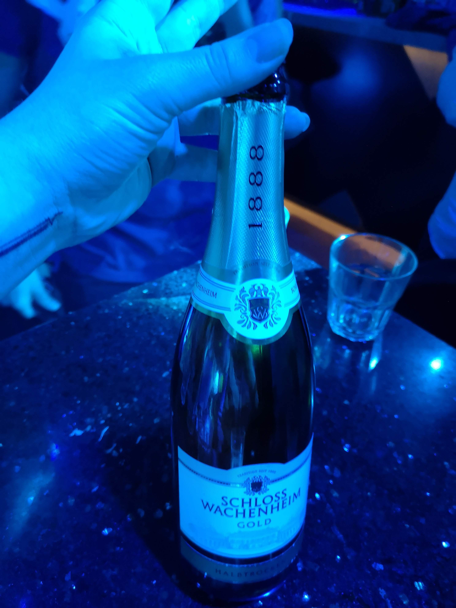
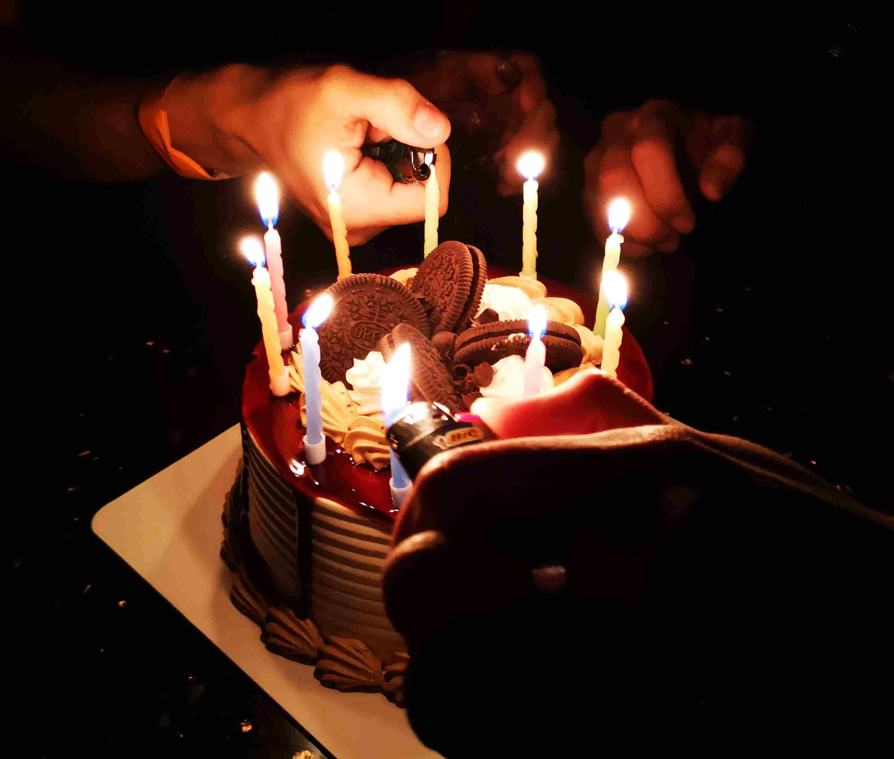
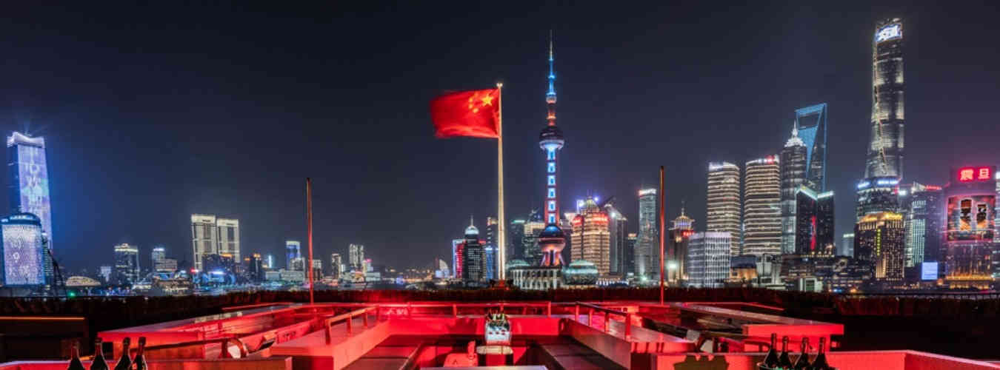

[Shanghai](https://blog.leaula.me/fr/blog/shanghai), sur la mer (shang, 上: dessus et hai, 海: mer) et sur l’embouchure du fleuve Huangpu, est l’une des plus grandes métropoles du monde. **Derrière sa place majeure dans l’économie mondiale, cette fenêtre de l’Occident sur la Chine – et de la Chine sur le monde – cache des petits secrets au cœur de sa vie nocturne.**

Entre l’apparat d’une population chinoise aisée et l’interculturalité – pourtant faible (0,6 % des Shanghaïens sont étrangers) mais attirée par les lumières huppées – naît chaque soir une folie de la fête au plus haut des grattes-ciel de la ville. Les boîtes de nuits y sont presque irréelles, avec des aquariums immenses où nagent des bébés requins devant des chinois en GUCCI et des litres de champagne. Parfois, des artistes mondialement connus – Martin Solveig, Vini Vici que j’ai eu la chance de voir – viennent y mixer le temps d’une soirée.

**_Un monde de festivités du lundi au dimanche où l’argent a une valeur totalement différente de celle de la rue. Et pour y rentrer, je n’ai eu qu’à tendre la main…_**

## Le ticket gagnant vers une somptueuse débauche

_J’avais des amis, partis en Erasmus à Shanghai quelques années avant moi, qui m’avaient raconté "tout ça". Pourtant avant que je puisse le vivre moi-même, je n’y avais jamais vraiment cru. **Parce que le ticket gagnant pour rentrer en VIP dans ce monde d’ivresse et de paillettes, c’était tout simplement mes yeux ronds, ma peau claire, mes traits d’européenne.**_

> « Je pense que de notre vie, on ne fera jamais autant de soirées que ce qu’on a fait à Shanghai » _Étudiant Erasmus 2018_

> « C’était quand même une belle époque… Je crois que je réalisais pas la folie derrière tout ça » _Étudiant Erasmus 2018_

Les entrées en boîte de nuit coûtent cher à Shanghai, encore plus les consommations et les tables (table privative classique pour la soirée entre 35 et 85€). Mais ce n’était pas un problème pour les "chinois riches" - _comme moi et mes amis les appelions_ - qui aiment beaucoup faire la fête et montrer de manière ostentatoire leur opulence. Il était d’ailleurs assez surprenant de noter la présence assez récurrente de chinois d’une quarantaine d’année venant, souvent en couple, profiter de l’ambiance festive.

En plus des multiples bouteilles de vodka – au minimum de la Belvédère – et d’autres alcools forts, il est courant de commander du champagne à des prix exorbitants. Les bouteilles sont ensuite amenées à table par un défilé de jeunes femmes en soutien-gorge agitant des minis feu d’artifices.

Ce qui est curieux – mais c’est aussi de là qu’une grande partie du système que nous verrons découle – c’est que les chinois n’aiment pas vraiment danser. Un comble de se rendre en boîte de nuit pour rester assis à une table… Lorsqu’ils viennent en soirée, c’est pour boire avec leurs amis, jouer aux dès (quasiment comme le [Dudo](https://fr.wikipedia.org/wiki/Dudo), sauf que quand on perd, on boit), écouter de la musique, mais surtout – _je suppute sans prendre énormément de risques_ – s’exhiber et flamber une partie de leur richesse ou celle de leurs parents.

Souvent les tables les mieux placées de la boîte jouent à celle qui commandera le plus de champagne. Ou encore a celle qui sera le mieux entourée. En effet il est courant d’inviter des occidentaux à sa table pour partager des moments avec eux. Il semble qu’il y ai un grand fantasme pour l’Europe et l’Occident en général – du moins sur l’apparence – chez les classes aisées chinoises. Prendre des photos, passer une soirée, ou encore mieux, avoir des amis blancs symbolise presque une sorte de réussite et de validation sociale.

> « Je me souviendrai tout ma vie de cette table de chinois qui m’avait invité et qui ne faisait que jouer aux dès. Je faisais exprès de perdre parce qu’il buvaient une super bouteille de Cognac. » _Étudiant Erasmus 2018_

Alors dans ce monde d’opulence et de fête au paroxysme, pour les boîtes de nuit, **il faut réussir à attirer « l’oiseau rare » : l’occidental, blanc de préférence.**  

D’un côté pour satisfaire les clients, se classer dans les lieux tendances de la ville, et de l’autre pour recruter chez les occidentaux des danseurs et des metteurs d’ambiance. Dans le but que les soirées ne se transforment pas en partie de jeux de dés…

> « On était basiquement des prostitués à chinois mais… c’était "un fair trade" » _Étudiant Erasmus 2018_

> « Personnellement, je n’avais pas l’impression d’être une pu** à chinois. Mais quand tu y penses, le concept c’est un peu ça oui. Tu es "invité" pour mettre l’ambiance que les locaux mettent pas, les amuser » _Étudiant Erasmus 2018_

**C’est donc pour ces raisons que nous disposions de ce fameux ticket gagnant, entrée gratuite et boisson à volonté dans les plus grandes et plus belles boites de Shanghai.**

**Et la distribution de ces tickets demandait toute une organisation.**

## L’argent de la fête : le système de promotion

En tant qu’occidentaux, nous rentrions directement dans les boîtes de nuit : notre nom était écrit sur une liste et nous donnait le droit à un petit bracelet en plastique symbolisant notre statut. Nous avions une à deux tables allouées, souvent à côté du dance-floor. Elles étaient régulièrement ravitaillées en alcool, vodka et whisky agrémenté de jus d’orange et de coca à l’eau. **Et pour pouvoir y accéder, pour pouvoir être sur une liste, il suffisait de passer par un promoteur.**

_J’avoue, j’ai adoré cette ivresse, ce monde de soirées continuelles. Donc, je suis énormément sortie, bien plus que mes amis. Même seule, ce n’était pas un problème à Shanghai. Et au court de mes pérégrinations nocturnes j’ai pu me faire d’autres amis et en apprendre un peu plus sur le monde de la nuit…_

### Les réseaux de Peoples

Un promoteur est un facilitateur entre la boîte de nuit, le club, et des clients potentiels. Son rôle est de faciliter les échanges entre les deux parties. Il est rémunéré selon son efficacité. L’activité est régulée : le promoteur reçoit une prime en fonction des clients qui consomment dans le club, par exemple, les clients qui payent une table.

À Shanghai le système est un peu particulier. On parle de "promoteurs internationaux" dont le travail est d’amener des étrangers en boîte, notamment des étudiants internationaux. Les étudiants internationaux ont souvent du temps libre, aiment faire la fête mais n’ont pas énormément d’argent – même si la vie est moins chère à Shanghai qu’en Europe.

Le rôle du promoteur est alors de rencontrer des étudiants, souvent non loin des écoles ou via les réseaux et le bouche à oreille, pour leur proposer des sorties attractives, très attractives : c’est-à-dire totalement gratuites. Pour ce faire, les promoteurs créent des groupes sur WeChat (WhatsApp chinois) avec tous leurs pseudo-clients, donc majoritairement étudiants, et y annoncent chaque soir la liste des boîtes de nuit ouvertes avec : les horaires, le thème, l’ambiance et la musique. Les clients n’ont plus qu’à avertir leur promoteur par message privé de la soirée à laquelle ils souhaitent assister. **Dans le jargons des boîtes de nuit,  ces clients sont appelés des Peoples.**

_Dans notre cas, tout s’est fait très facilement : les anciens étudiants de notre école en Erasmus à Shanghai nous ont donné le contact de leur promoteur. Nous avons tout de même croisé des promotrices qui ont tenté de nous proposer leurs services dans le Walmart près de notre école._

**L’établissement d’un réseau est la première partie du travail d’un promoteur. La deuxième partie est de réussir à s’en servir correctement pour honorer ses contrats et se rémunérer.** Le promoteur doit pouvoir bien utiliser son réseau pour être capable d’amener ses clients en boîte mais surtout de bien les répartir et de les faire arriver au bon moment. Il faut que les Peoples se rendent même dans des boîtes moins populaires, et assez tôt pour mettre l’ambiance dès le début de la soirée.

Une fois que les clients ont averti le promoteur de leur souhait pour la soirée, celui-ci les inscrit sur la liste du club correspondant. Il peut arriver que les listes soient limitées de sorte que les Peoples arrivant après l’horaire convenu ne rapporte plus d’argent au promoteur. Ils peuvent tout de même rentrer gratuitement dans le club.

En Chine il est très courant de changer de boîte de nuit durant la soirée : après la "party" (22h-0h),  il y a l’"after-party" (0h/1h-3h) et même parfois l’"after after party" (2h/3h-5h). Le promoteur est rémunéré pour les Peoples qu’il amène pour chaque phase de la soirée. **C’est donc toute une organisation pour « essayer de mener ses Peoples sur plusieurs boîtes par soir : party et after-party »** _(Promoteur 2018)_.

### La rentabilité des "jeunes blancs"

J’ai mis l’accent sur la rentabilité des _"jeunes blancs"_ et ce n’est pas un hasard. Les Peoples, étant des jeunes occidentaux, ont majoritairement la peau claire et les yeux ronds – et c’est d’ailleurs ce qui plaît aux chinois. Bien sûr il y a aussi des jeunes aux traits asiatiques, arabes ou noirs. Il faut savoir que les chinois de la classe aisée sont extrêmement racistes envers les arabes mais encore plus avec les noirs. **Dans quelques boîtes de nuit les Peoples asiatiques / arabes / noirs pouvaient ne pas rapporter d’argent au promoteur. Il est même arrivé que certaines boîtes refusent l’accès aux personnes noires par période…**

> «Vous vous souvenez quand dans (telle boîte) les renois ne pouvaient plus rentrer ? Que même le DJ c’était vu refusé l’accès jusqu’à ce qu'ils le reconnaissent ? » _Étudiant Erasmus 2018_

**Le client final des promoteurs étant les boites de nuit, elles-mêmes au services de leurs clients de la haute société chinoise, pétrie et gangrenée par des préjugés racistes.**

La promotion était auparavant un service discret entre un club et un promoteur. Le promoteur s’arrangeait pour faire venir le quota de "jeunes blancs" souhaité et était payé de manière plus ou moins légale en liquide ou en avantages (alcool, table privative).
Dorénavant, une entreprise de promotion passe des contrats avec des clubs, par exemple : envoi de cinquante personnes dans le club tous les soirs. C’est l’entreprise qui recrute les promoteurs et les paye en fonction du nombre de personnes qu’ils amènent au bon endroit et au bon moment.

Chaque semaine dans un bureau de Nanjin Lu - une des plus grandes rues commerçantes du centre de Shanghai – se tient une réunion entre les promoteurs et l’entreprise de promotion pour établir un bilan sur la semaine : le nombre de Peoples, les améliorations possibles, les outils de communication, … , presque comme dans n’importe quelle société. Le récapitulatif se termine sur la remise – illégale – d’une plus ou moins grosse liasse de billet de 100 yuans.

> « Quand tu commences à avoir du mal à ranger des billets dans tes poches… tu sais que c’était une bonne semaine » _Promoteur 2018_

**Un People, en 2018, valait entre 2 et 3 euros par soir et par boîte.** Un promoteur moyen pouvait avoir facilement 20 Peoples tous les soirs, **soit une enveloppe entre 280 et 420€ la semaine**. Pour un promoteur ayant un gros réseau ou simplement pour une très bonne semaine la rémunération pouvait même monter jusque 700-800€.

> « Financièrement parlant c’est pas forcément un boulot intéressant, du moins au début » _Promoteur 2018_

Le plus compliqué est souvent la première étape : se construire un réseau. La plupart des promoteurs sont eux-même des étudiants ou stagiaires internationaux qui a force d’apparition dans le monde de la fête se sont vus proposer le job. Ils connaissent donc déjà du monde, certes, mais leur entourage dispose déjà d’un promoteur attitré. Et s’il y a bien une règle d’or dans le milieu de la promotion c’est « qu’on ne pique pas les Peoples des autres » _(Promoteur 2018)_. _Je sortais souvent avec un pote promoteur mais il me rappelait toujours de mettre le nom de mon promoteur et jamais le sien._

Une fois le réseau créé, cela peut devenir assez lucratif pour se payer ses études et son loyer. _C’était d’ailleurs le cas de plusieurs promoteurs que j’ai pu rencontrer._

En plus de l’argent, pour une personne qui aime les soirées, cette activité n’a que des avantages – hormis l’illégalité : **un monde de boissons gratuites et à volonté, de pistes de danse ; un monde de bêtes nocturnes drapées dans la soie et les paillettes.**

> « C’était vite la fête tout le temps. Il y avait même des promoteurs spécialisés dans les anniversaires. Comme ça ils étaient sûrs d’avoir chaque soir : gâteau, champagne, du meilleur alcool et des potes pour la soirée » _Promoteur 2018_

### Les privilèges et le contrôle, le dessous les dorures

Comme dans la quasi-totalité des rues de Shanghai, les caméras de surveillance sont omniprésentes dans les clubs. Dès l’entrée de la boîte, lorsque les Peoples viennent se présenter pour recevoir leur bracelet, une caméra les identifie.

Bien entendu les caméras sont très utiles pour récupérer des affaires volées ou perdues. _Comme cela a pu arriver à plusieurs de mes amis, avec à chaque fois, la totalité des affaires retrouvées._ Mais on peut tout de même supposer des dérives avec le système chinois.

Certains Peoples ont même un identifiant attribué par l’entreprise de promotion et/ou par certains clubs. Évidemment cette identification n’est pas connue par la plupart des Peoples, même si elle n’est pas non plus ouvertement cachée. Si un People avait un identifiant c’est forcément qu’il y avait une raison derrière, positive ou négative.

Un People pouvait être identifié par une boîte car :
* Il était blacklisté  pour y avoir fait des dégâts
* Il y avait son nom et quelques privilèges associés – notamment la possibilité d’accéder à du meilleur alcool gratuitement.

Il pouvait également être identifié par l’entreprise de promotion pour les mêmes raisons :
* Totalement blacklisté d’entrée dans toutes les boîtes pour avoir fait dégâts à répétitions, ce qui nuisait à l’image de l’entreprise de promotion. _Ce fût le cas pour l’un de mes amis qui avait à plusieurs reprises - totalement ivre – insulté des managers et renversé des bouteilles sur un bar pour pouvoir danser dessus._

* Être identifié comme un Party People (metteur d’ambiance) par l’entreprise de promotion ce qui donnait quasiment des droits supplémentaires ou plutôt des avantages et de la souplesse : des retards tolérés, une plus grande flexibilité sur les accompagnants du Party People (des étudiants chinois de Shanghai ou des personnes de couleurs "trop sombres" pour des chinois racistes) et des bouteilles de champagne facilement.
_Par exemple dans mon cas, nous avions pu amener en soirée notre parrain étudiant chinois qui n’était jamais venu en boîte de sa vie. C’était pour lui un monde totalement inaccessible._
_Je me souviens aussi d’une soirée, deux jours après avoir fait mon tatouage où mon promoteur me demande pourquoi je ne bois pas. Je lui explique, il me nargue et je lui rétorque alors : seulement si c’est du champagne. Je n’ai bu que ça de la soirée. Et j’avoue que ce ne fut pas la dernière fois..._

**Nous pouvons nous demander quel était le véritable objectif derrière tout ça.** Derrière les entreprises de promotions. Il y a forcément des hypothèses, plus ou moins réalistes : enregistrer les Peoples via des caméras, pour les faire paraître comme des vrais clients payants, et ainsi blanchir de l’argent ; récolter des enregistrements vidéos pouvant être compromettant à cause de l’état d’ivresse…

 

**Pour avoir été dans la peau de cette jeunesse dorée – sans pour autant l’être – j’en suis sortie grisée et remplie d’ivresse : la "Fast Life" comme on l’appelle.** Un sentiment, non pas de puissance, mais plutôt une sensation de possibilités infinies d’amusement et de plaisir que l’on souhaiterai ne jamais voir finir.
Les entreprises de promotion l’avaient très bien compris. Elles utilisaient cette envie pour établir **un marché foisonnant et très fructueux où tout le monde avait l’impression de sortir gagnant.**

Merci à mes amis pour leur témoignages et pour avoir vécues ces expériences – finalement atypiques – à mes côtés.
