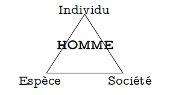
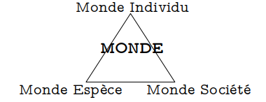
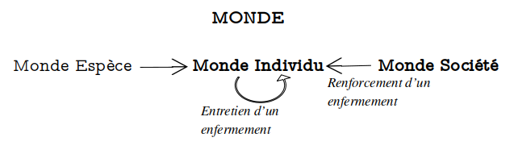
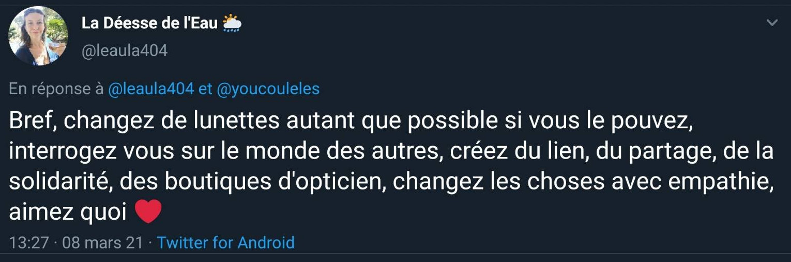

## Introduction: Nos réelles hallucinations

> Quand l'ordre des humains nous sert dans son cocktail
> Cinq milliards de versions différentes du réel
>
> _Hubert-félix Thiéfaine_

Nous vivons tous, plus de 7 milliards d’êtres humains, sur la même planète, dans le même monde et pourtant, qui ne s’est jamais senti totalement incompris, parfois seul? Qui n’a jamais eu l’impression que des concepts « normaux » échappaient à l’autre ou que l’autre « n’était pas du même monde » ?
Nous avons tous une perception différente de ce qui nous entoure, au-delà de nos sens, une analyse différente de l’information que nous percevons. 7 milliards de monde. Le même réel, et dans celui-ci, des choses qui nous importent et d’autres pas. Des choses que nous voyons et d’autres que nous ne voyons pas – ou peut être parfois que nous ne souhaitons pas voir car elles ne nous concernent pas.

_« C’est fou comme on vit tous dans le même monde mais en même temps pas du tout »_

Pourquoi ? _Parce que d’évidence nos visions du monde sont différentes de par énormément de facteurs déterminés (genre, couleur de peau, origine, culture, éducation, age, …)._ Mais au-delà des différences de visions induites par ses facteurs pourquoi sommes-nous si souvent enfermés dans notre seule vision du monde ? Et comment concilier, communiquer, vivre ensemble à travers le monde et nos mondes ?

L’homme peut se concevoir dans la trinité Individu – Société – Espèce. Réduire ou subordonner un terme à un autre fait perdre une partie de l’essence et de la complexité émanant de l’humain (Notion abordée par Edgar Morin et approchée ici: [https://blog.leaula.me/fr/reflexion/lesprit-de-la-vallee](L'esprit de la vallée)). La construction du monde et la vision, l’ image mentale, les perceptions et compréhensions de celui-ci chez l’individu sont donc fortement modelées par l’appartenance de l’homme à l’espèce humaine et la société dans laquelle il évolue.  

_Nous nous plaçons dans le regard d’un individu, élaboré par lui-même et co-construit  par l’appartenance à l’espèce et à la société._
* Le monde de l’Espèce : instinct, finalité de reproduction, dépendance du groupe pour la survie, ...
* Le monde de la Société : culture, éducation, statuts social, ...
* Le monde de l’Individu : genre, âge, le soi/ego, ...

Je mets de côté l’influence de l’appartenance à l’espèce humaine car il s’agit d’un axiome de base, tout humain est inévitablement soumis aux règles de l’espèce humaine. Il est déterminé en partie par elles, en dépit de toute déconstruction possible. Ici, je cherche à mettre en exergue les mécanismes ayant émergés de la Société et de l’Individu, étant à l’origine et entretenant nos réelles hallucinations personnelles.

## L’influence de la société sur l’enfermement des regards : chacun chez son opticien

La façon dont la société est structurée, me renvoie un monde qui prône l’individualisme dans les carreaux de mes lunettes. Je veux dire par là, que la société (ici mondialisée et occidentale) prône l’autonomie individuelle plus que les regroupements (famille, clan, corporation, …), regroupements que l’on cherche à éviter car ils exercent sur l’individu de multiples pressions – évidemment, il s’agit de devoir co-construire, être dépendant d’autres et donc potentiellement à leur merci. Il est plus « facile » et désormais tout à fait  possible de bâtir seul, grâce aux moyens et au confort moderne. Notre envie d’autonomie, de non-dépendance, nous entraîne donc à moins construire avec l’autre, à ne pas à avoir à se forcer « à succomber aux pressions », d’imaginer comment l’autre conçoit, fonctionne. Notre démarche individuelle nous met à l’abri des frustrations où nous accule l’autre. Ne pas se frustrer est agréable, ne plus se frustrer du tout, ne plus aller dans les compromis  c’est perdre l’occasion d’apprendre sans savoir ce que l’on va pouvoir apprendre. **L’individualisme nous encourage à nous couper et ne pas nous confronter au monde de l’autre.**
Je ne critique pas l’individualisme, ni ne le confond à l’égoïsme, mais en observe plutôt les effets rebonds.

De plus, la société est gangrenée de méfiance et de peur de l’autre. Je ne dirai pas que la société en temps que telle nous pousse à avoir peur des autres : c’est sa structuration et les informations véhiculées en son sein qui ont pour résultante d’entretenir le sentiment de peur chez l’individu. Dans les médias nous voyons : des incidents, des drames, des attentats, actuellement la crise sanitaire du Covid… Je n’apporte pas  d’idée nouvelle sur ce terrain et je ne crois ne pas être la seule à pointer du doigt le climat de peur médiatique qui tue ce qui reste de confiance en l’autre – mais que voulez vous, la peur ça fait des vues, du clic, du buzz, ça génère de l’argent. **La méfiance engendre un manque d’empathie, nous enlève l’envie de comprendre l’autre. Si l’autre, celui que je ne connais pas, me fait peur, pourquoi essayerai-je de le comprendre ?**
C’est d’ailleurs un bel exemple de cercle vicieux entretenu : « je ne connais pas donc j’ai peur, j’ai peur donc je n’apprend pas à connaître. » Il ne tient qu’a nous de bouleverser le cercle et d’y introduire de la curiosité.

L’intérêt ici, outre rappeler l’importance de l’empathie, c’est de faire le lien entre des effets de la Société (ici identifiée comme résultante :  la méfiance et la structuration individualiste, mais il y en a sûrement d’autres) sur la construction du monde et surtout la vision souvent égocentrée – sans que cela soit motivé par de l’égoïsme pur – de celui-ci par l’Individu. **L’absence de passerelles entre son monde, ce qu’il imagine être le monde, et le monde d’un autre.** Passerelles, qui, j’ai l’impression, peine à être construites par chacun. **Peut-être que l’effort est trop dur, trop douloureux ? Peut-être a t-on oublié que l’autre est différent et que nous portons tous des lunettes ?**

Il est encore plus dur – et paradoxalement tellement à portée de main – de changer de visions, de paradigmes, de lunettes, avec l’essor des réseaux sociaux et leurs algorithmes qui nous habituent à voir ce que nous voulons, basés sur nos préférences et nos désirs. Ce qui occulte entièrement des pans entiers du monde virtuel à notre vision et qui – inexorablement – nous donne à croire qu’ils n’existent même pas.

De part l’inné qui nous détermine, les expériences acquises qui nous façonnent, nous créons l’image mentale de notre monde (**cause d’existence de visions du monde différentes chez les individus**). Notre vision  du monde est renforcée par des biais sociétaux (réseaux sociaux, fermeture à un cercle social proche de nous) et notre faculté à comprendre les visions autres est entravée et découragée par d’autres effets sociétaux (la méfiance et la structuration individualiste : **causes de notre incapacité/difficultés à changer de lunettes**).

**Ici, ses effets sociétaux ne sont pas la cause d’existence de visions du monde différentes chez les individus mais une des causes de notre incapacité à construire des passerelles, à changer de lunettes pour voir le monde de l’autre, la beauté qui s’y trouve mais aussi les défis, les tensions, les peurs.**

_La Société paraît loin de nous, hors de nous, alors que c’est eux, c’est nous, c’est moi. Dans l’Homme, il y a la Société – tout comme l’Individu et l’Espèce. Les effets sociétaux prédominants sont ceux que nous entretenons et non des effets pervers d’un « Grand Tout » dans lequel nous n’avons aucune prise. Petite prise faible, certes, cependant existante. Si les médias diffusent beaucoup de drame c’est parce que c’est ce qui se regarde le plus, si nous nous méfions des autres c’est que nous prenons pas le temps de les connaître. **Les résultantes de la société, sont un agrégat fouillis de nos résultantes humaines. Et cela veut dire que nous avons un poids, des choix, une responsabilité. Et ce jusqu’aux frontières de l’individu.**_

## Le piège oublié et évident de l’Ego

Il est très simple d’imaginer que ce que l’on conçoit est la réalité de tous et que chacun pense comme l’on pense soi-même.

Peut être aurai-je dû commencer par cela, mais il me paraît Ô combien évident aujourd’hui, que **je conçois le monde depuis mes lunettes à moi, de par mes expériences, mes connaissances et mes déterminismes. Le premier piège, le plus évident et le plus sournois, est certainement d’oublier que la prise de conscience du fait que « chacun pense différemment, appréhende le monde selon lui même » est une connaissance que j’ai moi même inscrite sur mes lunettes.** Une connaissance, qui semble évidente mais souvent oubliée, qu’il nous faut transmettre et intérioriser.

L’autre aussi est un être complexe, tiraillé et mal mené par la vie, qui pense sans doute avoir raison, faire le bien, et ne voit pas forcément le mal qu’il peut causer si lui non plus ne soulève pas ces lunettes. _Bon, biensûr, il existe aussi des encu\*\*\* qui savent le mal qu'ils font mais s'en battent les coui\*\*\*._

En chinois, « tu » s’écrit : 你 ou 妳, le caractère qui signifie « homme » ou « femme » suivi du caractère « petit ». L’autre sera toujours plus petit que nous dans notre esprit. Non pas parce qu’il est important de toujours s’aimer soi d’abord et de penser à soi en premier mais dans le sens où **il est facile d’oublier que l’autre est un miroir de ma propre complexité.**

Cette focale sur nous même - cette vision égocentrée même – amène inexorablement à de l’incompréhension, une mauvaise communication, des conflits, de la violence. Il n’est pas simple de se mettre à la place de l’autre, d’agir avec empathie, surtout si nous sommes déjà blessés par la vie. Il n’est pas simple de faire des passerelles entre nos mondes, de mettre les lunettes des autres pour tenter de comprendre ce qui se trame chez eux.

## Changer de lunettes, tournoyer dans les visions périphériques

Des résultantes de la société – et non la société, car il serait injuste de dire que tout vient d’elle - mènent à un manque cruel d’empathie qui a pour effet d’accentuer l’enfermement des individus dans leurs visions du monde déjà construites et entretenues par leurs soins, regardant le réel à travers les vitres, les lunettes, de leur seul mental.

**La première étape est certainement de le concevoir, d’accepter que nous ayons notre propre construction mentale, pour ensuite tenter de l’absoudre, tournoyer dans les visions périphériques, briser les carreaux, voler d’un monde à l’autre…**

_« Bref, changez de lunettes autant que possible si vous le pouvez, interrogez vous sur le monde des autres, créez du lien, du partage, de la solidarité, des boutiques d’opticien, changez les choses avec empathie, aimez quoi ! »_
